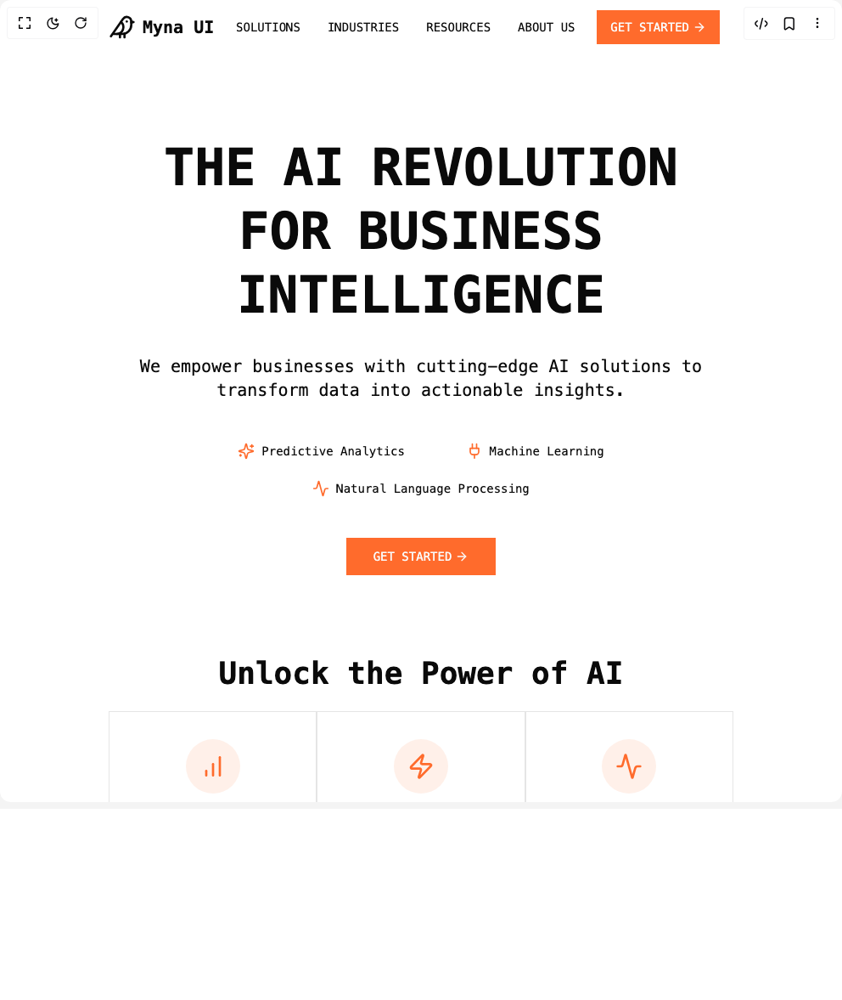

# Build Myna Hero in BuilderStudio

> Build this component in our Agentic IDE: [BuilderStudio](https://builderstudio.dev).
>
> Join the BuilderStudio community on [Discord](https://discord.gg/QdWeSGCqfe) and [Reddit](https://reddit.com/r/builderstudio).



## Component

- Author group: `bankkroll`
- Component: `myna-hero`
- Variant: `default`
- Rendered HTML snapshot: [`rendered.html`](rendered.html)

## BuilderStudio prompt

You are implementing a React component based on a component reference.

## Component identity

- Author: bankkroll
- Component slug: myna-hero
- Demo slug: default
- Title: myna-hero
- Description: 

## Goal

Recreate this component in a React + TypeScript + Tailwind CSS project. Preserve the visual layout, spacing, colors, border radius, shadows, interaction behavior, animation behavior, responsive behavior, and dark mode behavior shown in the rendered demo.

## Implementation requirements

- Use React and TypeScript.
- Use Tailwind CSS classes whenever possible.
- Keep the component self-contained unless the source files require helper components.
- If the source uses CSS variables, custom CSS, animations, or keyframes, include them.
- If the source uses external packages, list and use the required packages.
- Preserve accessibility attributes, button semantics, links, keyboard behavior, and ARIA attributes when visible in the source.
- Do not replace the component with a simplified placeholder.
- Return complete production-ready code.

## Dependencies

No reference metadata available.

## Rendered DOM snapshot

This is the rendered demo HTML extracted from the live preview. Use it to verify structure, class names, visible content, and layout.

```html
<div id="root"><div class="w-screen min-h-screen flex justify-center items-center"><div class="w-screen min-h-screen flex justify-center items-center"><div class="container mx-auto px-4 min-h-screen bg-background"><header><div class="flex h-16 items-center justify-between"><a href="#" class="flex items-center gap-2"><div class="flex items-center space-x-2"><svg xmlns="http://www.w3.org/2000/svg" width="24" height="24" viewBox="0 0 24 24" fill="none" stroke="currentColor" stroke-width="2" stroke-linecap="round" stroke-linejoin="round" class="lucide lucide-bird h-8 w-8" aria-hidden="true"><path d="M16 7h.01"></path><path d="M3.4 18H12a8 8 0 0 0 8-8V7a4 4 0 0 0-7.28-2.3L2 20"></path><path d="m20 7 2 .5-2 .5"></path><path d="M10 18v3"></path><path d="M14 17.75V21"></path><path d="M7 18a6 6 0 0 0 3.84-10.61"></path></svg><span class="font-mono text-xl font-bold">Myna UI</span></div></a><nav class="hidden md:flex items-center space-x-8"><a href="#" class="text-sm font-mono text-foreground hover:text-[#FF6B2C] transition-colors">SOLUTIONS</a><a href="#" class="text-sm font-mono text-foreground hover:text-[#FF6B2C] transition-colors">INDUSTRIES</a><a href="#" class="text-sm font-mono text-foreground hover:text-[#FF6B2C] transition-colors">RESOURCES</a><a href="#" class="text-sm font-mono text-foreground hover:text-[#FF6B2C] transition-colors">ABOUT US</a></nav><div class="flex items-center space-x-4"><button class="items-center justify-center whitespace-nowrap text-sm font-medium ring-offset-background transition-colors focus-visible:outline-none focus-visible:ring-2 focus-visible:ring-ring focus-visible:ring-offset-2 disabled:pointer-events-none disabled:opacity-50 text-primary-foreground h-10 px-4 py-2 rounded-none hidden md:inline-flex bg-[#FF6B2C] hover:bg-[#FF6B2C]/90 font-mono">GET STARTED <svg xmlns="http://www.w3.org/2000/svg" width="24" height="24" viewBox="0 0 24 24" fill="none" stroke="currentColor" stroke-width="2" stroke-linecap="round" stroke-linejoin="round" class="lucide lucide-arrow-right ml-1 w-4 h-4" aria-hidden="true"><path d="M5 12h14"></path><path d="m12 5 7 7-7 7"></path></svg></button><button class="inline-flex items-center justify-center whitespace-nowrap rounded-md text-sm font-medium ring-offset-background transition-colors focus-visible:outline-none focus-visible:ring-2 focus-visible:ring-ring focus-visible:ring-offset-2 disabled:pointer-events-none disabled:opacity-50 hover:bg-accent hover:text-accent-foreground h-10 w-10 md:hidden" type="button" aria-haspopup="dialog" aria-expanded="false" aria-controls="radix-«r0»" data-state="closed"><svg xmlns="http://www.w3.org/2000/svg" width="24" height="24" viewBox="0 0 24 24" fill="none" stroke="currentColor" stroke-width="2" stroke-linecap="round" stroke-linejoin="round" class="lucide lucide-menu h-5 w-5" aria-hidden="true"><line x1="4" x2="20" y1="12" y2="12"></line><line x1="4" x2="20" y1="6" y2="6"></line><line x1="4" x2="20" y1="18" y2="18"></line></svg><span class="sr-only">Toggle menu</span></button></div></div></header><main><section class="container py-24"><div class="flex flex-col items-center text-center"><h1 class="relative font-mono text-4xl font-bold sm:text-5xl md:text-6xl lg:text-7xl max-w-4xl mx-auto leading-tight" style="filter: blur(0px); opacity: 1; transform: none;"><span class="inline-block mx-2 md:mx-4" style="opacity: 1; transform: none;">THE</span><span class="inline-block mx-2 md:mx-4" style="opacity: 1; transform: none;">AI</span><span class="inline-block mx-2 md:mx-4" style="opacity: 1; transform: none;">REVOLUTION</span><span class="inline-block mx-2 md:mx-4" style="opacity: 1; transform: none;">FOR</span><span class="inline-block mx-2 md:mx-4" style="opacity: 1; transform: none;">BUSINESS</span><span class="inline-block mx-2 md:mx-4" style="opacity: 1; transform: none;">INTELLIGENCE</span></h1><p class="mx-auto mt-8 max-w-2xl text-xl text-foreground font-mono" style="opacity: 1; transform: none;">We empower businesses with cutting-edge AI solutions to transform data into actionable insights.</p><div class="mt-12 flex flex-wrap justify-center gap-6" style="opacity: 1;"><div class="flex items-center gap-2 px-6" style="opacity: 1; transform: none;"><svg xmlns="http://www.w3.org/2000/svg" width="24" height="24" viewBox="0 0 24 24" fill="none" stroke="currentColor" stroke-width="2" stroke-linecap="round" stroke-linejoin="round" class="lucide lucide-sparkles h-5 w-5 text-[#FF6B2C]" aria-hidden="true"><path d="M9.937 15.5A2 2 0 0 0 8.5 14.063l-6.135-1.582a.5.5 0 0 1 0-.962L8.5 9.936A2 2 0 0 0 9.937 8.5l1.582-6.135a.5.5 0 0 1 .963 0L14.063 8.5A2 2 0 0 0 15.5 9.937l6.135 1.581a.5.5 0 0 1 0 .964L15.5 14.063a2 2 0 0 0-1.437 1.437l-1.582 6.135a.5.5 0 0 1-.963 0z"></path><path d="M20 3v4"></path><path d="M22 5h-4"></path><path d="M4 17v2"></path><path d="M5 18H3"></path></svg><span class="text-sm font-mono">Predictive Analytics</span></div><div class="flex items-center gap-2 px-6" style="opacity: 1; transform: none;"><svg xmlns="http://www.w3.org/2000/svg" width="24" height="24" viewBox="0 0 24 24" fill="none" stroke="currentColor" stroke-width="2" stroke-linecap="round" stroke-linejoin="round" class="lucide lucide-plug h-5 w-5 text-[#FF6B2C]" aria-hidden="true"><path d="M12 22v-5"></path><path d="M9 8V2"></path><path d="M15 8V2"></path><path d="M18 8v5a4 4 0 0 1-4 4h-4a4 4 0 0 1-4-4V8Z"></path></svg><span class="text-sm font-mono">Machine Learning</span></div><div class="flex items-center gap-2 px-6" style="opacity: 1; transform: none;"><svg xmlns="http://www.w3.org/2000/svg" width="24" height="24" viewBox="0 0 24 24" fill="none" stroke="currentColor" stroke-width="2" stroke-linecap="round" stroke-linejoin="round" class="lucide lucide-activity h-5 w-5 text-[#FF6B2C]" aria-hidden="true"><path d="M22 12h-2.48a2 2 0 0 0-1.93 1.46l-2.35 8.36a.25.25 0 0 1-.48 0L9.24 2.18a.25.25 0 0 0-.48 0l-2.35 8.36A2 2 0 0 1 4.49 12H2"></path></svg><span class="text-sm font-mono">Natural Language Processing</span></div></div><div style="opacity: 1; transform: none;"><button class="inline-flex items-center justify-center whitespace-nowrap text-sm font-medium ring-offset-background transition-colors focus-visible:outline-none focus-visible:ring-2 focus-visible:ring-ring focus-visible:ring-offset-2 disabled:pointer-events-none disabled:opacity-50 text-primary-foreground h-11 px-8 cursor-pointer rounded-none mt-12 bg-[#FF6B2C] hover:bg-[#FF6B2C]/90 font-mono">GET STARTED <svg xmlns="http://www.w3.org/2000/svg" width="24" height="24" viewBox="0 0 24 24" fill="none" stroke="currentColor" stroke-width="2" stroke-linecap="round" stroke-linejoin="round" class="lucide lucide-arrow-right ml-1 w-4 h-4" aria-hidden="true"><path d="M5 12h14"></path><path d="m12 5 7 7-7 7"></path></svg></button></div></div></section><section class="container"><h2 class="text-center text-4xl font-mono font-bold mb-6" style="opacity: 1; transform: none;">Unlock the Power of AI</h2><div class="grid md:grid-cols-3 max-w-6xl mx-auto" style="opacity: 1;"><div class="flex flex-col items-center text-center p-8 bg-background border" style="opacity: 1; transform: none;"><div class="mb-6 rounded-full bg-[#FF6B2C]/10 p-4"><svg xmlns="http://www.w3.org/2000/svg" width="24" height="24" viewBox="0 0 24 24" fill="none" stroke="currentColor" stroke-width="2" stroke-linecap="round" stroke-linejoin="round" class="lucide lucide-chart-no-axes-column-increasing h-8 w-8 text-[#FF6B2C]" aria-hidden="true"><line x1="12" x2="12" y1="20" y2="10"></line><line x1="18" x2="18" y1="20" y2="4"></line><line x1="6" x2="6" y1="20" y2="16"></line></svg></div><h3 class="mb-4 text-xl font-mono font-bold">Advanced Analytics</h3><p class="text-muted-foreground font-mono text-sm leading-relaxed">Gain deeper insights from your data with our cutting-edge predictive models.</p></div><div class="flex flex-col items-center text-center p-8 bg-background border" style="opacity: 1; transform: none;"><div class="mb-6 rounded-full bg-[#FF6B2C]/10 p-4"><svg xmlns="http://www.w3.org/2000/svg" width="24" height="24" viewBox="0 0 24 24" fill="none" stroke="currentColor" stroke-width="2" stroke-linecap="round" stroke-linejoin="round" class="lucide lucide-zap h-8 w-8 text-[#FF6B2C]" aria-hidden="true"><path d="M4 14a1 1 0 0 1-.78-1.63l9.9-10.2a.5.5 0 0 1 .86.46l-1.92 6.02A1 1 0 0 0 13 10h7a1 1 0 0 1 .78 1.63l-9.9 10.2a.5.5 0 0 1-.86-.46l1.92-6.02A1 1 0 0 0 11 14z"></path></svg></div><h3 class="mb-4 text-xl font-mono font-bold">Intelligent Automation</h3><p class="text-muted-foreground font-mono text-sm leading-relaxed">Streamline your processes with AI-powered automation solutions.</p></div><div class="flex flex-col items-center text-center p-8 bg-background border" style="opacity: 1; transform: none;"><div class="mb-6 rounded-full bg-[#FF6B2C]/10 p-4"><svg xmlns="http://www.w3.org/2000/svg" width="24" height="24" viewBox="0 0 24 24" fill="none" stroke="currentColor" stroke-width="2" stroke-linecap="round" stroke-linejoin="round" class="lucide lucide-activity h-8 w-8 text-[#FF6B2C]" aria-hidden="true"><path d="M22 12h-2.48a2 2 0 0 0-1.93 1.46l-2.35 8.36a.25.25 0 0 1-.48 0L9.24 2.18a.25.25 0 0 0-.48 0l-2.35 8.36A2 2 0 0 1 4.49 12H2"></path></svg></div><h3 class="mb-4 text-xl font-mono font-bold">Real-time Insights</h3><p class="text-muted-foreground font-mono text-sm leading-relaxed">Make informed decisions faster with our real-time data processing capabilities.</p></div></div></section></main></div></div></div></div>
```

## Reference source files

No reference source files were available.
