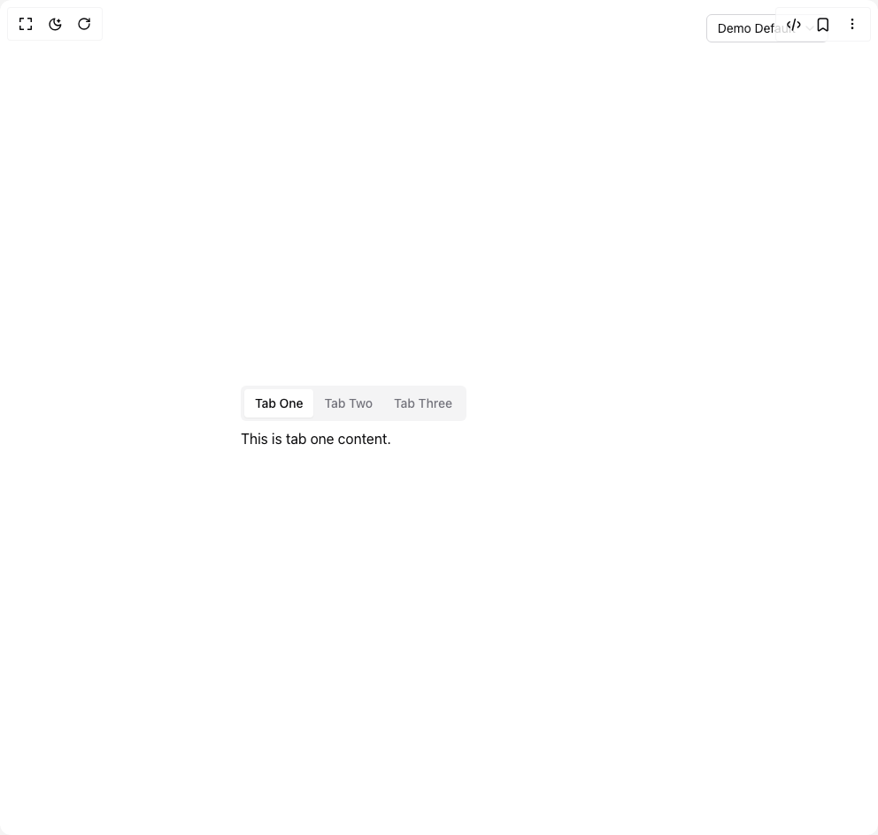

# Build Tabs in BuilderStudio

> Build this component in our Agentic IDE: [BuilderStudio](https://builderstudio.dev).
>
> Join the BuilderStudio community on [Discord](https://discord.gg/QdWeSGCqfe) and [Reddit](https://reddit.com/r/builderstudio).



## Component

- Author group: `bankkroll`
- Component: `tabs`
- Variant: `variant-tabs`
- Rendered HTML snapshot: [`rendered.html`](rendered.html)

## BuilderStudio prompt

You are implementing a React component based on a component reference.

## Component identity

- Author: bankkroll
- Component slug: tabs
- Demo slug: variant-tabs
- Title: tabs
- Description: 

## Goal

Recreate this component in a React + TypeScript + Tailwind CSS project. Preserve the visual layout, spacing, colors, border radius, shadows, interaction behavior, animation behavior, responsive behavior, and dark mode behavior shown in the rendered demo.

## Implementation requirements

- Use React and TypeScript.
- Use Tailwind CSS classes whenever possible.
- Keep the component self-contained unless the source files require helper components.
- If the source uses CSS variables, custom CSS, animations, or keyframes, include them.
- If the source uses external packages, list and use the required packages.
- Preserve accessibility attributes, button semantics, links, keyboard behavior, and ARIA attributes when visible in the source.
- Do not replace the component with a simplified placeholder.
- Return complete production-ready code.

## Dependencies

No reference metadata available.

## Rendered DOM snapshot

This is the rendered demo HTML extracted from the live preview. Use it to verify structure, class names, visible content, and layout.

```html
<div id="root"><div class="relative flex items-center justify-center h-screen w-full m-auto p-16 bg-background text-foreground"><div class="absolute lab-bg inset-0 size-full"><div class="absolute inset-0 bg-[radial-gradient(#00000021_1px,transparent_1px)] dark:bg-[radial-gradient(#ffffff22_1px,transparent_1px)]"></div></div><div class="absolute z-10 top-4 right-14 flex flex-col items-end gap-1"><button type="button" role="combobox" aria-controls="radix-«r0»" aria-expanded="false" aria-autocomplete="none" dir="ltr" data-state="closed" class="flex w-full items-center justify-between rounded-md border border-input bg-background px-3 py-2 text-sm ring-offset-background placeholder:text-muted-foreground focus:outline-none focus:ring-2 focus:ring-ring focus:ring-offset-2 disabled:cursor-not-allowed disabled:opacity-50 [&amp;&gt;span]:line-clamp-1 gap-2 h-8"><span style="pointer-events: none;">Demo Default</span><svg xmlns="http://www.w3.org/2000/svg" width="24" height="24" viewBox="0 0 24 24" fill="none" stroke="currentColor" stroke-width="2" stroke-linecap="round" stroke-linejoin="round" class="lucide lucide-chevron-down h-4 w-4 opacity-50" aria-hidden="true"><path d="m6 9 6 6 6-6"></path></svg></button></div><div class="flex w-full justify-center relative"><div dir="ltr" data-orientation="horizontal" class="w-full max-w-md mx-auto"><div role="tablist" aria-orientation="horizontal" class="inline-flex items-center justify-center text-muted-foreground bg-muted p-1 rounded-md" tabindex="0" data-orientation="horizontal" style="outline: none;"><button type="button" role="tab" aria-selected="true" aria-controls="radix-«r1»-content-tab1" data-state="active" id="radix-«r1»-trigger-tab1" class="inline-flex items-center justify-center whitespace-nowrap px-3 py-1.5 text-sm font-medium ring-offset-background transition-all focus-visible:outline-none focus-visible:ring-2 focus-visible:ring-ring focus-visible:ring-offset-2 disabled:pointer-events-none disabled:opacity-50 rounded-sm data-[state=active]:bg-background data-[state=inactive]:hover:bg-primary/5 data-[state=active]:text-foreground data-[state=active]:shadow-sm" tabindex="-1" data-orientation="horizontal" data-radix-collection-item="">Tab One</button><button type="button" role="tab" aria-selected="false" aria-controls="radix-«r1»-content-tab2" data-state="inactive" id="radix-«r1»-trigger-tab2" class="inline-flex items-center justify-center whitespace-nowrap px-3 py-1.5 text-sm font-medium ring-offset-background transition-all focus-visible:outline-none focus-visible:ring-2 focus-visible:ring-ring focus-visible:ring-offset-2 disabled:pointer-events-none disabled:opacity-50 rounded-sm data-[state=active]:bg-background data-[state=inactive]:hover:bg-primary/5 data-[state=active]:text-foreground data-[state=active]:shadow-sm" tabindex="-1" data-orientation="horizontal" data-radix-collection-item="">Tab Two</button><button type="button" role="tab" aria-selected="false" aria-controls="radix-«r1»-content-tab3" data-state="inactive" id="radix-«r1»-trigger-tab3" class="inline-flex items-center justify-center whitespace-nowrap px-3 py-1.5 text-sm font-medium ring-offset-background transition-all focus-visible:outline-none focus-visible:ring-2 focus-visible:ring-ring focus-visible:ring-offset-2 disabled:pointer-events-none disabled:opacity-50 rounded-sm data-[state=active]:bg-background data-[state=inactive]:hover:bg-primary/5 data-[state=active]:text-foreground data-[state=active]:shadow-sm" tabindex="-1" data-orientation="horizontal" data-radix-collection-item="">Tab Three</button></div><div data-state="active" data-orientation="horizontal" role="tabpanel" aria-labelledby="radix-«r1»-trigger-tab1" id="radix-«r1»-content-tab1" tabindex="0" class="mt-2 ring-offset-background focus-visible:outline-none focus-visible:ring-2 focus-visible:ring-ring focus-visible:ring-offset-2" style="animation-duration: 0s;">This is tab one content.</div><div data-state="inactive" data-orientation="horizontal" role="tabpanel" aria-labelledby="radix-«r1»-trigger-tab2" hidden="" id="radix-«r1»-content-tab2" tabindex="0" class="mt-2 ring-offset-background focus-visible:outline-none focus-visible:ring-2 focus-visible:ring-ring focus-visible:ring-offset-2"></div><div data-state="inactive" data-orientation="horizontal" role="tabpanel" aria-labelledby="radix-«r1»-trigger-tab3" hidden="" id="radix-«r1»-content-tab3" tabindex="0" class="mt-2 ring-offset-background focus-visible:outline-none focus-visible:ring-2 focus-visible:ring-ring focus-visible:ring-offset-2"></div></div></div></div></div>
```

## Reference source files

No reference source files were available.
