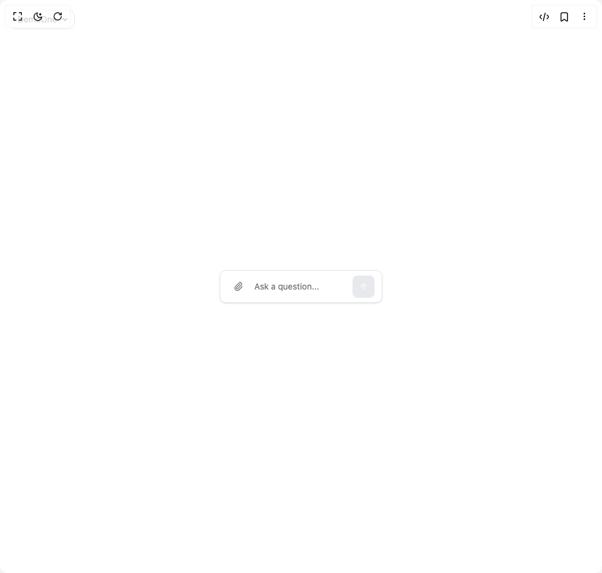

# Build Ai Chat Input in BuilderStudio

> Build this component in our Agentic IDE: [BuilderStudio](https://builderstudio.dev).
>
> Join the BuilderStudio community on [Discord](https://discord.gg/QdWeSGCqfe) and [Reddit](https://reddit.com/r/builderstudio).



## Component

- Author group: `baozhouqi`
- Component: `ai-chat-input`
- Variant: `default`
- Rendered HTML snapshot: [`rendered.html`](rendered.html)

## BuilderStudio prompt

You are implementing a React component based on a component reference.

## Component identity

- Author: baozhouqi
- Component slug: ai-chat-input
- Demo slug: default
- Title: ai-chat-input
- Description: 

## Goal

Recreate this component in a React + TypeScript + Tailwind CSS project. Preserve the visual layout, spacing, colors, border radius, shadows, interaction behavior, animation behavior, responsive behavior, and dark mode behavior shown in the rendered demo.

## Implementation requirements

- Use React and TypeScript.
- Use Tailwind CSS classes whenever possible.
- Keep the component self-contained unless the source files require helper components.
- If the source uses CSS variables, custom CSS, animations, or keyframes, include them.
- If the source uses external packages, list and use the required packages.
- Preserve accessibility attributes, button semantics, links, keyboard behavior, and ARIA attributes when visible in the source.
- Do not replace the component with a simplified placeholder.
- Return complete production-ready code.

## Dependencies

No reference metadata available.

## Rendered DOM snapshot

This is the rendered demo HTML extracted from the live preview. Use it to verify structure, class names, visible content, and layout.

```html
<div id="root"><div class="fixed top-4 left-4 z-10"><select class="appearance-none h-8 max-w-[200px] text-sm leading-tight rounded-lg pl-3 pr-7 py-0 border bg-background focus:outline-none focus:ring-0"><option value="named_DemoOne_DemoOne">DemoOne</option></select><div class="absolute top-1/2 transform -translate-y-1/2 right-2 pointer-events-none"><svg class="w-4 h-4 fill-current" viewBox="0 0 20 20"><path d="M5.516 7.548c.436-.446 1.043-.48 1.576 0L10 10.405l2.908-2.857c.533-.48 1.14-.446 1.576 0 .436.445.408 1.197 0 1.615l-3.734 3.705c-.533.534-1.39.534-1.923 0l-3.734-3.705c-.408-.418-.436-1.17 0-1.615z"></path></svg></div></div><div class="w-screen min-h-screen flex justify-center items-center"><div class="flex min-h-screen items-center justify-center p-4 bg-background"><div class="w-full max-w-2xl space-y-4"><div class="flex w-full max-w-2xl mx-auto items-center gap-2 rounded-lg border border-input bg-background px-3 py-2 shadow-sm focus-within:border-primary focus-within:ring-1 focus-within:ring-primary"><button class="inline-flex items-center justify-center whitespace-nowrap rounded-md text-sm font-medium transition-colors focus-visible:outline-none focus-visible:ring-1 focus-visible:ring-ring disabled:pointer-events-none disabled:opacity-50 hover:bg-accent hover:text-accent-foreground h-9 w-9 h-8 w-8 shrink-0 text-muted-foreground hover:text-foreground" type="button"><svg xmlns="http://www.w3.org/2000/svg" width="16" height="16" viewBox="0 0 24 24" fill="none" stroke="currentColor" stroke-width="2" stroke-linecap="round" stroke-linejoin="round" class="lucide lucide-paperclip" aria-hidden="true"><path d="M13.234 20.252 21 12.3"></path><path d="m16 6-8.414 8.586a2 2 0 0 0 0 2.828 2 2 0 0 0 2.828 0l8.414-8.586a4 4 0 0 0 0-5.656 4 4 0 0 0-5.656 0l-8.415 8.585a6 6 0 1 0 8.486 8.486"></path></svg><span class="sr-only">Upload file</span></button><input accept="image/*,.pdf,.doc,.docx,.txt" multiple="" class="hidden" type="file"><form class="flex w-full items-center gap-2"><input placeholder="Ask a question..." class="flex-1 bg-transparent text-sm text-foreground placeholder:text-muted-foreground focus:outline-none disabled:cursor-not-allowed disabled:opacity-50" type="text" value=""><button class="inline-flex items-center justify-center whitespace-nowrap rounded-md text-sm font-medium transition-colors focus-visible:outline-none focus-visible:ring-1 focus-visible:ring-ring disabled:pointer-events-none disabled:opacity-50 bg-primary text-primary-foreground shadow hover:bg-primary/90 disabled:bg-gray-300 disabled:text-white-200 h-9 w-9 h-7 w-7 shrink-0" type="submit" disabled=""><svg xmlns="http://www.w3.org/2000/svg" width="16" height="16" viewBox="0 0 24 24" fill="none" stroke="currentColor" stroke-width="2" stroke-linecap="round" stroke-linejoin="round" class="lucide lucide-arrow-up" aria-hidden="true"><path d="m5 12 7-7 7 7"></path><path d="M12 19V5"></path></svg><span class="sr-only">Send message</span></button></form></div></div></div></div></div>
```

## Reference source files

No reference source files were available.
