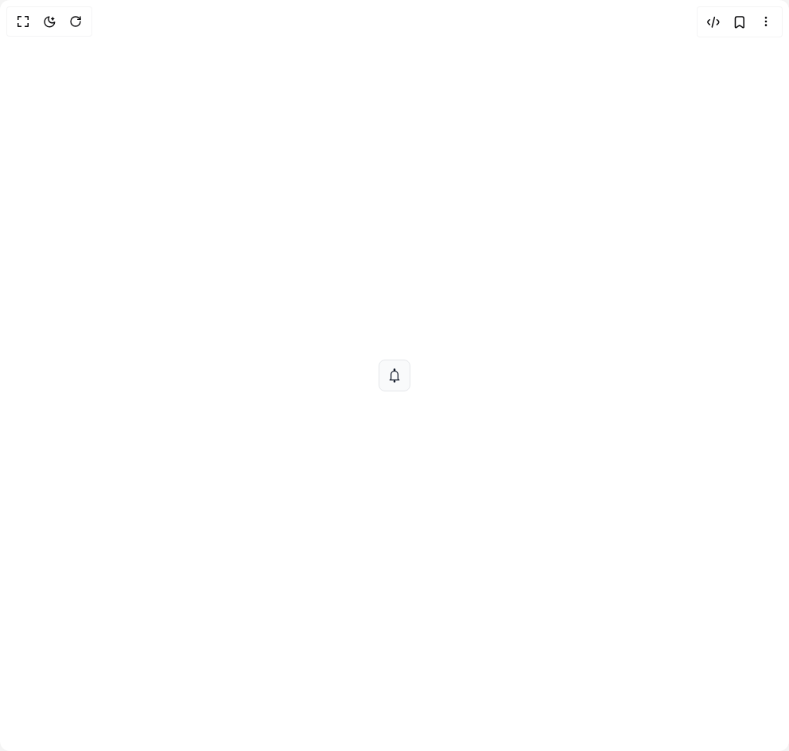

# Build Popover 1 in BuilderStudio

> Build this component in our Agentic IDE: [BuilderStudio](https://builderstudio.dev).
>
> Join the BuilderStudio community on [Discord](https://discord.gg/QdWeSGCqfe) and [Reddit](https://reddit.com/r/builderstudio).



## Component

- Author group: `base-ui`
- Component: `popover-1`
- Variant: `default`
- Rendered HTML snapshot: [`rendered.html`](rendered.html)

## BuilderStudio prompt

You are implementing a React component based on a component reference.

## Component identity

- Author: base-ui
- Component slug: popover-1
- Demo slug: default
- Title: popover-1
- Description: 

## Goal

Recreate this component in a React + TypeScript + Tailwind CSS project. Preserve the visual layout, spacing, colors, border radius, shadows, interaction behavior, animation behavior, responsive behavior, and dark mode behavior shown in the rendered demo.

## Implementation requirements

- Use React and TypeScript.
- Use Tailwind CSS classes whenever possible.
- Keep the component self-contained unless the source files require helper components.
- If the source uses CSS variables, custom CSS, animations, or keyframes, include them.
- If the source uses external packages, list and use the required packages.
- Preserve accessibility attributes, button semantics, links, keyboard behavior, and ARIA attributes when visible in the source.
- Do not replace the component with a simplified placeholder.
- Return complete production-ready code.

## Dependencies

No reference metadata available.

## Rendered DOM snapshot

This is the rendered demo HTML extracted from the live preview. Use it to verify structure, class names, visible content, and layout.

```html
<div id="root"><div class="w-screen min-h-screen flex justify-center items-center"><div class="w-screen min-h-screen flex justify-center items-center"><button type="button" tabindex="0" aria-expanded="false" aria-haspopup="dialog" class="flex size-10 items-center justify-center rounded-md border border-gray-200 bg-gray-50 text-gray-900 select-none hover:bg-gray-100 focus-visible:outline focus-visible:outline-2 focus-visible:-outline-offset-1 focus-visible:outline-blue-800 active:bg-gray-100 data-[popup-open]:bg-gray-100"><svg fill="currentcolor" width="20" height="20" viewBox="0 0 16 16" aria-label="Notifications"><path d="M 8 1 C 7.453125 1 7 1.453125 7 2 L 7 3.140625 C 5.28125 3.589844 4 5.144531 4 7 L 4 10.984375 C 4 10.984375 3.984375 11.261719 3.851563 11.519531 C 3.71875 11.78125 3.558594 12 3 12 L 3 13 L 13 13 L 13 12 C 12.40625 12 12.253906 11.78125 12.128906 11.53125 C 12.003906 11.277344 12 11.003906 12 11.003906 L 12 7 C 12 5.144531 10.71875 3.589844 9 3.140625 L 9 2 C 9 1.453125 8.546875 1 8 1 Z M 8 13 C 7.449219 13 7 13.449219 7 14 C 7 14.550781 7.449219 15 8 15 C 8.550781 15 9 14.550781 9 14 C 9 13.449219 8.550781 13 8 13 Z M 8 4 C 9.664063 4 11 5.335938 11 7 L 11 10.996094 C 11 10.996094 10.988281 11.472656 11.234375 11.96875 C 11.238281 11.980469 11.246094 11.988281 11.25 12 L 4.726563 12 C 4.730469 11.992188 4.738281 11.984375 4.742188 11.980469 C 4.992188 11.488281 5 11.015625 5 11.015625 L 5 7 C 5 5.335938 6.335938 4 8 4 Z"></path></svg></button></div></div></div>
```

## Reference source files

No reference source files were available.
