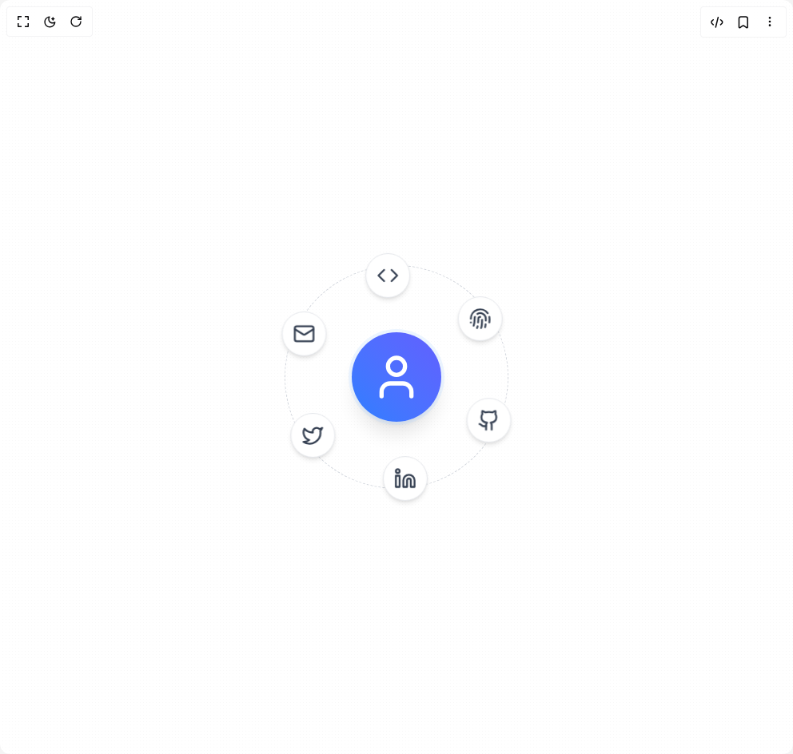

# Build Radial Social Menu in BuilderStudio

> Build this component in our Agentic IDE: [BuilderStudio](https://builderstudio.dev).
>
> Join the BuilderStudio community on [Discord](https://discord.gg/QdWeSGCqfe) and [Reddit](https://reddit.com/r/builderstudio).



## Component

- Author group: `beratberkay`
- Component: `radial-social-menu`
- Variant: `default`
- Rendered HTML snapshot: [`rendered.html`](rendered.html)

## BuilderStudio prompt

You are implementing a React component based on a component reference.

## Component identity

- Author: beratberkay
- Component slug: radial-social-menu
- Demo slug: default
- Title: radial-social-menu
- Description: 

## Goal

Recreate this component in a React + TypeScript + Tailwind CSS project. Preserve the visual layout, spacing, colors, border radius, shadows, interaction behavior, animation behavior, responsive behavior, and dark mode behavior shown in the rendered demo.

## Implementation requirements

- Use React and TypeScript.
- Use Tailwind CSS classes whenever possible.
- Keep the component self-contained unless the source files require helper components.
- If the source uses CSS variables, custom CSS, animations, or keyframes, include them.
- If the source uses external packages, list and use the required packages.
- Preserve accessibility attributes, button semantics, links, keyboard behavior, and ARIA attributes when visible in the source.
- Do not replace the component with a simplified placeholder.
- Return complete production-ready code.

## Dependencies

No reference metadata available.

## Rendered DOM snapshot

This is the rendered demo HTML extracted from the live preview. Use it to verify structure, class names, visible content, and layout.

```html
<div id="root"><div class="w-screen min-h-screen flex justify-center items-center"><div class="w-screen min-h-screen flex justify-center items-center"><div class="w-full h-screen flex items-center justify-center mx-auto relative"> <div class="relative h-screen w-screen flex items-center justify-center"><div class="relative z-10 flex items-center justify-center w-28 h-28 rounded-full bg-gradient-to-tr from-blue-500 to-indigo-500 shadow-xl ring-4 ring-blue-200/30 animate-pulse-slow"><svg xmlns="http://www.w3.org/2000/svg" width="24" height="24" viewBox="0 0 24 24" fill="none" stroke="currentColor" stroke-width="2" stroke-linecap="round" stroke-linejoin="round" class="lucide lucide-user text-white w-16 h-16" aria-hidden="true"><path d="M19 21v-2a4 4 0 0 0-4-4H9a4 4 0 0 0-4 4v2"></path><circle cx="12" cy="7" r="4"></circle></svg></div><div class="absolute rounded-full border-1 border-dashed border-gray-300" style="width: 280px; height: 280px; top: calc(50% - 140px); left: calc(50% - 140px);"></div><button class="absolute flex items-center justify-center w-14 h-14 rounded-full bg-white border border-gray-200 shadow-md hover:scale-110 hover:shadow-2xl transition-transform duration-300 animate-float" style="transform: translate(54.6212px, 128.905px);"><svg xmlns="http://www.w3.org/2000/svg" width="28" height="28" viewBox="0 0 24 24" fill="none" stroke="currentColor" stroke-width="2" stroke-linecap="round" stroke-linejoin="round" class="lucide lucide-github text-gray-700" aria-hidden="true"><path d="M15 22v-4a4.8 4.8 0 0 0-1-3.5c3 0 6-2 6-5.5.08-1.25-.27-2.48-1-3.5.28-1.15.28-2.35 0-3.5 0 0-1 0-3 1.5-2.64-.5-5.36-.5-8 0C6 2 5 2 5 2c-.3 1.15-.3 2.35 0 3.5A5.403 5.403 0 0 0 4 9c0 3.5 3 5.5 6 5.5-.39.49-.68 1.05-.85 1.65-.17.6-.22 1.23-.15 1.85v4"></path><path d="M9 18c-4.51 2-5-2-7-2"></path></svg></button><button class="absolute flex items-center justify-center w-14 h-14 rounded-full bg-white border border-gray-200 shadow-md hover:scale-110 hover:shadow-2xl transition-transform duration-300 animate-float" style="transform: translate(-84.3245px, 111.756px);"><svg xmlns="http://www.w3.org/2000/svg" width="28" height="28" viewBox="0 0 24 24" fill="none" stroke="currentColor" stroke-width="2" stroke-linecap="round" stroke-linejoin="round" class="lucide lucide-linkedin text-gray-700" aria-hidden="true"><path d="M16 8a6 6 0 0 1 6 6v7h-4v-7a2 2 0 0 0-2-2 2 2 0 0 0-2 2v7h-4v-7a6 6 0 0 1 6-6z"></path><rect width="4" height="12" x="2" y="9"></rect><circle cx="4" cy="4" r="2"></circle></svg></button><button class="absolute flex items-center justify-center w-14 h-14 rounded-full bg-white border border-gray-200 shadow-md hover:scale-110 hover:shadow-2xl transition-transform duration-300 animate-float" style="transform: translate(-138.946px, -17.1492px);"><svg xmlns="http://www.w3.org/2000/svg" width="28" height="28" viewBox="0 0 24 24" fill="none" stroke="currentColor" stroke-width="2" stroke-linecap="round" stroke-linejoin="round" class="lucide lucide-twitter text-gray-700" aria-hidden="true"><path d="M22 4s-.7 2.1-2 3.4c1.6 10-9.4 17.3-18 11.6 2.2.1 4.4-.6 6-2C3 15.5.5 9.6 3 5c2.2 2.6 5.6 4.1 9 4-.9-4.2 4-6.6 7-3.8 1.1 0 3-1.2 3-1.2z"></path></svg></button><button class="absolute flex items-center justify-center w-14 h-14 rounded-full bg-white border border-gray-200 shadow-md hover:scale-110 hover:shadow-2xl transition-transform duration-300 animate-float" style="transform: translate(-54.6212px, -128.905px);"><svg xmlns="http://www.w3.org/2000/svg" width="28" height="28" viewBox="0 0 24 24" fill="none" stroke="currentColor" stroke-width="2" stroke-linecap="round" stroke-linejoin="round" class="lucide lucide-mail text-gray-700" aria-hidden="true"><rect width="20" height="16" x="2" y="4" rx="2"></rect><path d="m22 7-8.97 5.7a1.94 1.94 0 0 1-2.06 0L2 7"></path></svg></button><button class="absolute flex items-center justify-center w-14 h-14 rounded-full bg-white border border-gray-200 shadow-md hover:scale-110 hover:shadow-2xl transition-transform duration-300 animate-float" style="transform: translate(84.3245px, -111.756px);"><svg xmlns="http://www.w3.org/2000/svg" width="28" height="28" viewBox="0 0 24 24" fill="none" stroke="currentColor" stroke-width="2" stroke-linecap="round" stroke-linejoin="round" class="lucide lucide-code text-gray-700" aria-hidden="true"><polyline points="16 18 22 12 16 6"></polyline><polyline points="8 6 2 12 8 18"></polyline></svg></button><button class="absolute flex items-center justify-center w-14 h-14 rounded-full bg-white border border-gray-200 shadow-md hover:scale-110 hover:shadow-2xl transition-transform duration-300 animate-float" style="transform: translate(138.946px, 17.1492px);"><svg xmlns="http://www.w3.org/2000/svg" width="28" height="28" viewBox="0 0 24 24" fill="none" stroke="currentColor" stroke-width="2" stroke-linecap="round" stroke-linejoin="round" class="lucide lucide-fingerprint text-gray-700" aria-hidden="true"><path d="M12 10a2 2 0 0 0-2 2c0 1.02-.1 2.51-.26 4"></path><path d="M14 13.12c0 2.38 0 6.38-1 8.88"></path><path d="M17.29 21.02c.12-.6.43-2.3.5-3.02"></path><path d="M2 12a10 10 0 0 1 18-6"></path><path d="M2 16h.01"></path><path d="M21.8 16c.2-2 .131-5.354 0-6"></path><path d="M5 19.5C5.5 18 6 15 6 12a6 6 0 0 1 .34-2"></path><path d="M8.65 22c.21-.66.45-1.32.57-2"></path><path d="M9 6.8a6 6 0 0 1 9 5.2v2"></path></svg></button></div> <div class="absolute w-full h-full -z-10" style="background-image: url(&quot;data:image/svg+xml,%3Csvg width='4' height='4' viewBox='0 0 6 6' xmlns='http://www.w3.org/2000/svg'%3E%3Ccircle cx='6' cy='6' r='1' fill='%23aaa' fill-opacity='0.25' /%3E%3C/svg%3E&quot;); background-color: transparent;"> </div></div></div></div></div>
```

## Reference source files

No reference source files were available.
