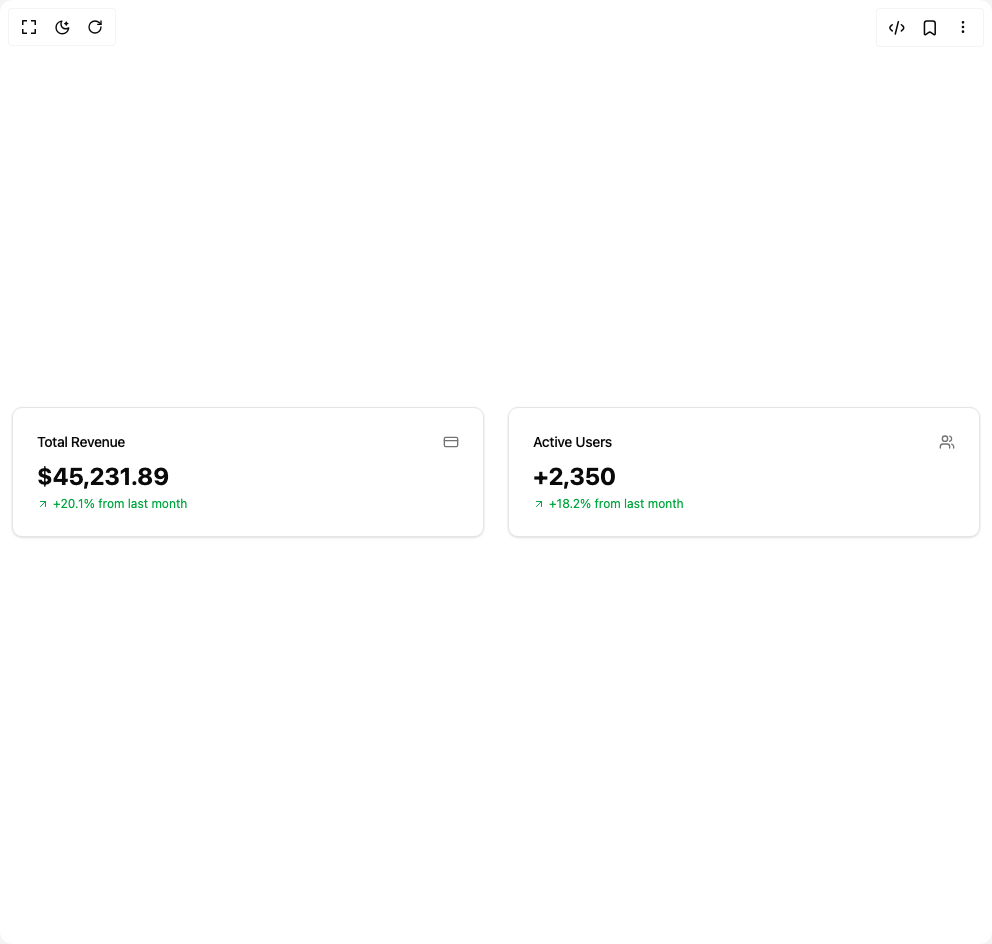

# Build Stats Cards in BuilderStudio

> Build this component in our Agentic IDE: [BuilderStudio](https://builderstudio.dev).
>
> Join the BuilderStudio community on [Discord](https://discord.gg/QdWeSGCqfe) and [Reddit](https://reddit.com/r/builderstudio).



## Component

- Author group: `beratberkay`
- Component: `stats-cards`
- Variant: `default`
- Rendered HTML snapshot: [`rendered.html`](rendered.html)

## BuilderStudio prompt

You are implementing a React component based on a component reference.

## Component identity

- Author: beratberkay
- Component slug: stats-cards
- Demo slug: default
- Title: stats-cards
- Description: 

## Goal

Recreate this component in a React + TypeScript + Tailwind CSS project. Preserve the visual layout, spacing, colors, border radius, shadows, interaction behavior, animation behavior, responsive behavior, and dark mode behavior shown in the rendered demo.

## Implementation requirements

- Use React and TypeScript.
- Use Tailwind CSS classes whenever possible.
- Keep the component self-contained unless the source files require helper components.
- If the source uses CSS variables, custom CSS, animations, or keyframes, include them.
- If the source uses external packages, list and use the required packages.
- Preserve accessibility attributes, button semantics, links, keyboard behavior, and ARIA attributes when visible in the source.
- Do not replace the component with a simplified placeholder.
- Return complete production-ready code.

## Dependencies

No reference metadata available.

## Rendered DOM snapshot

This is the rendered demo HTML extracted from the live preview. Use it to verify structure, class names, visible content, and layout.

```html
<div id="root"><div class="w-screen min-h-screen flex justify-center items-center"><div class="w-screen min-h-screen flex justify-center items-center"><div class="grid grid-cols-2 gap-6 w-full mx-3"><div class="rounded-lg border bg-card text-card-foreground shadow-sm"><div class="p-6 flex flex-row items-center justify-between space-y-0 pb-2"><h3 class="tracking-tight text-sm font-medium">Total Revenue</h3><svg xmlns="http://www.w3.org/2000/svg" width="24" height="24" viewBox="0 0 24 24" fill="none" stroke="currentColor" stroke-width="2" stroke-linecap="round" stroke-linejoin="round" class="lucide lucide-credit-card h-4 w-4 text-muted-foreground" aria-hidden="true"><rect width="20" height="14" x="2" y="5" rx="2"></rect><line x1="2" x2="22" y1="10" y2="10"></line></svg></div><div class="p-6 pt-0"><div class="text-2xl font-bold">$45,231.89</div><div class="flex items-center pt-1 text-xs text-green-600"><svg xmlns="http://www.w3.org/2000/svg" width="24" height="24" viewBox="0 0 24 24" fill="none" stroke="currentColor" stroke-width="2" stroke-linecap="round" stroke-linejoin="round" class="lucide lucide-arrow-up-right mr-1 h-3 w-3" aria-hidden="true"><path d="M7 7h10v10"></path><path d="M7 17 17 7"></path></svg><span>+20.1% from last month</span></div></div></div><div class="rounded-lg border bg-card text-card-foreground shadow-sm"><div class="p-6 flex flex-row items-center justify-between space-y-0 pb-2"><h3 class="tracking-tight text-sm font-medium">Active Users</h3><svg xmlns="http://www.w3.org/2000/svg" width="24" height="24" viewBox="0 0 24 24" fill="none" stroke="currentColor" stroke-width="2" stroke-linecap="round" stroke-linejoin="round" class="lucide lucide-users h-4 w-4 text-muted-foreground" aria-hidden="true"><path d="M16 21v-2a4 4 0 0 0-4-4H6a4 4 0 0 0-4 4v2"></path><circle cx="9" cy="7" r="4"></circle><path d="M22 21v-2a4 4 0 0 0-3-3.87"></path><path d="M16 3.13a4 4 0 0 1 0 7.75"></path></svg></div><div class="p-6 pt-0"><div class="text-2xl font-bold">+2,350</div><div class="flex items-center pt-1 text-xs text-green-600"><svg xmlns="http://www.w3.org/2000/svg" width="24" height="24" viewBox="0 0 24 24" fill="none" stroke="currentColor" stroke-width="2" stroke-linecap="round" stroke-linejoin="round" class="lucide lucide-arrow-up-right mr-1 h-3 w-3" aria-hidden="true"><path d="M7 7h10v10"></path><path d="M7 17 17 7"></path></svg><span>+18.2% from last month</span></div></div></div></div></div></div></div>
```

## Reference source files

No reference source files were available.
