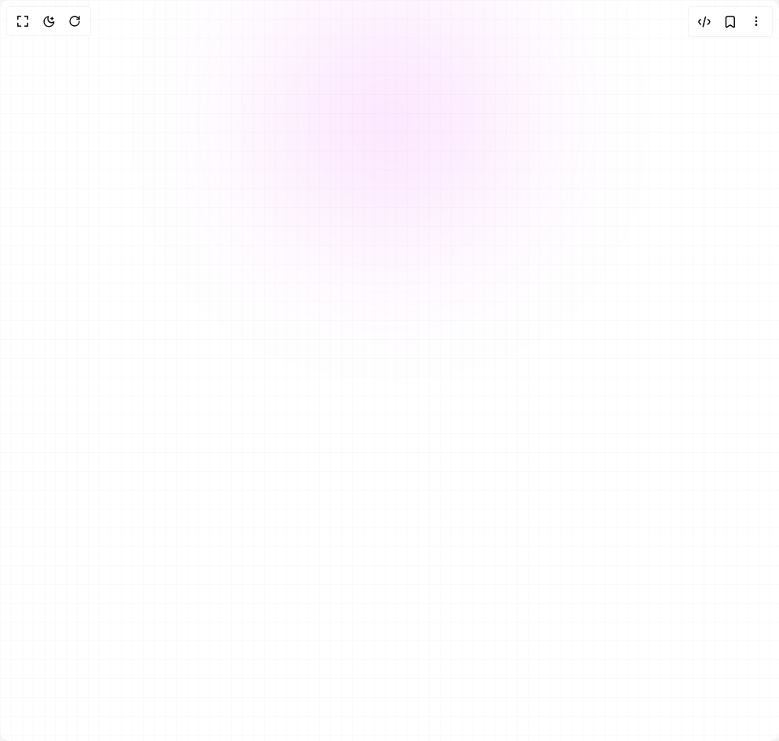

# Build Background Snippets in BuilderStudio

> Build this component in our Agentic IDE: [BuilderStudio](https://builderstudio.dev).
>
> Join the BuilderStudio community on [Discord](https://discord.gg/QdWeSGCqfe) and [Reddit](https://reddit.com/r/builderstudio).



## Component

- Author group: `bg.ibelick`
- Component: `background-snippets`
- Variant: `background-grid-fuchsia`
- Rendered HTML snapshot: [`rendered.html`](rendered.html)

## BuilderStudio prompt

You are implementing a React component based on a component reference.

## Component identity

- Author: bg.ibelick
- Component slug: background-snippets
- Demo slug: background-grid-fuchsia
- Title: background-snippets
- Description: 

## Goal

Recreate this component in a React + TypeScript + Tailwind CSS project. Preserve the visual layout, spacing, colors, border radius, shadows, interaction behavior, animation behavior, responsive behavior, and dark mode behavior shown in the rendered demo.

## Implementation requirements

- Use React and TypeScript.
- Use Tailwind CSS classes whenever possible.
- Keep the component self-contained unless the source files require helper components.
- If the source uses CSS variables, custom CSS, animations, or keyframes, include them.
- If the source uses external packages, list and use the required packages.
- Preserve accessibility attributes, button semantics, links, keyboard behavior, and ARIA attributes when visible in the source.
- Do not replace the component with a simplified placeholder.
- Return complete production-ready code.

## Dependencies

No reference metadata available.

## Rendered DOM snapshot

This is the rendered demo HTML extracted from the live preview. Use it to verify structure, class names, visible content, and layout.

```html
<div id="root"><div class="w-screen min-h-screen flex justify-center items-center"><div class="w-screen min-h-screen flex justify-center items-center"><div class="absolute inset-0 -z-10 h-full w-full bg-white bg-[linear-gradient(to_right,#8080800a_1px,transparent_1px),linear-gradient(to_bottom,#8080800a_1px,transparent_1px)] bg-[size:14px_24px]"><div class="absolute left-0 right-0 top-0 -z-10 m-auto h-[310px] w-[310px] rounded-full bg-fuchsia-400 opacity-20 blur-[100px]"></div></div></div></div></div>
```

## Reference source files

No reference source files were available.
