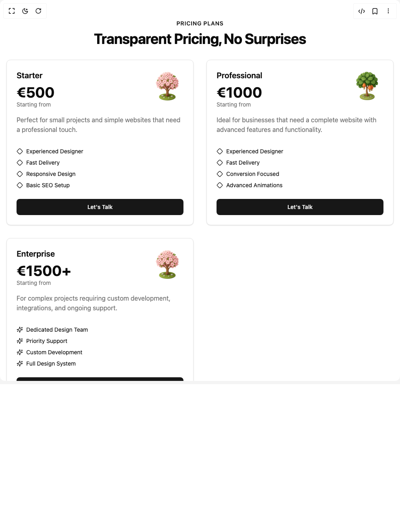

# Build Pricing Section in BuilderStudio

> Build this component in our Agentic IDE: [BuilderStudio](https://builderstudio.dev).
>
> Join the BuilderStudio community on [Discord](https://discord.gg/QdWeSGCqfe) and [Reddit](https://reddit.com/r/builderstudio).



## Component

- Author group: `bigbogiballer`
- Component: `pricing-section`
- Variant: `default`
- Rendered HTML snapshot: [`rendered.html`](rendered.html)

## BuilderStudio prompt

You are implementing a React component based on a component reference.

## Component identity

- Author: bigbogiballer
- Component slug: pricing-section
- Demo slug: default
- Title: pricing-section
- Description: 

## Goal

Recreate this component in a React + TypeScript + Tailwind CSS project. Preserve the visual layout, spacing, colors, border radius, shadows, interaction behavior, animation behavior, responsive behavior, and dark mode behavior shown in the rendered demo.

## Implementation requirements

- Use React and TypeScript.
- Use Tailwind CSS classes whenever possible.
- Keep the component self-contained unless the source files require helper components.
- If the source uses CSS variables, custom CSS, animations, or keyframes, include them.
- If the source uses external packages, list and use the required packages.
- Preserve accessibility attributes, button semantics, links, keyboard behavior, and ARIA attributes when visible in the source.
- Do not replace the component with a simplified placeholder.
- Return complete production-ready code.

## Dependencies

No reference metadata available.

## Rendered DOM snapshot

This is the rendered demo HTML extracted from the live preview. Use it to verify structure, class names, visible content, and layout.

```html
<div id="root"><div class="w-screen min-h-screen flex justify-center items-center"><div class="w-screen min-h-screen flex justify-center items-center"><div class="flex min-h-screen w-full items-center justify-center bg-background px-4 py-12"><div class="w-full max-w-5xl space-y-8"><div class="text-center"><p class="text-sm font-semibold uppercase tracking-wider text-primary">Pricing Plans</p><h1 class="mt-2 text-3xl font-bold tracking-tight sm:text-4xl">Transparent Pricing, No Surprises</h1></div><div class="grid grid-cols-1 gap-8 md:grid-cols-2 lg:grid-cols-3"><div class="relative flex flex-col justify-between rounded-lg border bg-card p-6 text-card-foreground shadow-sm transition-shadow duration-300" style="transform: none;"><div class="flex flex-col space-y-4"><div class="flex justify-between items-start"><div><h3 class="text-xl font-semibold">Starter</h3><div class="mt-2"><span class="text-4xl font-bold">€500</span><p class="text-sm text-muted-foreground">Starting from</p></div></div></div><p class="text-muted-foreground">Perfect for small projects and simple websites that need a professional touch.</p><ul class="space-y-2 pt-4"><li class="flex items-center gap-2"><svg xmlns="http://www.w3.org/2000/svg" width="24" height="24" viewBox="0 0 24 24" fill="none" stroke="currentColor" stroke-width="2" stroke-linecap="round" stroke-linejoin="round" class="lucide lucide-diamond h-4 w-4 text-primary" aria-hidden="true"><path d="M2.7 10.3a2.41 2.41 0 0 0 0 3.41l7.59 7.59a2.41 2.41 0 0 0 3.41 0l7.59-7.59a2.41 2.41 0 0 0 0-3.41l-7.59-7.59a2.41 2.41 0 0 0-3.41 0Z"></path></svg><span class="text-sm">Experienced Designer</span></li><li class="flex items-center gap-2"><svg xmlns="http://www.w3.org/2000/svg" width="24" height="24" viewBox="0 0 24 24" fill="none" stroke="currentColor" stroke-width="2" stroke-linecap="round" stroke-linejoin="round" class="lucide lucide-diamond h-4 w-4 text-primary" aria-hidden="true"><path d="M2.7 10.3a2.41 2.41 0 0 0 0 3.41l7.59 7.59a2.41 2.41 0 0 0 3.41 0l7.59-7.59a2.41 2.41 0 0 0 0-3.41l-7.59-7.59a2.41 2.41 0 0 0-3.41 0Z"></path></svg><span class="text-sm">Fast Delivery</span></li><li class="flex items-center gap-2"><svg xmlns="http://www.w3.org/2000/svg" width="24" height="24" viewBox="0 0 24 24" fill="none" stroke="currentColor" stroke-width="2" stroke-linecap="round" stroke-linejoin="round" class="lucide lucide-diamond h-4 w-4 text-primary" aria-hidden="true"><path d="M2.7 10.3a2.41 2.41 0 0 0 0 3.41l7.59 7.59a2.41 2.41 0 0 0 3.41 0l7.59-7.59a2.41 2.41 0 0 0 0-3.41l-7.59-7.59a2.41 2.41 0 0 0-3.41 0Z"></path></svg><span class="text-sm">Responsive Design</span></li><li class="flex items-center gap-2"><svg xmlns="http://www.w3.org/2000/svg" width="24" height="24" viewBox="0 0 24 24" fill="none" stroke="currentColor" stroke-width="2" stroke-linecap="round" stroke-linejoin="round" class="lucide lucide-diamond h-4 w-4 text-primary" aria-hidden="true"><path d="M2.7 10.3a2.41 2.41 0 0 0 0 3.41l7.59 7.59a2.41 2.41 0 0 0 3.41 0l7.59-7.59a2.41 2.41 0 0 0 0-3.41l-7.59-7.59a2.41 2.41 0 0 0-3.41 0Z"></path></svg><span class="text-sm">Basic SEO Setup</span></li></ul></div><div class="mt-6"><button class="inline-flex items-center justify-center whitespace-nowrap rounded-md text-sm font-medium ring-offset-background transition-colors focus-visible:outline-none focus-visible:ring-2 focus-visible:ring-ring focus-visible:ring-offset-2 disabled:pointer-events-none disabled:opacity-50 bg-primary text-primary-foreground hover:bg-primary/90 h-10 px-4 py-2 w-full">Let's Talk</button></div></div><div class="relative flex flex-col justify-between rounded-lg border bg-card p-6 text-card-foreground shadow-sm transition-shadow duration-300" style="transform: none;"><div class="flex flex-col space-y-4"><div class="flex justify-between items-start"><div><h3 class="text-xl font-semibold">Professional</h3><div class="mt-2"><span class="text-4xl font-bold">€1000</span><p class="text-sm text-muted-foreground">Starting from</p></div></div></div><p class="text-muted-foreground">Ideal for businesses that need a complete website with advanced features and functionality.</p><ul class="space-y-2 pt-4"><li class="flex items-center gap-2"><svg xmlns="http://www.w3.org/2000/svg" width="24" height="24" viewBox="0 0 24 24" fill="none" stroke="currentColor" stroke-width="2" stroke-linecap="round" stroke-linejoin="round" class="lucide lucide-diamond h-4 w-4 text-primary" aria-hidden="true"><path d="M2.7 10.3a2.41 2.41 0 0 0 0 3.41l7.59 7.59a2.41 2.41 0 0 0 3.41 0l7.59-7.59a2.41 2.41 0 0 0 0-3.41l-7.59-7.59a2.41 2.41 0 0 0-3.41 0Z"></path></svg><span class="text-sm">Experienced Designer</span></li><li class="flex items-center gap-2"><svg xmlns="http://www.w3.org/2000/svg" width="24" height="24" viewBox="0 0 24 24" fill="none" stroke="currentColor" stroke-width="2" stroke-linecap="round" stroke-linejoin="round" class="lucide lucide-diamond h-4 w-4 text-primary" aria-hidden="true"><path d="M2.7 10.3a2.41 2.41 0 0 0 0 3.41l7.59 7.59a2.41 2.41 0 0 0 3.41 0l7.59-7.59a2.41 2.41 0 0 0 0-3.41l-7.59-7.59a2.41 2.41 0 0 0-3.41 0Z"></path></svg><span class="text-sm">Fast Delivery</span></li><li class="flex items-center gap-2"><svg xmlns="http://www.w3.org/2000/svg" width="24" height="24" viewBox="0 0 24 24" fill="none" stroke="currentColor" stroke-width="2" stroke-linecap="round" stroke-linejoin="round" class="lucide lucide-diamond h-4 w-4 text-primary" aria-hidden="true"><path d="M2.7 10.3a2.41 2.41 0 0 0 0 3.41l7.59 7.59a2.41 2.41 0 0 0 3.41 0l7.59-7.59a2.41 2.41 0 0 0 0-3.41l-7.59-7.59a2.41 2.41 0 0 0-3.41 0Z"></path></svg><span class="text-sm">Conversion Focused</span></li><li class="flex items-center gap-2"><svg xmlns="http://www.w3.org/2000/svg" width="24" height="24" viewBox="0 0 24 24" fill="none" stroke="currentColor" stroke-width="2" stroke-linecap="round" stroke-linejoin="round" class="lucide lucide-diamond h-4 w-4 text-primary" aria-hidden="true"><path d="M2.7 10.3a2.41 2.41 0 0 0 0 3.41l7.59 7.59a2.41 2.41 0 0 0 3.41 0l7.59-7.59a2.41 2.41 0 0 0 0-3.41l-7.59-7.59a2.41 2.41 0 0 0-3.41 0Z"></path></svg><span class="text-sm">Advanced Animations</span></li></ul></div><div class="mt-6"><button class="inline-flex items-center justify-center whitespace-nowrap rounded-md text-sm font-medium ring-offset-background transition-colors focus-visible:outline-none focus-visible:ring-2 focus-visible:ring-ring focus-visible:ring-offset-2 disabled:pointer-events-none disabled:opacity-50 bg-primary text-primary-foreground hover:bg-primary/90 h-10 px-4 py-2 w-full">Let's Talk</button></div></div><div class="relative flex flex-col justify-between rounded-lg border bg-card p-6 text-card-foreground shadow-sm transition-shadow duration-300" style="transform: none;"><div class="flex flex-col space-y-4"><div class="flex justify-between items-start"><div><h3 class="text-xl font-semibold">Enterprise</h3><div class="mt-2"><span class="text-4xl font-bold">€1500+</span><p class="text-sm text-muted-foreground">Starting from</p></div></div></div><p class="text-muted-foreground">For complex projects requiring custom development, integrations, and ongoing support.</p><ul class="space-y-2 pt-4"><li class="flex items-center gap-2"><svg xmlns="http://www.w3.org/2000/svg" width="24" height="24" viewBox="0 0 24 24" fill="none" stroke="currentColor" stroke-width="2" stroke-linecap="round" stroke-linejoin="round" class="lucide lucide-sparkles h-4 w-4 text-primary" aria-hidden="true"><path d="M9.937 15.5A2 2 0 0 0 8.5 14.063l-6.135-1.582a.5.5 0 0 1 0-.962L8.5 9.936A2 2 0 0 0 9.937 8.5l1.582-6.135a.5.5 0 0 1 .963 0L14.063 8.5A2 2 0 0 0 15.5 9.937l6.135 1.581a.5.5 0 0 1 0 .964L15.5 14.063a2 2 0 0 0-1.437 1.437l-1.582 6.135a.5.5 0 0 1-.963 0z"></path><path d="M20 3v4"></path><path d="M22 5h-4"></path><path d="M4 17v2"></path><path d="M5 18H3"></path></svg><span class="text-sm">Dedicated Design Team</span></li><li class="flex items-center gap-2"><svg xmlns="http://www.w3.org/2000/svg" width="24" height="24" viewBox="0 0 24 24" fill="none" stroke="currentColor" stroke-width="2" stroke-linecap="round" stroke-linejoin="round" class="lucide lucide-sparkles h-4 w-4 text-primary" aria-hidden="true"><path d="M9.937 15.5A2 2 0 0 0 8.5 14.063l-6.135-1.582a.5.5 0 0 1 0-.962L8.5 9.936A2 2 0 0 0 9.937 8.5l1.582-6.135a.5.5 0 0 1 .963 0L14.063 8.5A2 2 0 0 0 15.5 9.937l6.135 1.581a.5.5 0 0 1 0 .964L15.5 14.063a2 2 0 0 0-1.437 1.437l-1.582 6.135a.5.5 0 0 1-.963 0z"></path><path d="M20 3v4"></path><path d="M22 5h-4"></path><path d="M4 17v2"></path><path d="M5 18H3"></path></svg><span class="text-sm">Priority Support</span></li><li class="flex items-center gap-2"><svg xmlns="http://www.w3.org/2000/svg" width="24" height="24" viewBox="0 0 24 24" fill="none" stroke="currentColor" stroke-width="2" stroke-linecap="round" stroke-linejoin="round" class="lucide lucide-sparkles h-4 w-4 text-primary" aria-hidden="true"><path d="M9.937 15.5A2 2 0 0 0 8.5 14.063l-6.135-1.582a.5.5 0 0 1 0-.962L8.5 9.936A2 2 0 0 0 9.937 8.5l1.582-6.135a.5.5 0 0 1 .963 0L14.063 8.5A2 2 0 0 0 15.5 9.937l6.135 1.581a.5.5 0 0 1 0 .964L15.5 14.063a2 2 0 0 0-1.437 1.437l-1.582 6.135a.5.5 0 0 1-.963 0z"></path><path d="M20 3v4"></path><path d="M22 5h-4"></path><path d="M4 17v2"></path><path d="M5 18H3"></path></svg><span class="text-sm">Custom Development</span></li><li class="flex items-center gap-2"><svg xmlns="http://www.w3.org/2000/svg" width="24" height="24" viewBox="0 0 24 24" fill="none" stroke="currentColor" stroke-width="2" stroke-linecap="round" stroke-linejoin="round" class="lucide lucide-sparkles h-4 w-4 text-primary" aria-hidden="true"><path d="M9.937 15.5A2 2 0 0 0 8.5 14.063l-6.135-1.582a.5.5 0 0 1 0-.962L8.5 9.936A2 2 0 0 0 9.937 8.5l1.582-6.135a.5.5 0 0 1 .963 0L14.063 8.5A2 2 0 0 0 15.5 9.937l6.135 1.581a.5.5 0 0 1 0 .964L15.5 14.063a2 2 0 0 0-1.437 1.437l-1.582 6.135a.5.5 0 0 1-.963 0z"></path><path d="M20 3v4"></path><path d="M22 5h-4"></path><path d="M4 17v2"></path><path d="M5 18H3"></path></svg><span class="text-sm">Full Design System</span></li></ul></div><div class="mt-6"><button class="inline-flex items-center justify-center whitespace-nowrap rounded-md text-sm font-medium ring-offset-background transition-colors focus-visible:outline-none focus-visible:ring-2 focus-visible:ring-ring focus-visible:ring-offset-2 disabled:pointer-events-none disabled:opacity-50 bg-primary text-primary-foreground hover:bg-primary/90 h-10 px-4 py-2 w-full">Let's Talk</button></div></div></div><div class="rounded-lg border bg-card p-6 text-card-foreground shadow-sm"><h3 class="text-xl font-semibold">Unique Request</h3><p class="mt-2 text-muted-foreground">Are you looking for something custom? Don't hesitate to contact us, and we'll help brainstorm your product to success.</p><div class="mt-6"><button class="inline-flex items-center justify-center whitespace-nowrap rounded-md text-sm font-medium ring-offset-background transition-colors focus-visible:outline-none focus-visible:ring-2 focus-visible:ring-ring focus-visible:ring-offset-2 disabled:pointer-events-none disabled:opacity-50 bg-primary text-primary-foreground hover:bg-primary/90 h-10 px-4 py-2 w-full md:w-auto">Let's Talk</button></div></div></div></div></div></div></div>
```

## Reference source files

No reference source files were available.
