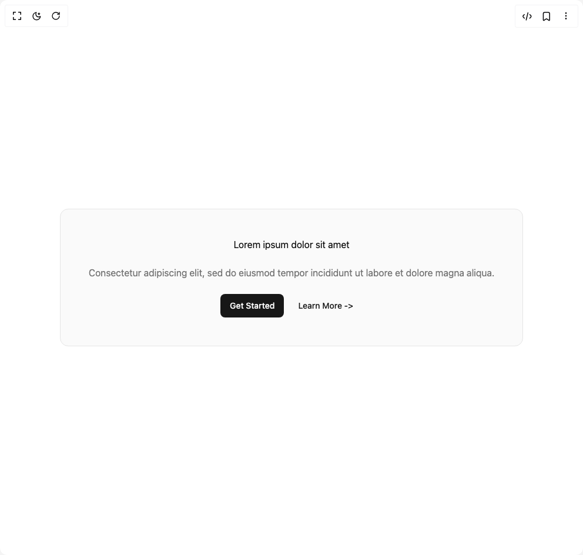

# Build Call To Action 1 in BuilderStudio

> Build this component in our Agentic IDE: [BuilderStudio](https://builderstudio.dev).
>
> Join the BuilderStudio community on [Discord](https://discord.gg/QdWeSGCqfe) and [Reddit](https://reddit.com/r/builderstudio).



## Component

- Author group: `brijr`
- Component: `call-to-action-1`
- Variant: `call-to-action-three`
- Rendered HTML snapshot: [`rendered.html`](rendered.html)

## BuilderStudio prompt

You are implementing a React component based on a component reference.

## Component identity

- Author: brijr
- Component slug: call-to-action-1
- Demo slug: call-to-action-three
- Title: call-to-action-1
- Description: 

## Goal

Recreate this component in a React + TypeScript + Tailwind CSS project. Preserve the visual layout, spacing, colors, border radius, shadows, interaction behavior, animation behavior, responsive behavior, and dark mode behavior shown in the rendered demo.

## Implementation requirements

- Use React and TypeScript.
- Use Tailwind CSS classes whenever possible.
- Keep the component self-contained unless the source files require helper components.
- If the source uses CSS variables, custom CSS, animations, or keyframes, include them.
- If the source uses external packages, list and use the required packages.
- Preserve accessibility attributes, button semantics, links, keyboard behavior, and ARIA attributes when visible in the source.
- Do not replace the component with a simplified placeholder.
- Return complete production-ready code.

## Dependencies

No reference metadata available.

## Rendered DOM snapshot

This is the rendered demo HTML extracted from the live preview. Use it to verify structure, class names, visible content, and layout.

```html
<div id="root"><div class="w-screen min-h-screen flex justify-center items-center"><div class="w-screen min-h-screen flex justify-center items-center"><section class="py-8 md:py-12 px-4"><div class="mx-auto max-w-5xl sm:p-8 flex flex-col items-center gap-6 rounded-lg border bg-accent/50 p-6 text-center md:rounded-xl md:p-12"><h2 class="!my-0">Lorem ipsum dolor sit amet</h2><h3 class="!mb-0 text-muted-foreground"><span data-br="«r0»" data-brr="1" style="display: inline-block; vertical-align: top; text-decoration: inherit; text-wrap: balance; max-width: 690.5px;">Consectetur adipiscing elit, sed do eiusmod tempor incididunt ut labore et dolore magna aliqua.</span><script>self.__wrap_n=self.__wrap_n||(self.CSS&&CSS.supports("text-wrap","balance")?1:2);self.__wrap_b=(o,T,g)=>{g=g||document.querySelector(`[data-br="${o}"]`);let s=g==null?void 0:g.parentElement;if(!s)return;let A=i(N=>g.style.maxWidth=N+"px","l");g.style.maxWidth="";let R=s.clientWidth,H=s.clientHeight,X=R/2-.25,x=R+.5,p;if(R){for(A(X),X=Math.max(g.scrollWidth,X);X+1<x;)p=Math.round((X+x)/2),A(p),s.clientHeight===H?x=p:X=p;A(x*T+R*(1-T))}g.__wrap_o||typeof ResizeObserver<"u"&&(g.__wrap_o=new ResizeObserver(()=>{self.__wrap_b(0,+g.dataset.brr,g)})).observe(s)};self.__wrap_n!=1&&self.__wrap_b("«r0»",1)</script></h3><div class="not-prose mx-auto flex items-center gap-2"><a href="#" class="inline-flex items-center justify-center whitespace-nowrap rounded-md text-sm font-medium ring-offset-background transition-colors focus-visible:outline-none focus-visible:ring-2 focus-visible:ring-ring focus-visible:ring-offset-2 disabled:pointer-events-none disabled:opacity-50 bg-primary text-primary-foreground hover:bg-primary/90 h-10 px-4 py-2 w-fit">Get Started</a><a href="#" class="inline-flex items-center justify-center whitespace-nowrap rounded-md text-sm font-medium ring-offset-background transition-colors focus-visible:outline-none focus-visible:ring-2 focus-visible:ring-ring focus-visible:ring-offset-2 disabled:pointer-events-none disabled:opacity-50 text-primary underline-offset-4 hover:underline h-10 px-4 py-2 w-fit">Learn More -&gt;</a></div></div></section></div></div></div>
```

## Reference source files

No reference source files were available.
