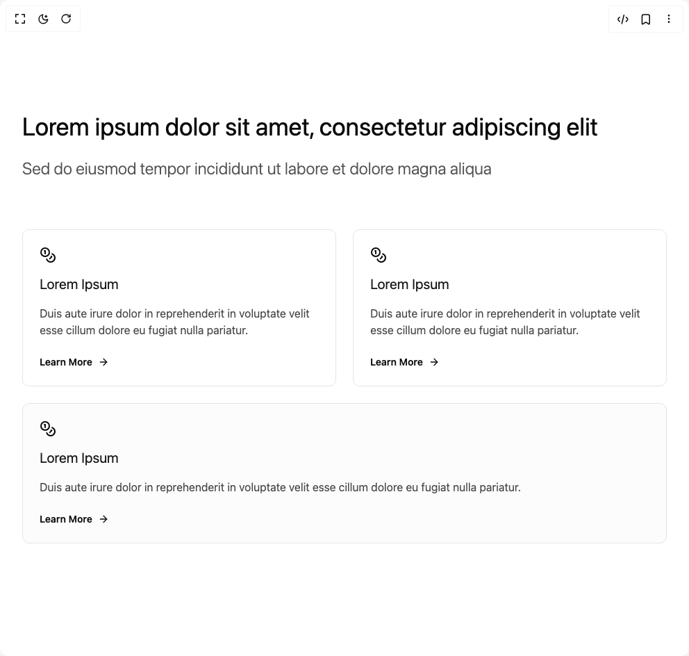

# Build Feature Modern in BuilderStudio

> Build this component in our Agentic IDE: [BuilderStudio](https://builderstudio.dev).
>
> Join the BuilderStudio community on [Discord](https://discord.gg/QdWeSGCqfe) and [Reddit](https://reddit.com/r/builderstudio).



## Component

- Author group: `brijr`
- Component: `feature-modern`
- Variant: `feature-six`
- Rendered HTML snapshot: [`rendered.html`](rendered.html)

## BuilderStudio prompt

You are implementing a React component based on a component reference.

## Component identity

- Author: brijr
- Component slug: feature-modern
- Demo slug: feature-six
- Title: feature-modern
- Description: 

## Goal

Recreate this component in a React + TypeScript + Tailwind CSS project. Preserve the visual layout, spacing, colors, border radius, shadows, interaction behavior, animation behavior, responsive behavior, and dark mode behavior shown in the rendered demo.

## Implementation requirements

- Use React and TypeScript.
- Use Tailwind CSS classes whenever possible.
- Keep the component self-contained unless the source files require helper components.
- If the source uses CSS variables, custom CSS, animations, or keyframes, include them.
- If the source uses external packages, list and use the required packages.
- Preserve accessibility attributes, button semantics, links, keyboard behavior, and ARIA attributes when visible in the source.
- Do not replace the component with a simplified placeholder.
- Return complete production-ready code.

## Dependencies

No reference metadata available.

## Rendered DOM snapshot

This is the rendered demo HTML extracted from the live preview. Use it to verify structure, class names, visible content, and layout.

```html
<div id="root"><div class="w-screen min-h-screen flex justify-center items-center"><div class="w-screen min-h-screen flex justify-center items-center"><section class="py-8 md:py-12"><div class="mx-auto max-w-5xl p-6 sm:p-8 not-prose"><div class="flex flex-col gap-6"><h3 class="text-4xl"><span data-br="«r0»" data-brr="1" style="display: inline-block; vertical-align: top; text-decoration: inherit; text-wrap: balance; max-width: 830px;">Lorem ipsum dolor sit amet, consectetur adipiscing elit</span><script>self.__wrap_n=self.__wrap_n||(self.CSS&&CSS.supports("text-wrap","balance")?1:2);self.__wrap_b=(s,A,p)=>{p=p||document.querySelector(`[data-br="${s}"]`);let o=p==null?void 0:p.parentElement;if(!o)return;let O=i(N=>p.style.maxWidth=N+"px","l");p.style.maxWidth="";let R=o.clientWidth,q=o.clientHeight,Z=R/2-.25,_=R+.5,T;if(R){for(O(Z),Z=Math.max(p.scrollWidth,Z);Z+1<_;)T=Math.round((Z+_)/2),O(T),o.clientHeight===q?_=T:Z=T;O(_*A+R*(1-A))}p.__wrap_o||typeof ResizeObserver<"u"&&(p.__wrap_o=new ResizeObserver(()=>{self.__wrap_b(0,+p.dataset.brr,p)})).observe(o)};self.__wrap_n!=1&&self.__wrap_b("«r0»",1)</script></h3><h4 class="text-2xl font-light opacity-70"><span data-br="«r1»" data-brr="1" style="display: inline-block; vertical-align: top; text-decoration: inherit; text-wrap: balance; max-width: 677px;">Sed do eiusmod tempor incididunt ut labore et dolore magna aliqua</span><script>self.__wrap_n=self.__wrap_n||(self.CSS&&CSS.supports("text-wrap","balance")?1:2);self.__wrap_b=(s,A,p)=>{p=p||document.querySelector(`[data-br="${s}"]`);let o=p==null?void 0:p.parentElement;if(!o)return;let O=i(N=>p.style.maxWidth=N+"px","l");p.style.maxWidth="";let R=o.clientWidth,q=o.clientHeight,Z=R/2-.25,_=R+.5,T;if(R){for(O(Z),Z=Math.max(p.scrollWidth,Z);Z+1<_;)T=Math.round((Z+_)/2),O(T),o.clientHeight===q?_=T:Z=T;O(_*A+R*(1-A))}p.__wrap_o||typeof ResizeObserver<"u"&&(p.__wrap_o=new ResizeObserver(()=>{self.__wrap_b(0,+p.dataset.brr,p)})).observe(o)};self.__wrap_n!=1&&self.__wrap_b("«r1»",1)</script></h4><div class="mt-6 grid gap-6 md:mt-12 md:grid-cols-2"><a href="/" class="flex flex-col justify-between gap-6 rounded-lg border p-6 transition-all hover:-mt-2 hover:mb-2"><div class="grid gap-4"><svg xmlns="http://www.w3.org/2000/svg" width="24" height="24" viewBox="0 0 24 24" fill="none" stroke="currentColor" stroke-width="2" stroke-linecap="round" stroke-linejoin="round" class="lucide lucide-coins h-6 w-6" aria-hidden="true"><circle cx="8" cy="8" r="6"></circle><path d="M18.09 10.37A6 6 0 1 1 10.34 18"></path><path d="M7 6h1v4"></path><path d="m16.71 13.88.7.71-2.82 2.82"></path></svg><h4 class="text-xl text-primary">Lorem Ipsum</h4><p class="text-base opacity-75">Duis aute irure dolor in reprehenderit in voluptate velit esse cillum dolore eu fugiat nulla pariatur.</p></div><div class="flex h-fit items-center text-sm font-semibold"><span>Learn More</span> <svg xmlns="http://www.w3.org/2000/svg" width="24" height="24" viewBox="0 0 24 24" fill="none" stroke="currentColor" stroke-width="2" stroke-linecap="round" stroke-linejoin="round" class="lucide lucide-arrow-right ml-2 h-4 w-4" aria-hidden="true"><path d="M5 12h14"></path><path d="m12 5 7 7-7 7"></path></svg></div></a><a href="/" class="flex flex-col justify-between gap-6 rounded-lg border p-6 transition-all hover:-mt-2 hover:mb-2"><div class="grid gap-4"><svg xmlns="http://www.w3.org/2000/svg" width="24" height="24" viewBox="0 0 24 24" fill="none" stroke="currentColor" stroke-width="2" stroke-linecap="round" stroke-linejoin="round" class="lucide lucide-coins h-6 w-6" aria-hidden="true"><circle cx="8" cy="8" r="6"></circle><path d="M18.09 10.37A6 6 0 1 1 10.34 18"></path><path d="M7 6h1v4"></path><path d="m16.71 13.88.7.71-2.82 2.82"></path></svg><h4 class="text-xl text-primary">Lorem Ipsum</h4><p class="text-base opacity-75">Duis aute irure dolor in reprehenderit in voluptate velit esse cillum dolore eu fugiat nulla pariatur.</p></div><div class="flex h-fit items-center text-sm font-semibold"><span>Learn More</span> <svg xmlns="http://www.w3.org/2000/svg" width="24" height="24" viewBox="0 0 24 24" fill="none" stroke="currentColor" stroke-width="2" stroke-linecap="round" stroke-linejoin="round" class="lucide lucide-arrow-right ml-2 h-4 w-4" aria-hidden="true"><path d="M5 12h14"></path><path d="m12 5 7 7-7 7"></path></svg></div></a></div><div><a href="/" class="flex flex-col justify-between gap-6 rounded-lg border bg-muted/25 p-6 transition-all hover:-mt-2 hover:mb-2"><div class="grid gap-4"><svg xmlns="http://www.w3.org/2000/svg" width="24" height="24" viewBox="0 0 24 24" fill="none" stroke="currentColor" stroke-width="2" stroke-linecap="round" stroke-linejoin="round" class="lucide lucide-coins h-6 w-6" aria-hidden="true"><circle cx="8" cy="8" r="6"></circle><path d="M18.09 10.37A6 6 0 1 1 10.34 18"></path><path d="M7 6h1v4"></path><path d="m16.71 13.88.7.71-2.82 2.82"></path></svg><h4 class="text-xl text-primary">Lorem Ipsum</h4><p class="text-base opacity-75">Duis aute irure dolor in reprehenderit in voluptate velit esse cillum dolore eu fugiat nulla pariatur.</p></div><div class="flex h-fit items-center text-sm font-semibold"><span>Learn More</span> <svg xmlns="http://www.w3.org/2000/svg" width="24" height="24" viewBox="0 0 24 24" fill="none" stroke="currentColor" stroke-width="2" stroke-linecap="round" stroke-linejoin="round" class="lucide lucide-arrow-right ml-2 h-4 w-4" aria-hidden="true"><path d="M5 12h14"></path><path d="m12 5 7 7-7 7"></path></svg></div></a></div></div></div></section></div></div></div>
```

## Reference source files

No reference source files were available.
