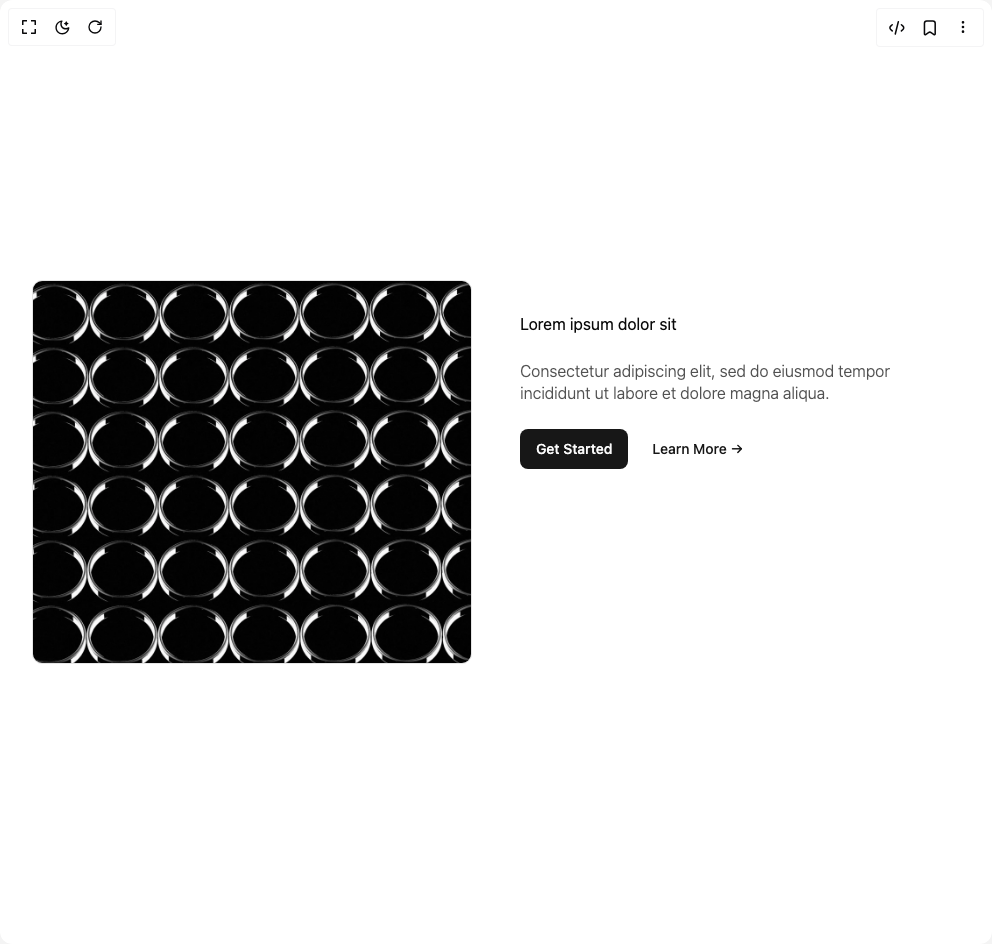

# Build Feature Modern in BuilderStudio

> Build this component in our Agentic IDE: [BuilderStudio](https://builderstudio.dev).
>
> Join the BuilderStudio community on [Discord](https://discord.gg/QdWeSGCqfe) and [Reddit](https://reddit.com/r/builderstudio).



## Component

- Author group: `brijr`
- Component: `feature-modern`
- Variant: `feature-three`
- Rendered HTML snapshot: [`rendered.html`](rendered.html)

## BuilderStudio prompt

You are implementing a React component based on a component reference.

## Component identity

- Author: brijr
- Component slug: feature-modern
- Demo slug: feature-three
- Title: feature-modern
- Description: 

## Goal

Recreate this component in a React + TypeScript + Tailwind CSS project. Preserve the visual layout, spacing, colors, border radius, shadows, interaction behavior, animation behavior, responsive behavior, and dark mode behavior shown in the rendered demo.

## Implementation requirements

- Use React and TypeScript.
- Use Tailwind CSS classes whenever possible.
- Keep the component self-contained unless the source files require helper components.
- If the source uses CSS variables, custom CSS, animations, or keyframes, include them.
- If the source uses external packages, list and use the required packages.
- Preserve accessibility attributes, button semantics, links, keyboard behavior, and ARIA attributes when visible in the source.
- Do not replace the component with a simplified placeholder.
- Return complete production-ready code.

## Dependencies

No reference metadata available.

## Rendered DOM snapshot

This is the rendered demo HTML extracted from the live preview. Use it to verify structure, class names, visible content, and layout.

```html
<div id="root"><div class="w-screen min-h-screen flex justify-center items-center"><div class="w-screen min-h-screen flex justify-center items-center"><section class="py-8 md:py-12"><div class="mx-auto max-w-5xl p-6 sm:p-8 grid items-stretch md:grid-cols-2 md:gap-12"><div class="not-prose relative h-96 overflow-hidden rounded-lg border"></div><div class="flex flex-col gap-6 py-8"><h3 class="!my-0">Lorem ipsum dolor sit</h3><p class="font-light leading-[1.4] opacity-70">Consectetur adipiscing elit, sed do eiusmod tempor incididunt ut labore et dolore magna aliqua.</p><div class="not-prose flex items-center gap-2"><a href="#" class="inline-flex items-center justify-center whitespace-nowrap rounded-md text-sm font-medium ring-offset-background transition-colors focus-visible:outline-none focus-visible:ring-2 focus-visible:ring-ring focus-visible:ring-offset-2 disabled:pointer-events-none disabled:opacity-50 bg-primary text-primary-foreground hover:bg-primary/90 h-10 px-4 py-2 w-fit">Get Started</a><a href="#" class="inline-flex items-center justify-center whitespace-nowrap rounded-md text-sm font-medium ring-offset-background transition-colors focus-visible:outline-none focus-visible:ring-2 focus-visible:ring-ring focus-visible:ring-offset-2 disabled:pointer-events-none disabled:opacity-50 text-primary underline-offset-4 hover:underline h-10 px-4 py-2 w-fit">Learn More →</a></div></div></div></section></div></div></div>
```

## Reference source files

No reference source files were available.
