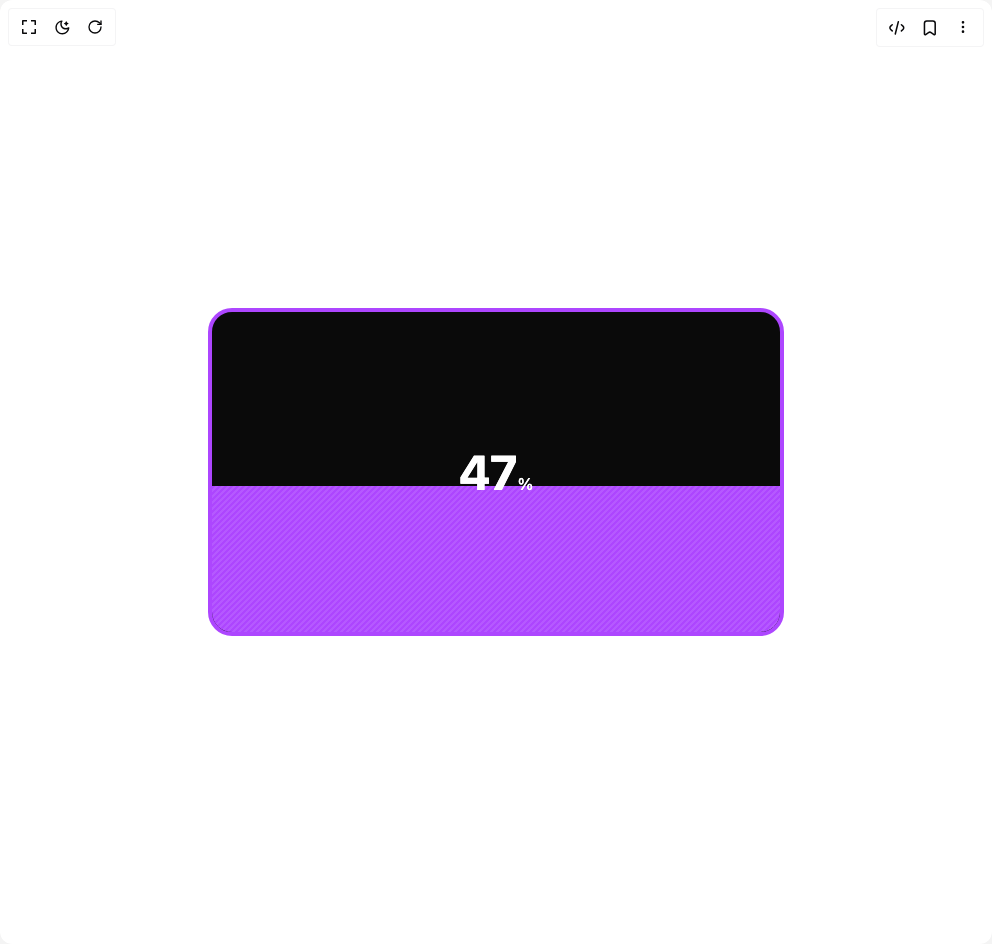

# Build Modern Verticle Progress in BuilderStudio

> Build this component in our Agentic IDE: [BuilderStudio](https://builderstudio.dev).
>
> Join the BuilderStudio community on [Discord](https://discord.gg/QdWeSGCqfe) and [Reddit](https://reddit.com/r/builderstudio).



## Component

- Author group: `bucharitesh`
- Component: `modern-verticle-progress`
- Variant: `default`
- Rendered HTML snapshot: [`rendered.html`](rendered.html)

## BuilderStudio prompt

You are implementing a React component based on a component reference.

## Component identity

- Author: bucharitesh
- Component slug: modern-verticle-progress
- Demo slug: default
- Title: modern-verticle-progress
- Description: 

## Goal

Recreate this component in a React + TypeScript + Tailwind CSS project. Preserve the visual layout, spacing, colors, border radius, shadows, interaction behavior, animation behavior, responsive behavior, and dark mode behavior shown in the rendered demo.

## Implementation requirements

- Use React and TypeScript.
- Use Tailwind CSS classes whenever possible.
- Keep the component self-contained unless the source files require helper components.
- If the source uses CSS variables, custom CSS, animations, or keyframes, include them.
- If the source uses external packages, list and use the required packages.
- Preserve accessibility attributes, button semantics, links, keyboard behavior, and ARIA attributes when visible in the source.
- Do not replace the component with a simplified placeholder.
- Return complete production-ready code.

## Dependencies

No reference metadata available.

## Rendered DOM snapshot

This is the rendered demo HTML extracted from the live preview. Use it to verify structure, class names, visible content, and layout.

```html
<div id="root"><div class="w-screen min-h-screen flex justify-center items-center"><div class="w-screen min-h-screen flex justify-center items-center"><div class="w-full h-full flex items-center justify-center max-w-xl"><div role="progressbar" aria-valuemin="0" aria-valuemax="100" aria-valuenow="47" class="w-full flex items-center justify-center relative overflow-hidden bg-neutral-950 border-4 rounded-3xl border-purple-500"><div class="w-full aspect-video relative"><div class="w-full absolute left-0 bottom-0 z-20 transition-[height,background-color] duration-300 [&amp;&gt;div]:bg-[linear-gradient(45deg,rgba(255,255,255,.15)_25%,transparent_25%,transparent_50%,rgba(255,255,255,.15)_50%,rgba(255,255,255,.15)_75%,transparent_75%,transparent)] [&amp;&gt;div]:bg-size-1 bg-purple-500" style="height: 47%;"><div data-pattern="stripes" class="w-full h-full relative z-10 transition-colors duration-300"></div></div><div class="absolute top-1/2 left-1/2 -translate-x-1/2 -translate-y-1/2 w-full h-full flex items-center justify-center z-20"><span class="text-white text-5xl font-bold">47<span class="text-white text-base font-medium">%</span></span></div></div></div></div></div></div></div>
```

## Reference source files

No reference source files were available.
