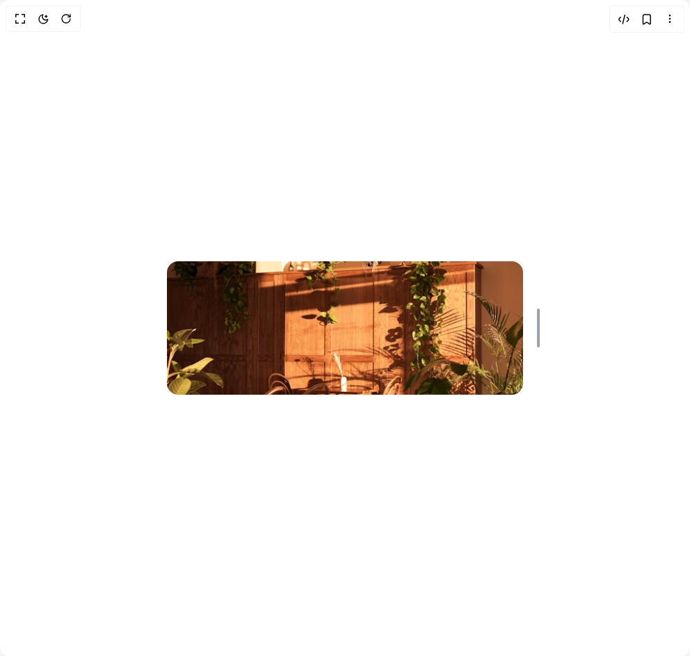

# Build View Magnifier in BuilderStudio

> Build this component in our Agentic IDE: [BuilderStudio](https://builderstudio.dev).
>
> Join the BuilderStudio community on [Discord](https://discord.gg/QdWeSGCqfe) and [Reddit](https://reddit.com/r/builderstudio).



## Component

- Author group: `bucharitesh`
- Component: `view-magnifier`
- Variant: `default`
- Rendered HTML snapshot: [`rendered.html`](rendered.html)

## BuilderStudio prompt

You are implementing a React component based on a component reference.

## Component identity

- Author: bucharitesh
- Component slug: view-magnifier
- Demo slug: default
- Title: view-magnifier
- Description: 

## Goal

Recreate this component in a React + TypeScript + Tailwind CSS project. Preserve the visual layout, spacing, colors, border radius, shadows, interaction behavior, animation behavior, responsive behavior, and dark mode behavior shown in the rendered demo.

## Implementation requirements

- Use React and TypeScript.
- Use Tailwind CSS classes whenever possible.
- Keep the component self-contained unless the source files require helper components.
- If the source uses CSS variables, custom CSS, animations, or keyframes, include them.
- If the source uses external packages, list and use the required packages.
- Preserve accessibility attributes, button semantics, links, keyboard behavior, and ARIA attributes when visible in the source.
- Do not replace the component with a simplified placeholder.
- Return complete production-ready code.

## Dependencies

No reference metadata available.

## Rendered DOM snapshot

This is the rendered demo HTML extracted from the live preview. Use it to verify structure, class names, visible content, and layout.

```html
<div id="root"><div class="w-screen min-h-screen flex justify-center items-center"><div class="w-screen min-h-screen flex justify-center items-center"><div class="relative w-full max-w-lg"><div class="outline-none z-40"><div class="fixed h-screen w-screen outline-none inset-0 pointer-events-none backdrop-blur-xl after:content-[''] after:rounded-[inherit] after:w-full after:h-full after:inset-0 after:absolute after:pointer-events-none dark:after:block dark:after:shadow-[inset_0_0_0_1px_hsla(0,0%,100%,0.2)]" aria-hidden="true" style="opacity: 0;"></div><div class="relative left-1/2 right-1/2 w-full h-auto overflow-visible my-3 z-[60] rounded-2xl transform lg:transform-none" role="img" aria-label="Content at zoom level 100%" style="transform: translateX(-50%);"><div class="relative w-full h-full rounded-2xl overflow-hidden"><div class="h-48 w-full bg-red-500"></div></div><div class="w-full h-full absolute rounded-[inherit] inset-0 shadow-[0px_1px_1px_0px_rgba(0,0,0,0.02),0px_16px_24px_-4px_rgba(0,0,0,0.04),0px_32px_48px_-8px_rgba(0,0,0,0.06)]" aria-hidden="true" style="opacity: 0;"></div><button aria-label="Drag to zoom. Current zoom level: 100%" aria-valuemin="80" aria-valuemax="180" aria-valuenow="100" role="slider" class="absolute top-1/2 -right-6 w-1 h-14 rounded-full bg-gray-400 dark:bg-gray-600 hover:bg-gray-500 dark:hover:bg-gray-500 transition-colors duration-300 focus-visible:outline-none focus-visible:ring-2 focus-visible:ring-gray-400 dark:focus-visible:ring-gray-500 focus-visible:ring-offset-2 focus-visible:ring-offset-white dark:focus-visible:ring-offset-gray-900 md:block hidden cursor-grab after:content-[''] after:absolute after:w-4 after:h-full after:-left-2 after:top-0" touch-action="none" style="transform: translateY(-50%);"></button></div></div></div></div></div></div>
```

## Reference source files

No reference source files were available.
