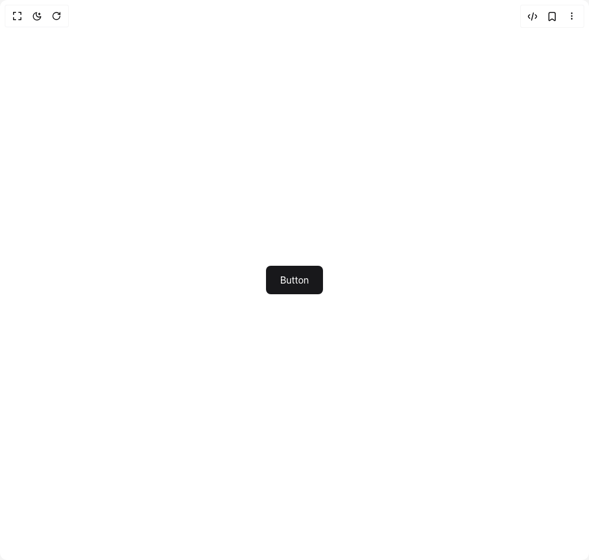
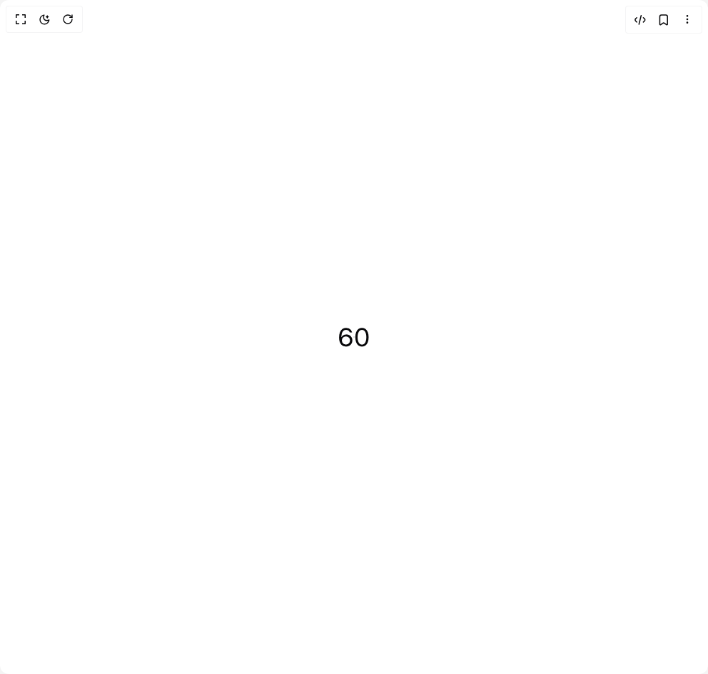

# Bundui Components

4 components are available in this author group.

> Build any component in [BuilderStudio](https://builderstudio.dev), then share improvements with the community on [Discord](https://discord.gg/QdWeSGCqfe) or [Reddit](https://reddit.com/r/builderstudio).

| Preview | Component | Variant |
| --- | --- | --- |
|  | [Animated Text](animated-text/animated-gradient-text/README.md) | `animated-gradient-text` |
|  | [Animated Text](animated-text/default/README.md) | `default` |
|  | [Button](button/default/README.md) | `default` |
|  | [Count Animation](count-animation/default/README.md) | `default` |
