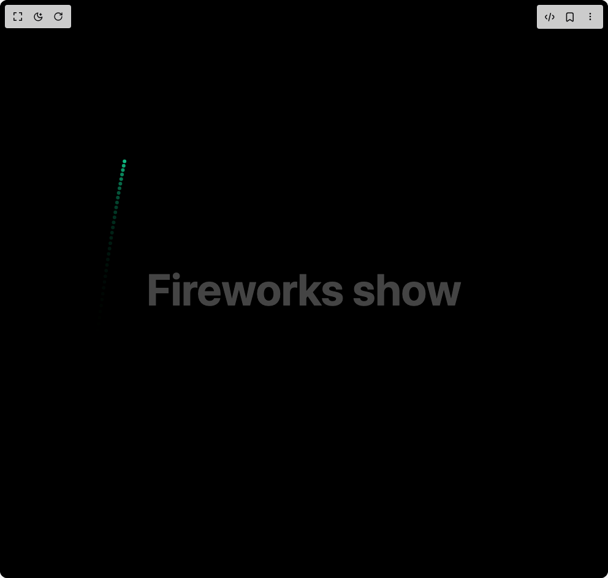
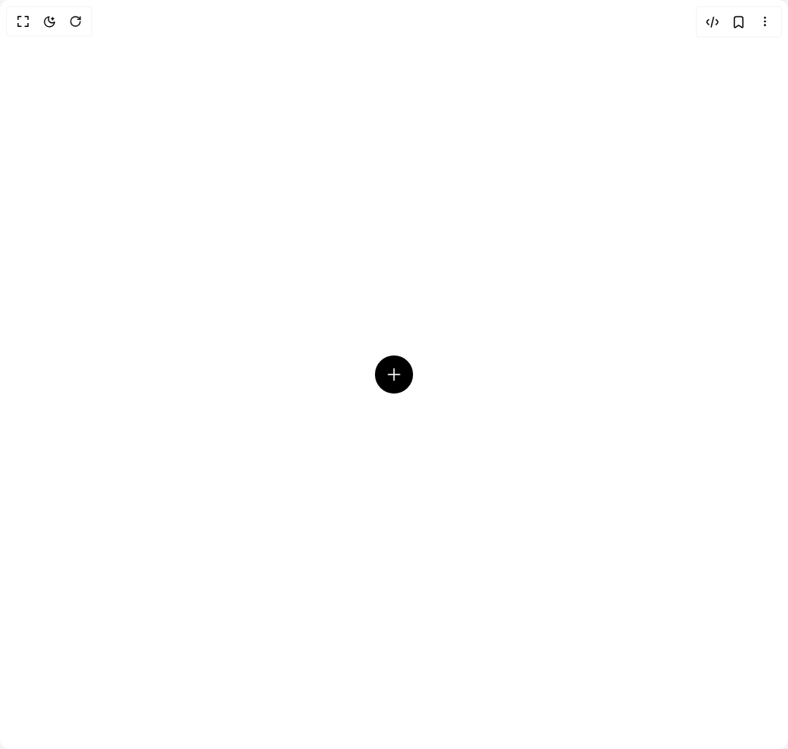
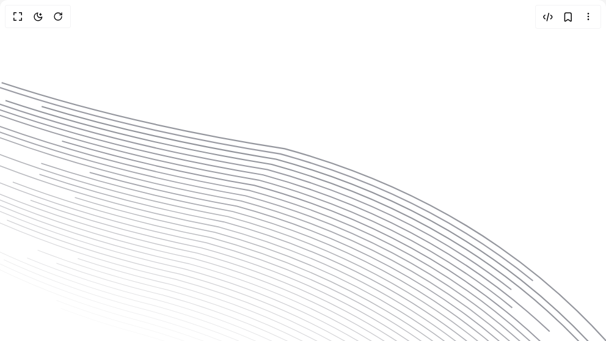
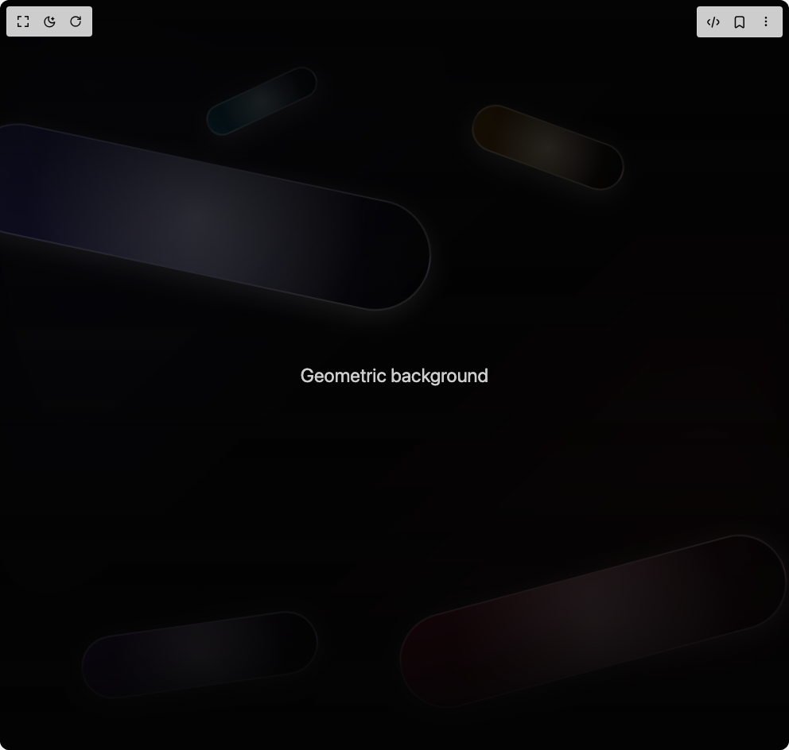
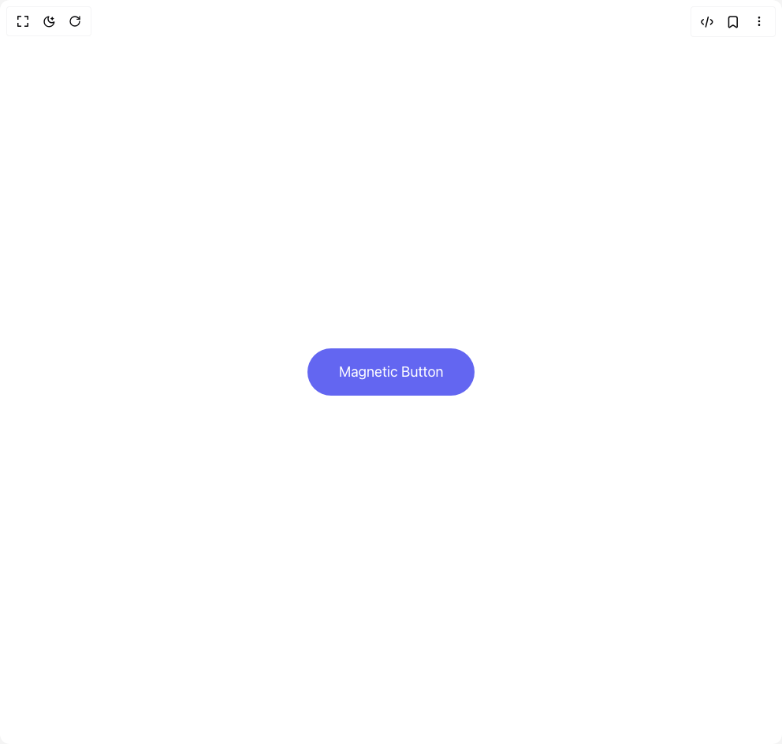
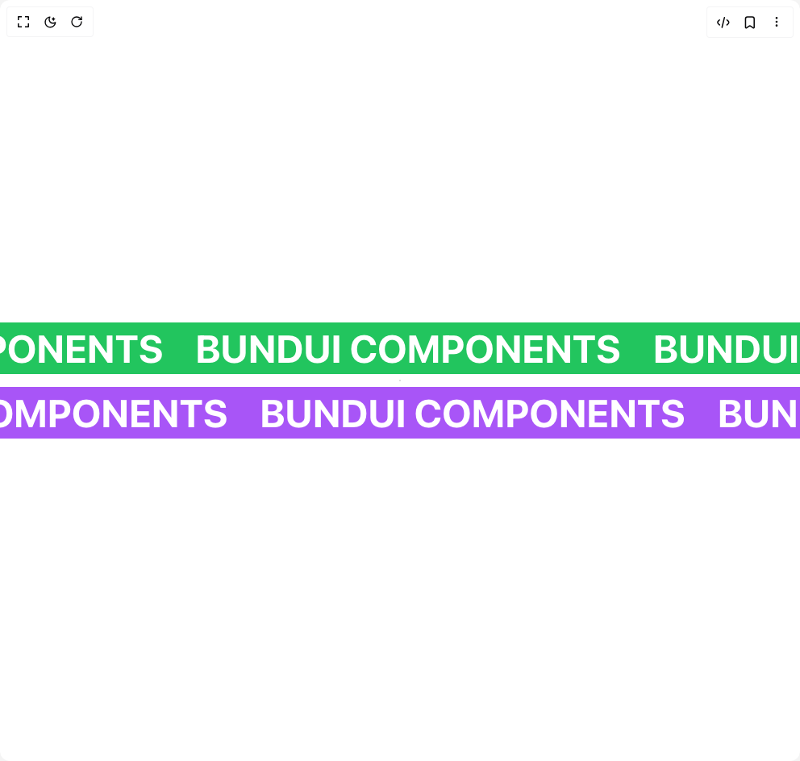
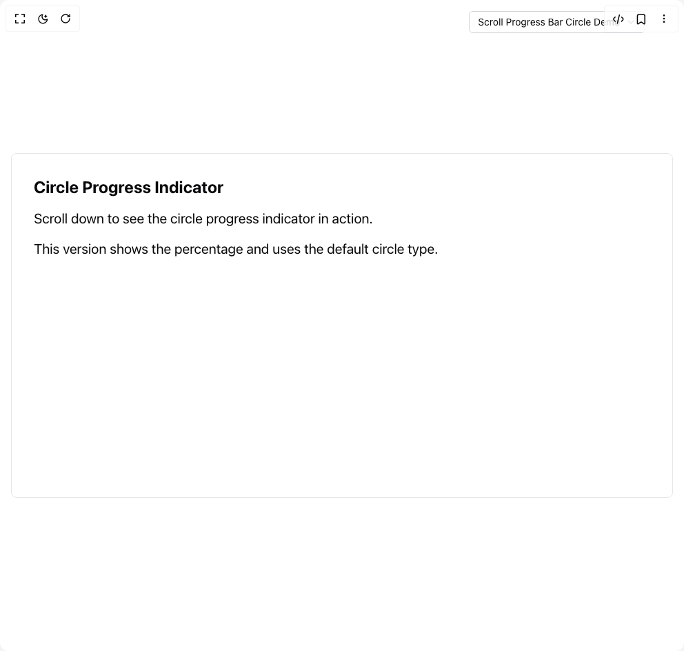
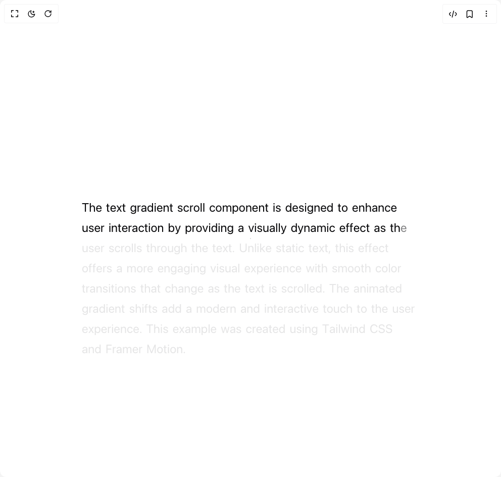
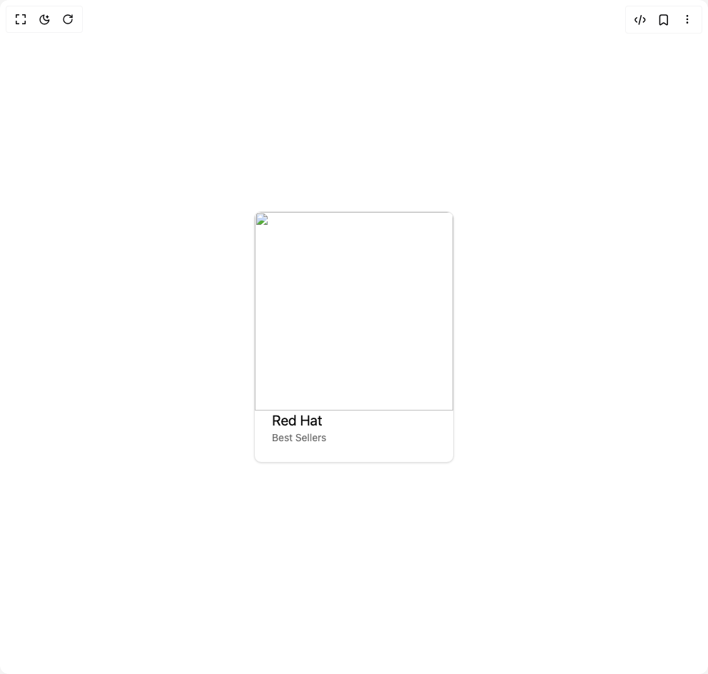
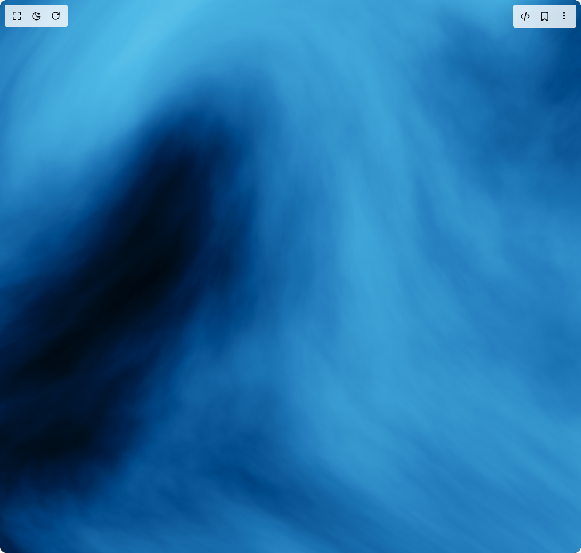

# Bundui Components

17 components are available in this author group.

> Build any component in [BuilderStudio](https://builderstudio.dev), then share improvements with the community on [Discord](https://discord.gg/QdWeSGCqfe) or [Reddit](https://reddit.com/r/builderstudio).

| Preview | Component | Variant |
| --- | --- | --- |
|  | [Animated Text](animated-text/animated-gradient-text/README.md) | `animated-gradient-text` |
|  | [Animated Text](animated-text/default/README.md) | `default` |
|  | [Button](button/default/README.md) | `default` |
|  | [Count Animation](count-animation/default/README.md) | `default` |
|  | [Fireworks Show](fireworks-show/default/README.md) | `default` |
|  | [Floating Button](floating-button/default/README.md) | `default` |
|  | [Floating Paths](floating-paths/default/README.md) | `default` |
|  | [Fluid Particles Background](fluid-particles-background/default/README.md) | `default` |
|  | [Geometric](geometric/default/README.md) | `default` |
|  | [Magnetic Button](magnetic-button/default/README.md) | `default` |
|  | [Marquee Effect](marquee-effect/default/README.md) | `default` |
|  | [Scroll Progress Bar](scroll-progress-bar/default/README.md) | `default` |
|  | [Sliding Number](sliding-number/default/README.md) | `default` |
|  | [Stars](stars/default/README.md) | `default` |
|  | [Text Gradient Scroll](text-gradient-scroll/default/README.md) | `default` |
|  | [Tilt Effect](tilt-effect/default/README.md) | `default` |
|  | [Wavy](wavy/default/README.md) | `default` |
