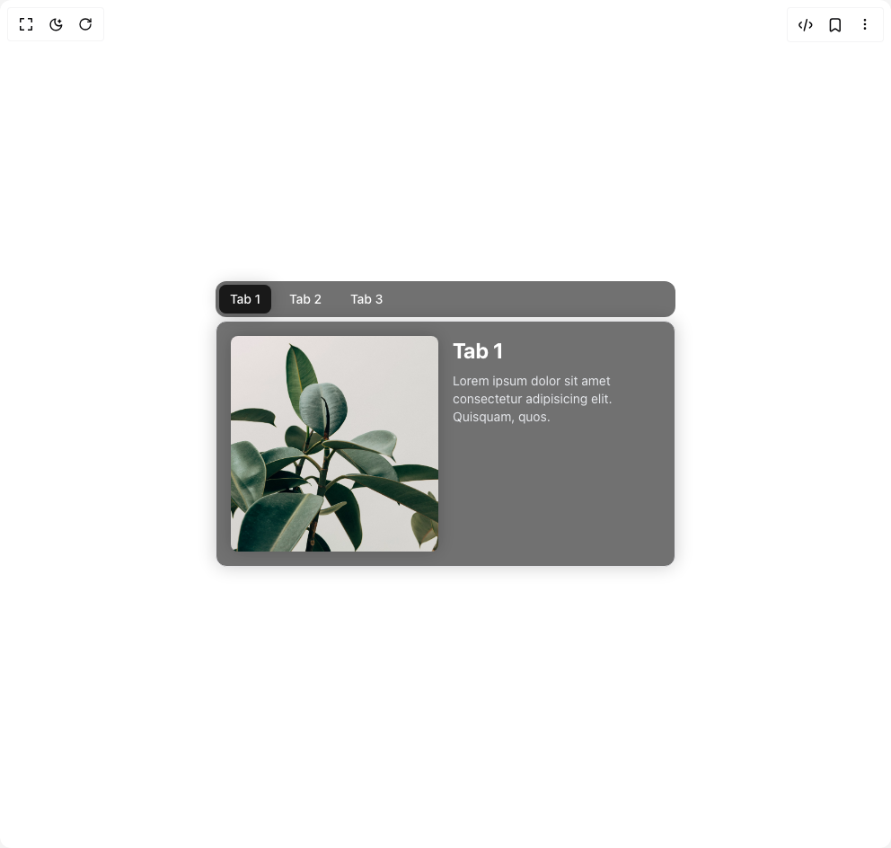
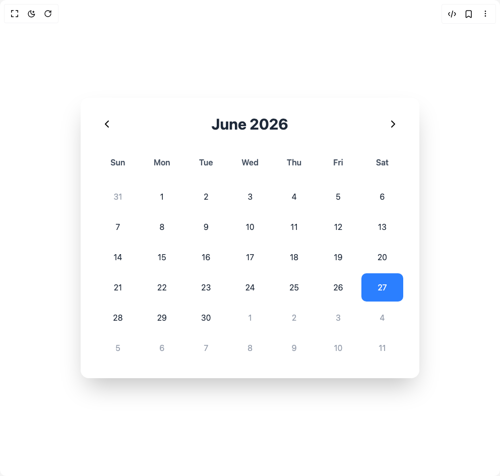
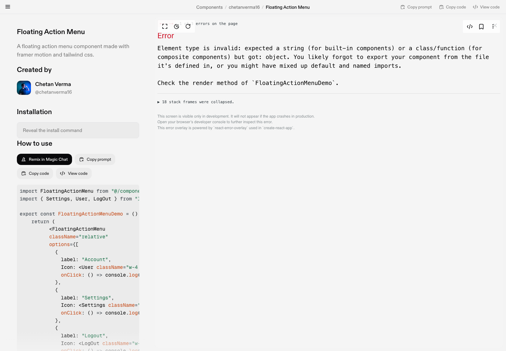
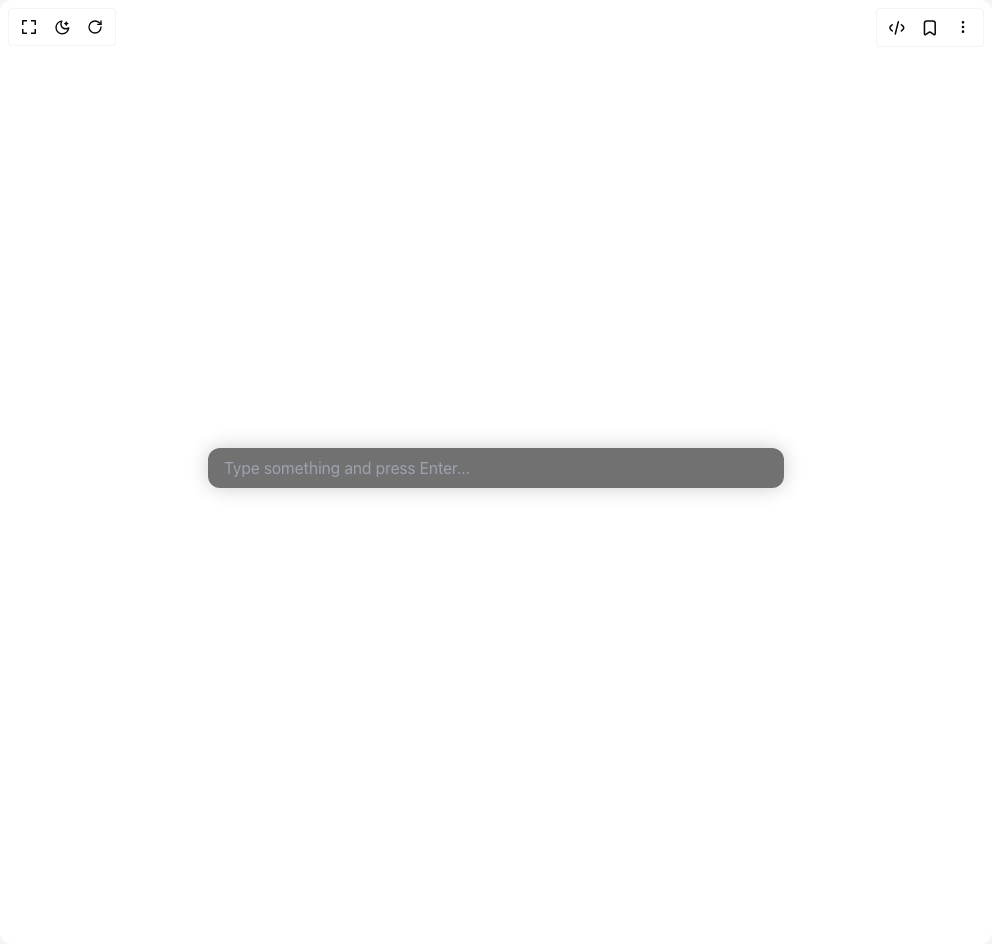
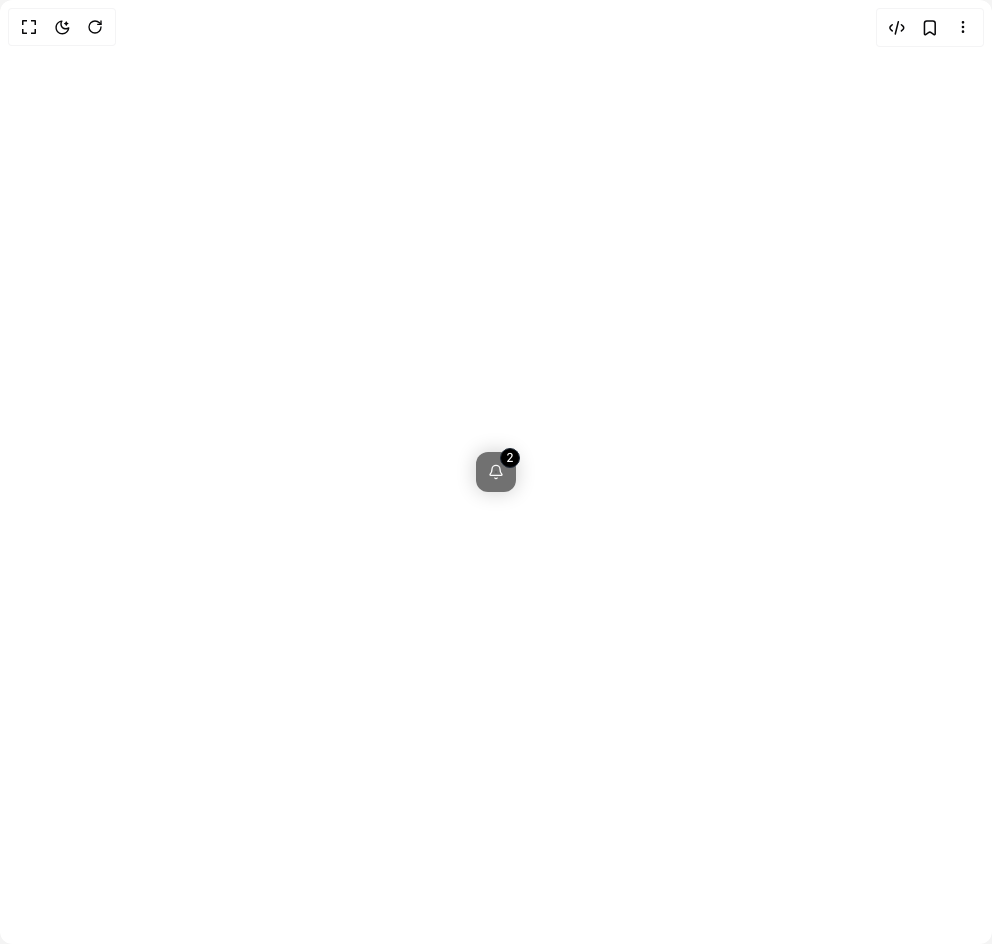
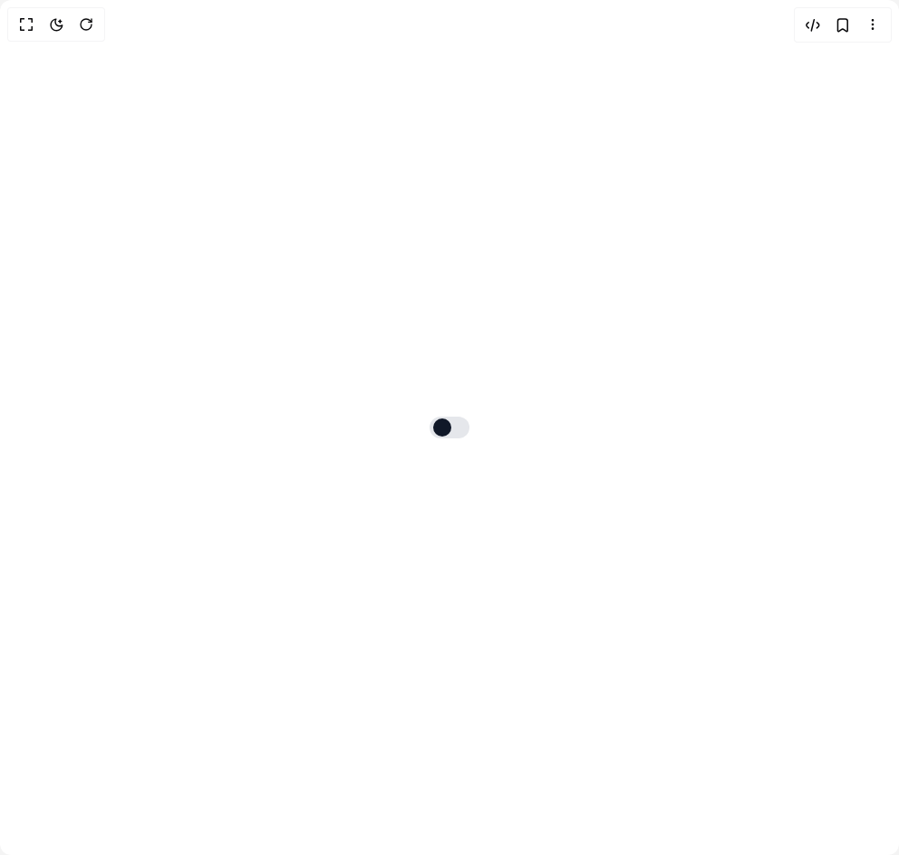
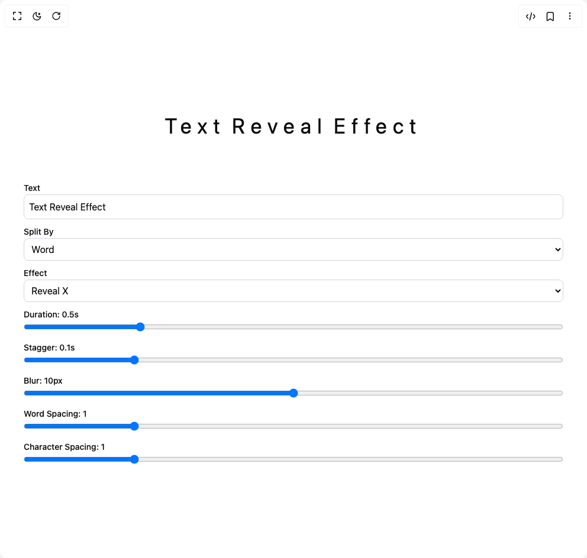
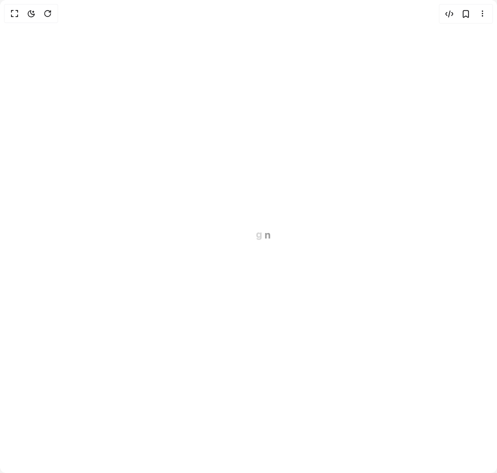

# Chetanverma16 Components

15 components are available in this author group.

> Build any component in [BuilderStudio](https://builderstudio.dev), then share improvements with the community on [Discord](https://discord.gg/QdWeSGCqfe) or [Reddit](https://reddit.com/r/builderstudio).

| Preview | Component | Variant |
| --- | --- | --- |
|  | [Alert](alert/default/README.md) | `default` |
|  | [Animated Tabs](animated-tabs/default/README.md) | `default` |
|  | [Audio Player](audio-player/default/README.md) | `default` |
|  | [Avatar Group](avatar-group/default/README.md) | `default` |
|  | [Calendar](calendar/default/README.md) | `default` |
|  | [Cvui Badge](cvui-badge/badge/README.md) | `badge` |
|  | [Floating Action Menu](floating-action-menu/default/README.md) | `default` |
|  | [Input With Tags](input-with-tags/default/README.md) | `default` |
|  | [Notification Popover](notification-popover/notification-popover/README.md) | `notification-popover` |
|  | [Stacked Cards Interaction](stacked-cards-interaction/default/README.md) | `default` |
|  | [Status Cycle Button](status-cycle-button/default/README.md) | `default` |
|  | [Switch](switch/default/README.md) | `default` |
|  | [Text Reveal](text-reveal/default/README.md) | `default` |
|  | [Video Player](video-player/default/README.md) | `default` |
|  | [Word Loader](word-loader/default/README.md) | `default` |
