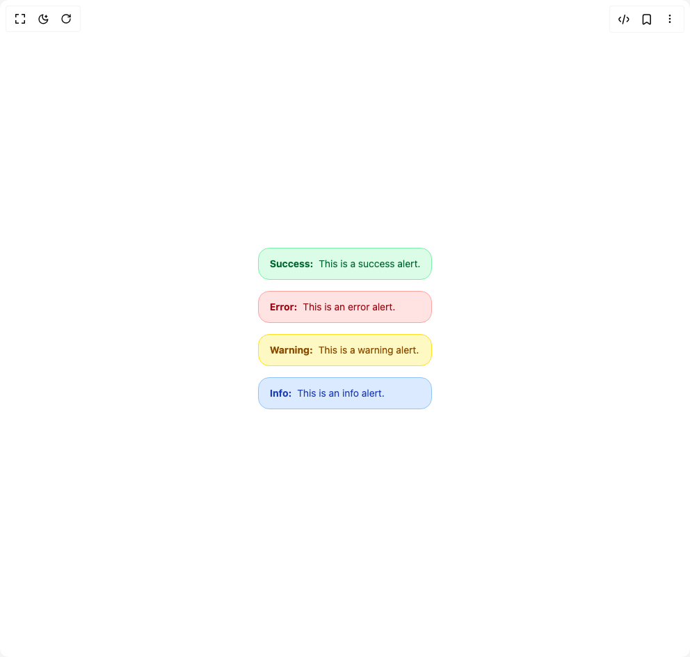

# Build Alert in BuilderStudio

> Build this component in our Agentic IDE: [BuilderStudio](https://builderstudio.dev).
>
> Join the BuilderStudio community on [Discord](https://discord.gg/QdWeSGCqfe) and [Reddit](https://reddit.com/r/builderstudio).



## Component

- Author group: `chetanverma16`
- Component: `alert`
- Variant: `default`
- Rendered HTML snapshot: [`rendered.html`](rendered.html)

## BuilderStudio prompt

You are implementing a React component based on a component reference.

## Component identity

- Author: chetanverma16
- Component slug: alert
- Demo slug: default
- Title: alert
- Description: 

## Goal

Recreate this component in a React + TypeScript + Tailwind CSS project. Preserve the visual layout, spacing, colors, border radius, shadows, interaction behavior, animation behavior, responsive behavior, and dark mode behavior shown in the rendered demo.

## Implementation requirements

- Use React and TypeScript.
- Use Tailwind CSS classes whenever possible.
- Keep the component self-contained unless the source files require helper components.
- If the source uses CSS variables, custom CSS, animations, or keyframes, include them.
- If the source uses external packages, list and use the required packages.
- Preserve accessibility attributes, button semantics, links, keyboard behavior, and ARIA attributes when visible in the source.
- Do not replace the component with a simplified placeholder.
- Return complete production-ready code.

## Dependencies

No reference metadata available.

## Rendered DOM snapshot

This is the rendered demo HTML extracted from the live preview. Use it to verify structure, class names, visible content, and layout.

```html
<div id="root"><div class="w-screen min-h-screen flex justify-center items-center"><div class="w-screen min-h-screen flex justify-center items-center"><div class="flex flex-col gap-4"><div class="border px-4 py-3 flex gap-x-2 items-center rounded-2xl text-sm bg-green-100 text-green-800 border-green-300" role="alert" tabindex="0" style="opacity: 1; filter: blur(0px); transform: none;"><span class="font-bold capitalize">success:</span><span>This is a success alert.</span></div><div class="border px-4 py-3 flex gap-x-2 items-center rounded-2xl text-sm bg-red-100 text-red-800 border-red-300" role="alert" tabindex="0" style="opacity: 1; filter: blur(0px); transform: none;"><span class="font-bold capitalize">error:</span><span>This is an error alert.</span></div><div class="border px-4 py-3 flex gap-x-2 items-center rounded-2xl text-sm bg-yellow-100 text-yellow-800 border-yellow-300" role="alert" tabindex="0" style="opacity: 1; filter: blur(0px); transform: none;"><span class="font-bold capitalize">warning:</span><span>This is a warning alert.</span></div><div class="border px-4 py-3 flex gap-x-2 items-center rounded-2xl text-sm bg-blue-100 text-blue-800 border-blue-300" role="alert" tabindex="0" style="opacity: 1; filter: blur(0px); transform: none;"><span class="font-bold capitalize">info:</span><span>This is an info alert.</span></div></div></div></div></div>
```

## Reference source files

No reference source files were available.
