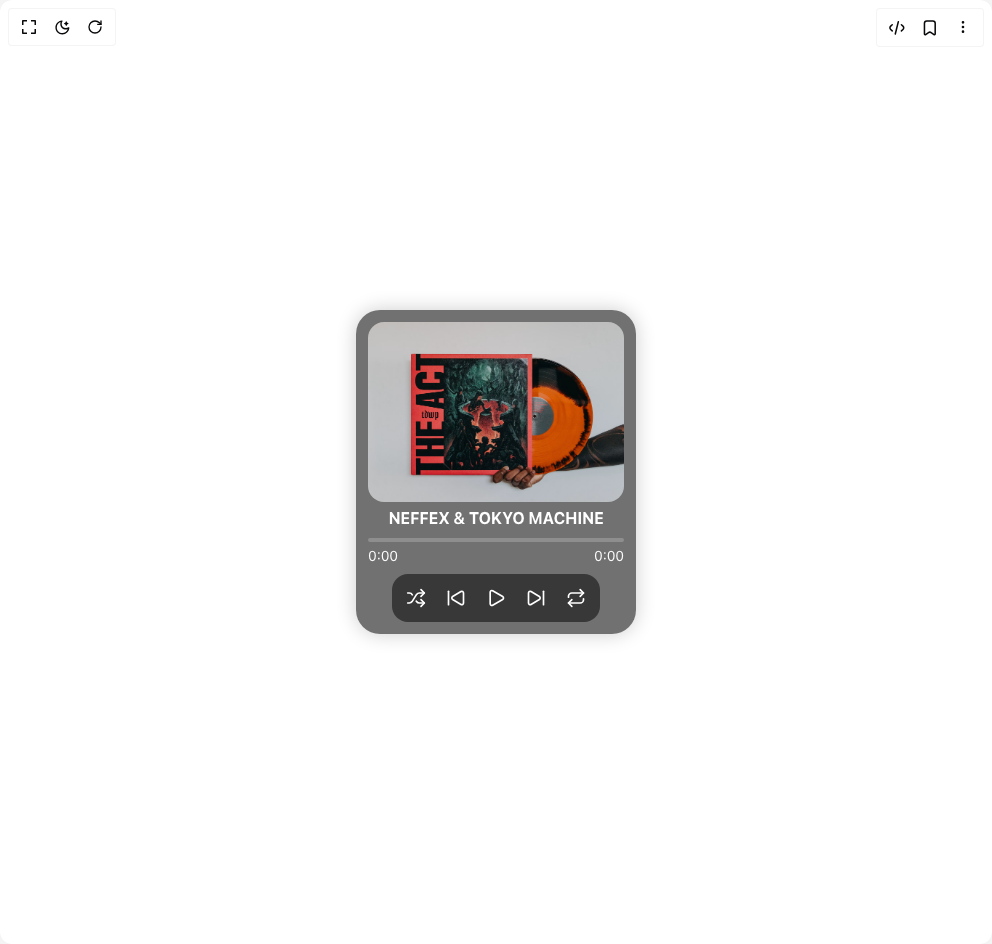

# Build Audio Player in BuilderStudio

> Build this component in our Agentic IDE: [BuilderStudio](https://builderstudio.dev).
>
> Join the BuilderStudio community on [Discord](https://discord.gg/QdWeSGCqfe) and [Reddit](https://reddit.com/r/builderstudio).



## Component

- Author group: `chetanverma16`
- Component: `audio-player`
- Variant: `default`
- Rendered HTML snapshot: [`rendered.html`](rendered.html)

## BuilderStudio prompt

You are implementing a React component based on a component reference.

## Component identity

- Author: chetanverma16
- Component slug: audio-player
- Demo slug: default
- Title: audio-player
- Description: 

## Goal

Recreate this component in a React + TypeScript + Tailwind CSS project. Preserve the visual layout, spacing, colors, border radius, shadows, interaction behavior, animation behavior, responsive behavior, and dark mode behavior shown in the rendered demo.

## Implementation requirements

- Use React and TypeScript.
- Use Tailwind CSS classes whenever possible.
- Keep the component self-contained unless the source files require helper components.
- If the source uses CSS variables, custom CSS, animations, or keyframes, include them.
- If the source uses external packages, list and use the required packages.
- Preserve accessibility attributes, button semantics, links, keyboard behavior, and ARIA attributes when visible in the source.
- Do not replace the component with a simplified placeholder.
- Return complete production-ready code.

## Dependencies

No reference metadata available.

## Rendered DOM snapshot

This is the rendered demo HTML extracted from the live preview. Use it to verify structure, class names, visible content, and layout.

```html
<div id="root"><div class="relative flex items-center justify-center h-screen w-full m-auto p-16 bg-background text-foreground"><div class="absolute lab-bg inset-0 size-full"><div class="absolute inset-0 bg-[radial-gradient(#00000021_1px,transparent_1px)] dark:bg-[radial-gradient(#ffffff22_1px,transparent_1px)]"></div></div><div class="flex w-full justify-center relative"><div class="relative flex flex-col mx-auto rounded-3xl overflow-hidden bg-[#11111198] shadow-[0_0_20px_rgba(0,0,0,0.2)] backdrop-blur-sm p-3 w-[280px] h-auto" style="opacity: 1; filter: blur(0px);"><audio src="https://ui.webmakers.studio/audio/ncs.mp3" class="hidden"></audio><div class="flex flex-col relative" style="opacity: 1;"><div class="bg-white/20 overflow-hidden rounded-[16px] h-[180px] w-full relative"></div><div class="flex flex-col w-full gap-y-2"><h3 class="text-white font-bold text-base text-center mt-1">NEFFEX &amp; TOKYO MACHINE</h3><div class="flex flex-col gap-y-1"><div class="relative h-1 bg-white/20 rounded-full cursor-pointer w-full"><div class="absolute top-0 left-0 h-full bg-white rounded-full" style="width: 0%;"></div></div><div class="flex items-center justify-between"><span class="text-white text-sm">0:00</span><span class="text-white text-sm">0:00</span></div></div><div class="flex items-center justify-center w-full"><div class="flex items-center gap-2 w-fit bg-[#11111198] rounded-[16px] p-2"><div tabindex="0"><button class="inline-flex items-center justify-center whitespace-nowrap text-sm font-medium ring-offset-background transition-colors focus-visible:outline-none focus-visible:ring-2 focus-visible:ring-ring focus-visible:ring-offset-2 disabled:pointer-events-none disabled:opacity-50 text-white hover:bg-[#111111d1] hover:text-white h-8 w-8 rounded-full"><svg xmlns="http://www.w3.org/2000/svg" width="24" height="24" viewBox="0 0 24 24" fill="none" stroke="currentColor" stroke-width="2" stroke-linecap="round" stroke-linejoin="round" class="lucide lucide-shuffle h-5 w-5" aria-hidden="true"><path d="m18 14 4 4-4 4"></path><path d="m18 2 4 4-4 4"></path><path d="M2 18h1.973a4 4 0 0 0 3.3-1.7l5.454-8.6a4 4 0 0 1 3.3-1.7H22"></path><path d="M2 6h1.972a4 4 0 0 1 3.6 2.2"></path><path d="M22 18h-6.041a4 4 0 0 1-3.3-1.8l-.359-.45"></path></svg></button></div><div tabindex="0"><button class="inline-flex items-center justify-center whitespace-nowrap text-sm font-medium ring-offset-background transition-colors focus-visible:outline-none focus-visible:ring-2 focus-visible:ring-ring focus-visible:ring-offset-2 disabled:pointer-events-none disabled:opacity-50 text-white hover:bg-[#111111d1] hover:text-white h-8 w-8 rounded-full"><svg xmlns="http://www.w3.org/2000/svg" width="24" height="24" viewBox="0 0 24 24" fill="none" stroke="currentColor" stroke-width="2" stroke-linecap="round" stroke-linejoin="round" class="lucide lucide-skip-back h-5 w-5" aria-hidden="true"><path d="M17.971 4.285A2 2 0 0 1 21 6v12a2 2 0 0 1-3.029 1.715l-9.997-5.998a2 2 0 0 1-.003-3.432z"></path><path d="M3 20V4"></path></svg></button></div><div tabindex="0"><button class="inline-flex items-center justify-center whitespace-nowrap text-sm font-medium ring-offset-background transition-colors focus-visible:outline-none focus-visible:ring-2 focus-visible:ring-ring focus-visible:ring-offset-2 disabled:pointer-events-none disabled:opacity-50 text-white hover:bg-[#111111d1] hover:text-white h-8 w-8 rounded-full"><svg xmlns="http://www.w3.org/2000/svg" width="24" height="24" viewBox="0 0 24 24" fill="none" stroke="currentColor" stroke-width="2" stroke-linecap="round" stroke-linejoin="round" class="lucide lucide-play h-5 w-5" aria-hidden="true"><path d="M5 5a2 2 0 0 1 3.008-1.728l11.997 6.998a2 2 0 0 1 .003 3.458l-12 7A2 2 0 0 1 5 19z"></path></svg></button></div><div tabindex="0"><button class="inline-flex items-center justify-center whitespace-nowrap text-sm font-medium ring-offset-background transition-colors focus-visible:outline-none focus-visible:ring-2 focus-visible:ring-ring focus-visible:ring-offset-2 disabled:pointer-events-none disabled:opacity-50 text-white hover:bg-[#111111d1] hover:text-white h-8 w-8 rounded-full"><svg xmlns="http://www.w3.org/2000/svg" width="24" height="24" viewBox="0 0 24 24" fill="none" stroke="currentColor" stroke-width="2" stroke-linecap="round" stroke-linejoin="round" class="lucide lucide-skip-forward h-5 w-5" aria-hidden="true"><path d="M21 4v16"></path><path d="M6.029 4.285A2 2 0 0 0 3 6v12a2 2 0 0 0 3.029 1.715l9.997-5.998a2 2 0 0 0 .003-3.432z"></path></svg></button></div><div tabindex="0"><button class="inline-flex items-center justify-center whitespace-nowrap text-sm font-medium ring-offset-background transition-colors focus-visible:outline-none focus-visible:ring-2 focus-visible:ring-ring focus-visible:ring-offset-2 disabled:pointer-events-none disabled:opacity-50 text-white hover:bg-[#111111d1] hover:text-white h-8 w-8 rounded-full"><svg xmlns="http://www.w3.org/2000/svg" width="24" height="24" viewBox="0 0 24 24" fill="none" stroke="currentColor" stroke-width="2" stroke-linecap="round" stroke-linejoin="round" class="lucide lucide-repeat h-5 w-5" aria-hidden="true"><path d="m17 2 4 4-4 4"></path><path d="M3 11v-1a4 4 0 0 1 4-4h14"></path><path d="m7 22-4-4 4-4"></path><path d="M21 13v1a4 4 0 0 1-4 4H3"></path></svg></button></div></div></div></div></div></div></div></div></div>
```

## Reference source files

No reference source files were available.
