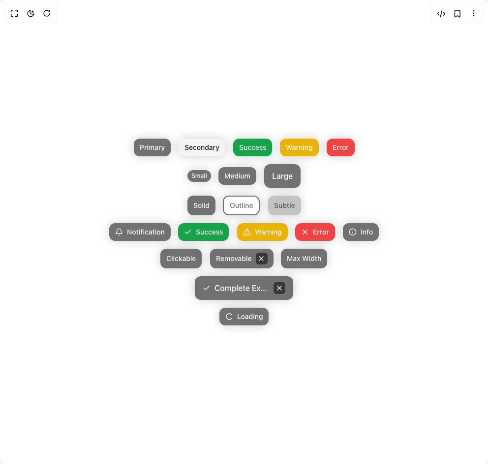

# Build Cvui Badge in BuilderStudio

> Build this component in our Agentic IDE: [BuilderStudio](https://builderstudio.dev).
>
> Join the BuilderStudio community on [Discord](https://discord.gg/QdWeSGCqfe) and [Reddit](https://reddit.com/r/builderstudio).



## Component

- Author group: `chetanverma16`
- Component: `cvui-badge`
- Variant: `badge`
- Rendered HTML snapshot: [`rendered.html`](rendered.html)

## BuilderStudio prompt

You are implementing a React component based on a component reference.

## Component identity

- Author: chetanverma16
- Component slug: cvui-badge
- Demo slug: badge
- Title: cvui-badge
- Description: 

## Goal

Recreate this component in a React + TypeScript + Tailwind CSS project. Preserve the visual layout, spacing, colors, border radius, shadows, interaction behavior, animation behavior, responsive behavior, and dark mode behavior shown in the rendered demo.

## Implementation requirements

- Use React and TypeScript.
- Use Tailwind CSS classes whenever possible.
- Keep the component self-contained unless the source files require helper components.
- If the source uses CSS variables, custom CSS, animations, or keyframes, include them.
- If the source uses external packages, list and use the required packages.
- Preserve accessibility attributes, button semantics, links, keyboard behavior, and ARIA attributes when visible in the source.
- Do not replace the component with a simplified placeholder.
- Return complete production-ready code.

## Dependencies

No reference metadata available.

## Rendered DOM snapshot

This is the rendered demo HTML extracted from the live preview. Use it to verify structure, class names, visible content, and layout.

```html
<div id="root"><div class="relative flex items-center justify-center h-screen w-full m-auto p-16 bg-background text-foreground"><div class="absolute lab-bg inset-0 size-full"><div class="absolute inset-0 bg-[radial-gradient(#00000021_1px,transparent_1px)] dark:bg-[radial-gradient(#ffffff22_1px,transparent_1px)]"></div></div><div class="flex w-full justify-center relative"><div class="flex flex-col gap-4 items-center justify-center"><div class="flex gap-4 flex-wrap"><div class="rounded-xl font-medium shadow-[0_0_20px_rgba(0,0,0,0.2)] inline-flex items-center gap-2 backdrop-blur-sm bg-[#11111198] text-white text-sm px-3 py-2" style="opacity: 1; filter: blur(0px); transform: none;"><span class="truncate">Primary</span></div><div class="rounded-xl font-medium shadow-[0_0_20px_rgba(0,0,0,0.2)] inline-flex items-center gap-2 backdrop-blur-sm bg-secondary text-secondary-foreground text-sm px-3 py-2" style="opacity: 1; filter: blur(0px); transform: none;"><span class="truncate">Secondary</span></div><div class="rounded-xl font-medium shadow-[0_0_20px_rgba(0,0,0,0.2)] inline-flex items-center gap-2 backdrop-blur-sm bg-green-600 text-white text-sm px-3 py-2" style="opacity: 1; filter: blur(0px); transform: none;"><span class="truncate">Success</span></div><div class="rounded-xl font-medium shadow-[0_0_20px_rgba(0,0,0,0.2)] inline-flex items-center gap-2 backdrop-blur-sm bg-yellow-500 text-white text-sm px-3 py-2" style="opacity: 1; filter: blur(0px); transform: none;"><span class="truncate">Warning</span></div><div class="rounded-xl font-medium shadow-[0_0_20px_rgba(0,0,0,0.2)] inline-flex items-center gap-2 backdrop-blur-sm bg-destructive text-destructive-foreground text-sm px-3 py-2" style="opacity: 1; filter: blur(0px); transform: none;"><span class="truncate">Error</span></div></div><div class="flex gap-4 flex-wrap items-center"><div class="rounded-xl font-medium shadow-[0_0_20px_rgba(0,0,0,0.2)] inline-flex items-center gap-2 backdrop-blur-sm bg-[#11111198] text-white text-xs px-2 py-1" style="opacity: 1; filter: blur(0px); transform: none;"><span class="truncate">Small</span></div><div class="rounded-xl font-medium shadow-[0_0_20px_rgba(0,0,0,0.2)] inline-flex items-center gap-2 backdrop-blur-sm bg-[#11111198] text-white text-sm px-3 py-2" style="opacity: 1; filter: blur(0px); transform: none;"><span class="truncate">Medium</span></div><div class="rounded-xl font-medium shadow-[0_0_20px_rgba(0,0,0,0.2)] inline-flex items-center gap-2 backdrop-blur-sm bg-[#11111198] text-white text-base px-4 py-3" style="opacity: 1; filter: blur(0px); transform: none;"><span class="truncate">Large</span></div></div><div class="flex gap-4 flex-wrap"><div class="rounded-xl font-medium shadow-[0_0_20px_rgba(0,0,0,0.2)] inline-flex items-center gap-2 backdrop-blur-sm bg-[#11111198] text-white text-sm px-3 py-2" style="opacity: 1; filter: blur(0px); transform: none;"><span class="truncate">Solid</span></div><div class="rounded-xl font-medium shadow-[0_0_20px_rgba(0,0,0,0.2)] inline-flex items-center gap-2 backdrop-blur-sm border-2 border-[#11111198] text-[#11111198] text-sm px-3 py-2" style="opacity: 1; filter: blur(0px); transform: none;"><span class="truncate">Outline</span></div><div class="rounded-xl font-medium shadow-[0_0_20px_rgba(0,0,0,0.2)] inline-flex items-center gap-2 backdrop-blur-sm bg-[#11111140] text-[#11111198] text-sm px-3 py-2" style="opacity: 1; filter: blur(0px); transform: none;"><span class="truncate">Subtle</span></div></div><div class="flex gap-4 flex-wrap"><div class="rounded-xl font-medium shadow-[0_0_20px_rgba(0,0,0,0.2)] inline-flex items-center gap-2 backdrop-blur-sm bg-[#11111198] text-white text-sm px-3 py-2" style="opacity: 1; filter: blur(0px); transform: none;"><span class="flex-shrink-0"><svg xmlns="http://www.w3.org/2000/svg" width="24" height="24" viewBox="0 0 24 24" fill="none" stroke="currentColor" stroke-width="2" stroke-linecap="round" stroke-linejoin="round" class="lucide lucide-bell w-4 h-4" aria-hidden="true"><path d="M10.268 21a2 2 0 0 0 3.464 0"></path><path d="M3.262 15.326A1 1 0 0 0 4 17h16a1 1 0 0 0 .74-1.673C19.41 13.956 18 12.499 18 8A6 6 0 0 0 6 8c0 4.499-1.411 5.956-2.738 7.326"></path></svg></span><span class="truncate">Notification</span></div><div class="rounded-xl font-medium shadow-[0_0_20px_rgba(0,0,0,0.2)] inline-flex items-center gap-2 backdrop-blur-sm bg-green-600 text-white text-sm px-3 py-2" style="opacity: 1; filter: blur(0px); transform: none;"><span class="flex-shrink-0"><svg xmlns="http://www.w3.org/2000/svg" width="24" height="24" viewBox="0 0 24 24" fill="none" stroke="currentColor" stroke-width="2" stroke-linecap="round" stroke-linejoin="round" class="lucide lucide-check w-4 h-4" aria-hidden="true"><path d="M20 6 9 17l-5-5"></path></svg></span><span class="truncate">Success</span></div><div class="rounded-xl font-medium shadow-[0_0_20px_rgba(0,0,0,0.2)] inline-flex items-center gap-2 backdrop-blur-sm bg-yellow-500 text-white text-sm px-3 py-2" style="opacity: 1; filter: blur(0px); transform: none;"><span class="flex-shrink-0"><svg xmlns="http://www.w3.org/2000/svg" width="24" height="24" viewBox="0 0 24 24" fill="none" stroke="currentColor" stroke-width="2" stroke-linecap="round" stroke-linejoin="round" class="lucide lucide-triangle-alert w-4 h-4" aria-hidden="true"><path d="m21.73 18-8-14a2 2 0 0 0-3.48 0l-8 14A2 2 0 0 0 4 21h16a2 2 0 0 0 1.73-3"></path><path d="M12 9v4"></path><path d="M12 17h.01"></path></svg></span><span class="truncate">Warning</span></div><div class="rounded-xl font-medium shadow-[0_0_20px_rgba(0,0,0,0.2)] inline-flex items-center gap-2 backdrop-blur-sm bg-destructive text-destructive-foreground text-sm px-3 py-2" style="opacity: 1; filter: blur(0px); transform: none;"><span class="flex-shrink-0"><svg xmlns="http://www.w3.org/2000/svg" width="24" height="24" viewBox="0 0 24 24" fill="none" stroke="currentColor" stroke-width="2" stroke-linecap="round" stroke-linejoin="round" class="lucide lucide-x w-4 h-4" aria-hidden="true"><path d="M18 6 6 18"></path><path d="m6 6 12 12"></path></svg></span><span class="truncate">Error</span></div><div class="rounded-xl font-medium shadow-[0_0_20px_rgba(0,0,0,0.2)] inline-flex items-center gap-2 backdrop-blur-sm bg-[#11111198] text-white text-sm px-3 py-2" style="opacity: 1; filter: blur(0px); transform: none;"><span class="flex-shrink-0"><svg xmlns="http://www.w3.org/2000/svg" width="24" height="24" viewBox="0 0 24 24" fill="none" stroke="currentColor" stroke-width="2" stroke-linecap="round" stroke-linejoin="round" class="lucide lucide-info w-4 h-4" aria-hidden="true"><circle cx="12" cy="12" r="10"></circle><path d="M12 16v-4"></path><path d="M12 8h.01"></path></svg></span><span class="truncate">Info</span></div></div><div class="flex gap-4 flex-wrap"><div class="rounded-xl font-medium shadow-[0_0_20px_rgba(0,0,0,0.2)] inline-flex items-center gap-2 backdrop-blur-sm bg-[#11111198] text-white text-sm px-3 py-2 cursor-pointer" style="opacity: 1; filter: blur(0px); transform: none;"><span class="truncate">Clickable</span></div><div class="rounded-xl font-medium shadow-[0_0_20px_rgba(0,0,0,0.2)] inline-flex items-center gap-2 backdrop-blur-sm bg-[#11111198] text-white text-sm px-3 py-2" style="opacity: 1; filter: blur(0px); transform: none;"><span class="truncate">Removable</span><button class="p-1 opacity-60 hover:opacity-100 bg-[#11111198] hover:bg-[#11111198] rounded-md flex items-center justify-center" style="opacity: 1; filter: blur(0px); transform: none;"><svg xmlns="http://www.w3.org/2000/svg" width="24" height="24" viewBox="0 0 24 24" fill="none" stroke="currentColor" stroke-width="2" stroke-linecap="round" stroke-linejoin="round" class="lucide lucide-x h-4 w-4" aria-hidden="true"><path d="M18 6 6 18"></path><path d="m6 6 12 12"></path></svg></button></div><div class="rounded-xl font-medium shadow-[0_0_20px_rgba(0,0,0,0.2)] inline-flex items-center gap-2 backdrop-blur-sm bg-[#11111198] text-white text-sm px-3 py-2" style="max-width: 100px; opacity: 1; filter: blur(0px); transform: none;"><span class="truncate">Max Width</span></div></div><div class="rounded-xl font-medium shadow-[0_0_20px_rgba(0,0,0,0.2)] inline-flex items-center gap-2 backdrop-blur-sm bg-[#11111198] text-white text-base px-4 py-3 cursor-pointer" style="max-width: 200px; opacity: 1; filter: blur(0px); transform: none;"><span class="flex-shrink-0"><svg xmlns="http://www.w3.org/2000/svg" width="24" height="24" viewBox="0 0 24 24" fill="none" stroke="currentColor" stroke-width="2" stroke-linecap="round" stroke-linejoin="round" class="lucide lucide-check w-4 h-4" aria-hidden="true"><path d="M20 6 9 17l-5-5"></path></svg></span><span class="truncate">Complete Example</span><button class="p-1 opacity-60 hover:opacity-100 bg-[#11111198] hover:bg-[#11111198] rounded-md flex items-center justify-center" style="opacity: 1; filter: blur(0px); transform: none;"><svg xmlns="http://www.w3.org/2000/svg" width="24" height="24" viewBox="0 0 24 24" fill="none" stroke="currentColor" stroke-width="2" stroke-linecap="round" stroke-linejoin="round" class="lucide lucide-x h-4 w-4" aria-hidden="true"><path d="M18 6 6 18"></path><path d="m6 6 12 12"></path></svg></button></div><div class="rounded-xl font-medium shadow-[0_0_20px_rgba(0,0,0,0.2)] inline-flex items-center gap-2 backdrop-blur-sm bg-[#11111198] text-white text-sm px-3 py-2" style="opacity: 1; filter: blur(0px); transform: none;"><div class="flex-shrink-0" style="transform: rotate(19.44deg);"><svg xmlns="http://www.w3.org/2000/svg" width="24" height="24" viewBox="0 0 24 24" fill="none" stroke="currentColor" stroke-width="2" stroke-linecap="round" stroke-linejoin="round" class="lucide lucide-loader-circle h-4 w-4" aria-hidden="true"><path d="M21 12a9 9 0 1 1-6.219-8.56"></path></svg></div><span class="truncate">Loading</span></div></div></div></div></div>
```

## Reference source files

No reference source files were available.
