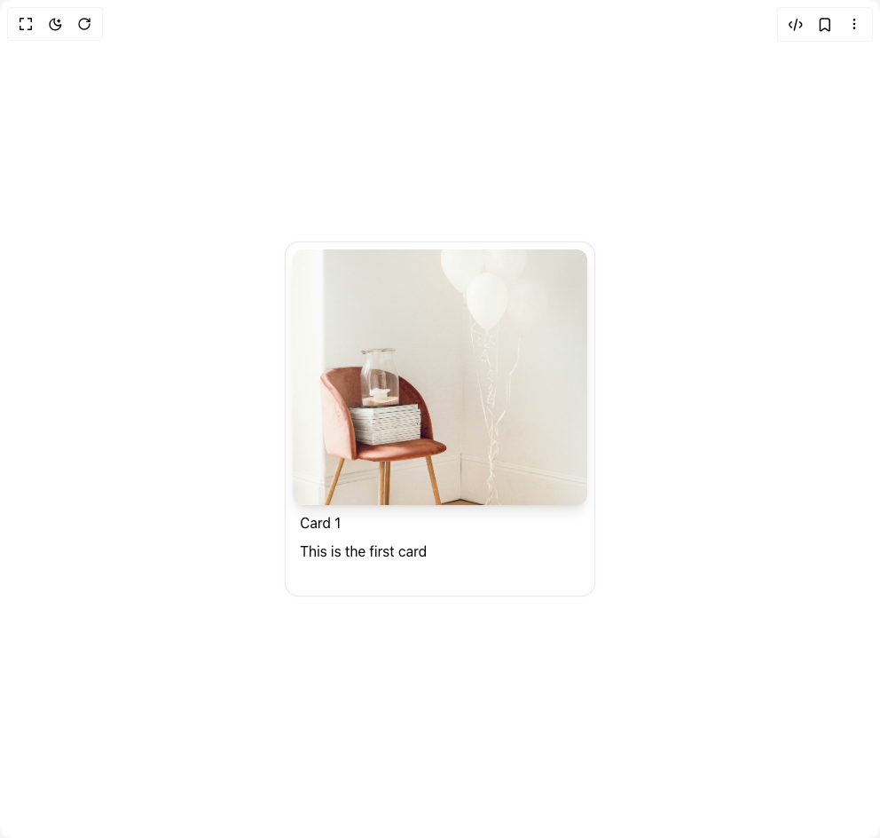

# Build Stacked Cards Interaction in BuilderStudio

> Build this component in our Agentic IDE: [BuilderStudio](https://builderstudio.dev).
>
> Join the BuilderStudio community on [Discord](https://discord.gg/QdWeSGCqfe) and [Reddit](https://reddit.com/r/builderstudio).



## Component

- Author group: `chetanverma16`
- Component: `stacked-cards-interaction`
- Variant: `default`
- Rendered HTML snapshot: [`rendered.html`](rendered.html)

## BuilderStudio prompt

You are implementing a React component based on a component reference.

## Component identity

- Author: chetanverma16
- Component slug: stacked-cards-interaction
- Demo slug: default
- Title: stacked-cards-interaction
- Description: 

## Goal

Recreate this component in a React + TypeScript + Tailwind CSS project. Preserve the visual layout, spacing, colors, border radius, shadows, interaction behavior, animation behavior, responsive behavior, and dark mode behavior shown in the rendered demo.

## Implementation requirements

- Use React and TypeScript.
- Use Tailwind CSS classes whenever possible.
- Keep the component self-contained unless the source files require helper components.
- If the source uses CSS variables, custom CSS, animations, or keyframes, include them.
- If the source uses external packages, list and use the required packages.
- Preserve accessibility attributes, button semantics, links, keyboard behavior, and ARIA attributes when visible in the source.
- Do not replace the component with a simplified placeholder.
- Return complete production-ready code.

## Dependencies

No reference metadata available.

## Rendered DOM snapshot

This is the rendered demo HTML extracted from the live preview. Use it to verify structure, class names, visible content, and layout.

```html
<div id="root"><div class="relative flex items-center justify-center h-screen w-full m-auto p-16 bg-background text-foreground"><div class="absolute lab-bg inset-0 size-full"><div class="absolute inset-0 bg-[radial-gradient(#00000021_1px,transparent_1px)] dark:bg-[radial-gradient(#ffffff22_1px,transparent_1px)]"></div></div><div class="flex w-full justify-center relative"><div class="relative w-full h-full flex items-center justify-center"><div class="relative w-[350px] h-[400px]"><div class="absolute z-10" style="transform: none; z-index: 10;"><div class="w-[350px] h-[400px] overflow-hidden bg-white rounded-2xl shadow-[0_0_10px_rgba(0,0,0,0.02)] border border-gray-200/80 z-10 cursor-pointer"><div class="relative h-72 rounded-xl shadow-lg overflow-hidden w-[calc(100%-1rem)] mx-2 mt-2"></div><div class="px-4 p-2 flex flex-col gap-y-2"><h2>Card 1</h2><p>This is the first card</p></div></div></div><div class="absolute z-0" style="transform: none; z-index: 0;"><div class="w-[350px] cursor-pointer h-[400px] overflow-hidden bg-white rounded-2xl shadow-[0_0_10px_rgba(0,0,0,0.02)] border border-gray-200/80 z-0"><div class="relative h-72 rounded-xl shadow-lg overflow-hidden w-[calc(100%-1rem)] mx-2 mt-2"></div><div class="px-4 p-2 flex flex-col gap-y-2"><h2>Card 2</h2><p>This is the second card</p></div></div></div><div class="absolute z-0" style="transform: none; z-index: 0;"><div class="w-[350px] cursor-pointer h-[400px] overflow-hidden bg-white rounded-2xl shadow-[0_0_10px_rgba(0,0,0,0.02)] border border-gray-200/80 z-0"><div class="relative h-72 rounded-xl shadow-lg overflow-hidden w-[calc(100%-1rem)] mx-2 mt-2"></div><div class="px-4 p-2 flex flex-col gap-y-2"><h2>Card 3</h2><p>This is the third card</p></div></div></div></div></div></div></div></div>
```

## Reference source files

No reference source files were available.
