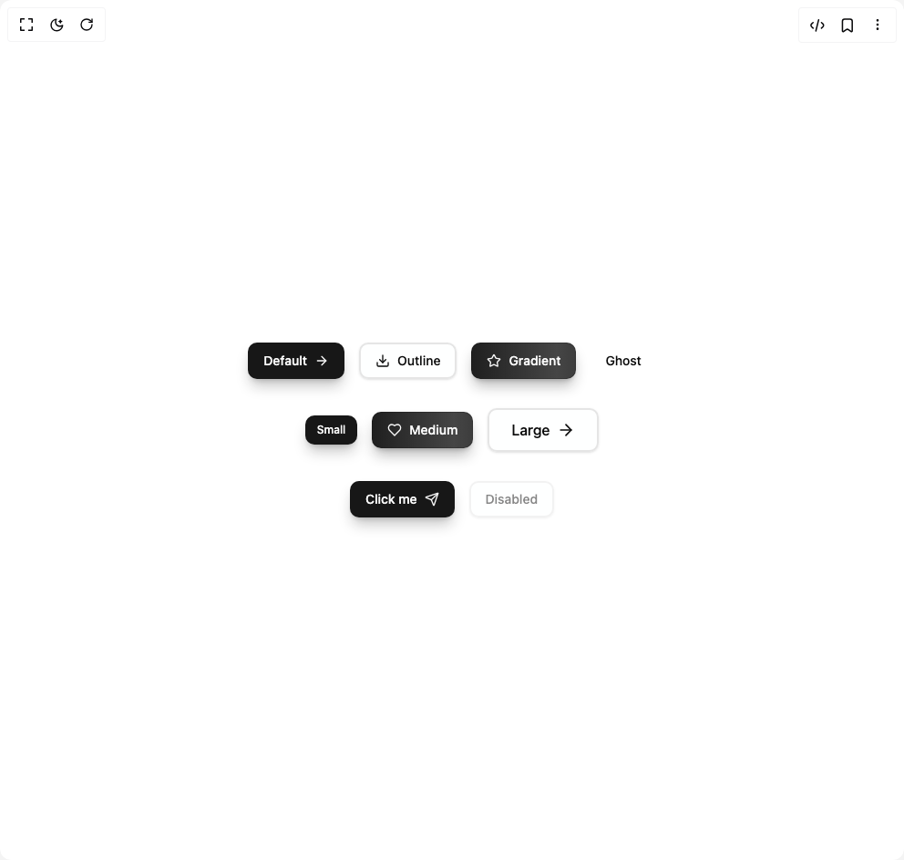
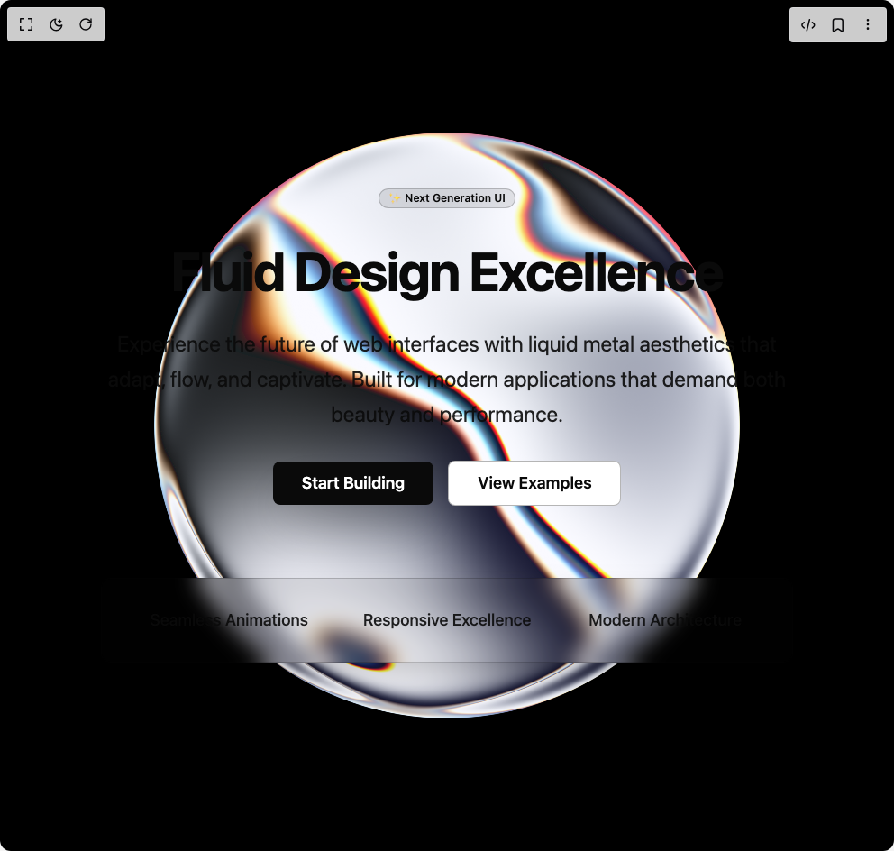
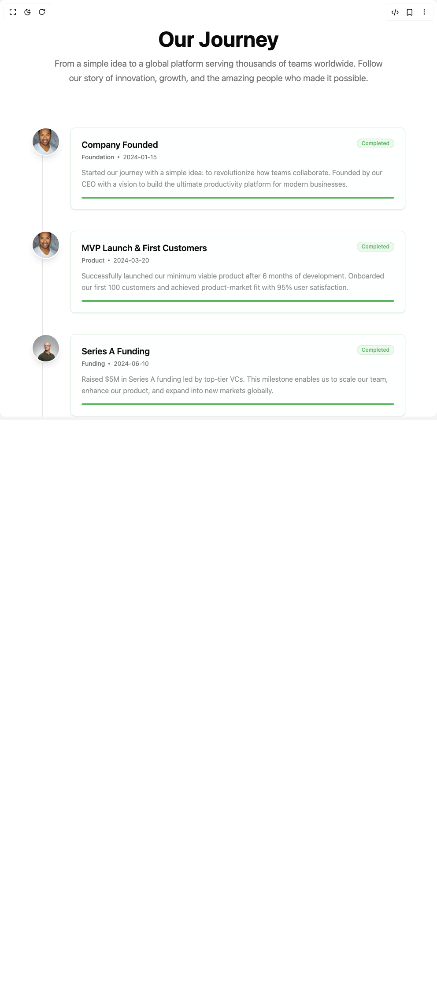
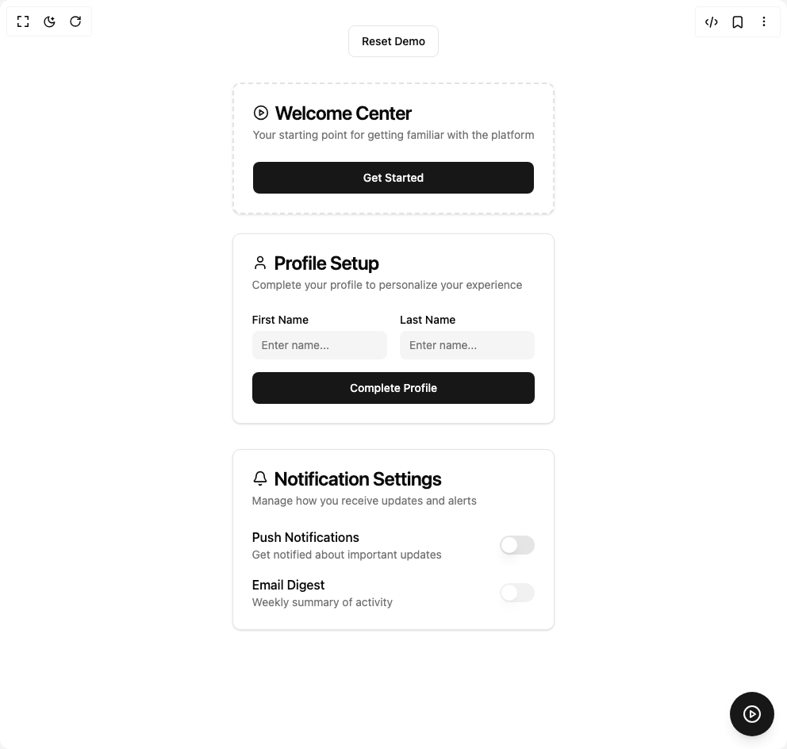
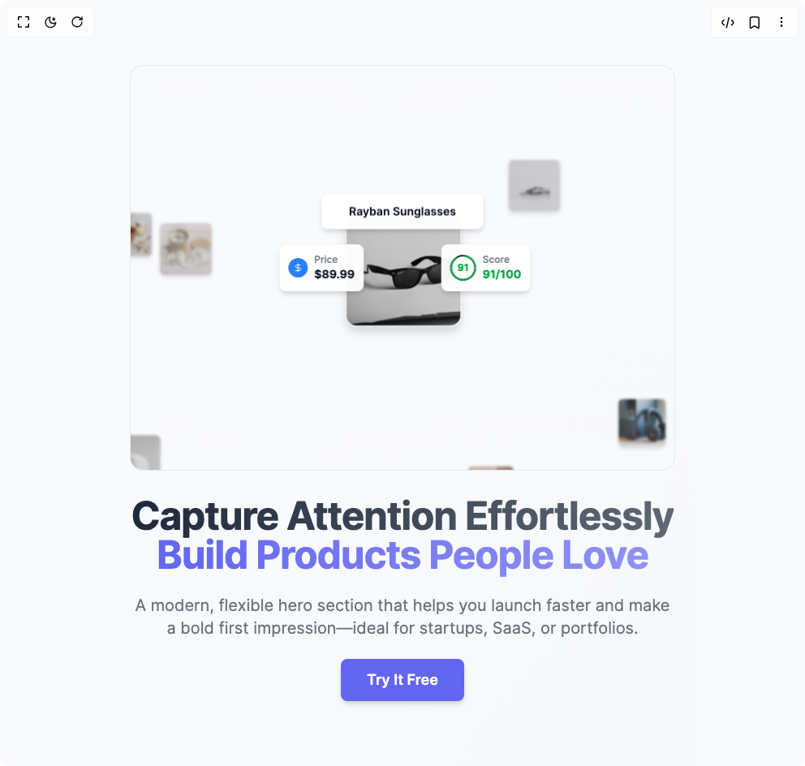

# Chow Stack Components

7 components are available in this author group.

> Build any component in [BuilderStudio](https://builderstudio.dev), then share improvements with the community on [Discord](https://discord.gg/QdWeSGCqfe) or [Reddit](https://reddit.com/r/builderstudio).

| Preview | Component | Variant |
| --- | --- | --- |
|  | [Animated Gradient Button](animated-gradient-button/default/README.md) | `default` |
|  | [Globe Hero](globe-hero/default/README.md) | `default` |
|  | [Grain Gradient Hero Section](grain-gradient-hero-section/default/README.md) | `default` |
|  | [Liquid Metal Hero](liquid-metal-hero/default/README.md) | `default` |
|  | [Modern Timeline](modern-timeline/default/README.md) | `default` |
|  | [Onboarding Checklist](onboarding-checklist/default/README.md) | `default` |
|  | [Product Spotlight Hero Section](product-spotlight-hero-section/default/README.md) | `default` |
