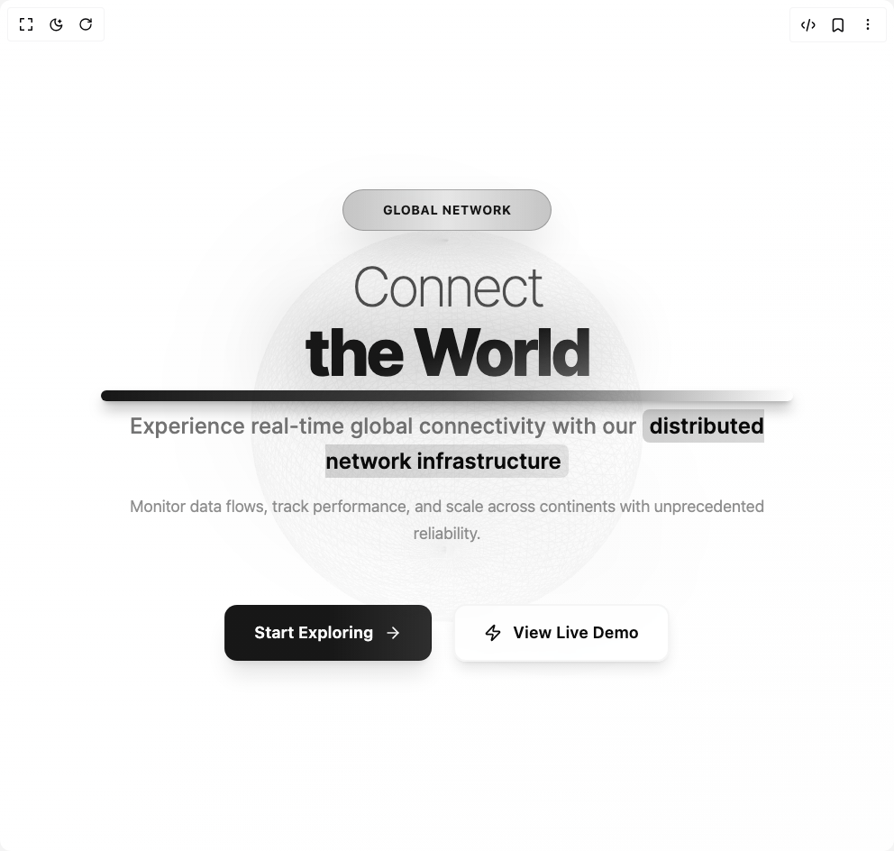

# Build Globe Hero in BuilderStudio

> Build this component in our Agentic IDE: [BuilderStudio](https://builderstudio.dev).
>
> Join the BuilderStudio community on [Discord](https://discord.gg/QdWeSGCqfe) and [Reddit](https://reddit.com/r/builderstudio).



## Component

- Author group: `chow-stack`
- Component: `globe-hero`
- Variant: `default`
- Rendered HTML snapshot: [`rendered.html`](rendered.html)

## BuilderStudio prompt

You are implementing a React component based on a component reference.

## Component identity

- Author: chow-stack
- Component slug: globe-hero
- Demo slug: default
- Title: globe-hero
- Description: 

## Goal

Recreate this component in a React + TypeScript + Tailwind CSS project. Preserve the visual layout, spacing, colors, border radius, shadows, interaction behavior, animation behavior, responsive behavior, and dark mode behavior shown in the rendered demo.

## Implementation requirements

- Use React and TypeScript.
- Use Tailwind CSS classes whenever possible.
- Keep the component self-contained unless the source files require helper components.
- If the source uses CSS variables, custom CSS, animations, or keyframes, include them.
- If the source uses external packages, list and use the required packages.
- Preserve accessibility attributes, button semantics, links, keyboard behavior, and ARIA attributes when visible in the source.
- Do not replace the component with a simplified placeholder.
- Return complete production-ready code.

## Dependencies

No reference metadata available.

## Rendered DOM snapshot

This is the rendered demo HTML extracted from the live preview. Use it to verify structure, class names, visible content, and layout.

```html
<div id="root"><div class="w-screen min-h-screen flex justify-center items-center"><div class="w-screen min-h-screen flex justify-center items-center"><div class="w-full h-screen bg-gradient-to-br from-background via-background/95 to-muted/10 relative overflow-hidden"><div class="relative z-10 flex flex-col items-center justify-center h-full"><div class="absolute inset-0 bg-gradient-to-t from-background/50 via-transparent to-background/30"></div><div class="absolute top-1/4 left-1/4 w-96 h-96 bg-primary/5 rounded-full blur-3xl animate-pulse"></div><div class="absolute bottom-1/4 right-1/4 w-64 h-64 bg-primary/3 rounded-full blur-3xl animate-pulse"></div><div class="relative z-10 text-center space-y-12 max-w-5xl mx-auto px-6 py-12"><div class="space-y-8" style="opacity: 1; transform: none;"><div class="relative inline-flex items-center gap-3 px-6 py-3 rounded-full bg-gradient-to-r from-primary/20 via-primary/10 to-primary/20 border border-primary/30 backdrop-blur-xl shadow-2xl" style="opacity: 1; transform: none;"><div class="absolute inset-0 rounded-full bg-gradient-to-r from-primary/10 via-transparent to-primary/10 animate-pulse"></div><div class="w-2 h-2 bg-primary rounded-full animate-ping"></div><span class="relative z-10 text-sm font-bold text-primary tracking-wider uppercase">GLOBAL NETWORK</span><div class="w-2 h-2 bg-primary rounded-full animate-ping animation-delay-500"></div></div><div class="space-y-6"><h1 class="text-5xl md:text-7xl lg:text-8xl xl:text-9xl font-black tracking-tighter leading-[0.85] select-none" style="font-family: Inter, system-ui, sans-serif; opacity: 1; transform: none;"><span class="block font-light text-foreground/70 mb-3 text-4xl md:text-6xl lg:text-7xl">Connect</span><span class="block relative"><span class="bg-gradient-to-br from-primary via-primary to-primary/60 bg-clip-text text-transparent font-black relative z-10">the World</span><div class="absolute inset-0 bg-gradient-to-br from-primary via-primary to-primary/60 bg-clip-text text-transparent font-black blur-2xl opacity-50 scale-105" style="font-family: Inter, system-ui, sans-serif;">the World</div><div class="absolute -bottom-6 left-0 h-3 bg-gradient-to-r from-primary via-primary/80 to-transparent rounded-full shadow-lg shadow-primary/50" style="width: 100%;"></div></span></h1></div><div class="max-w-3xl mx-auto space-y-4" style="opacity: 1;"><p class="text-xl md:text-2xl text-muted-foreground leading-relaxed font-medium" style="font-family: Inter, system-ui, sans-serif;">Experience real-time global connectivity with our <span class="text-foreground font-semibold bg-gradient-to-r from-primary/20 to-primary/10 px-2 py-1 rounded-md">distributed network infrastructure</span></p><p class="text-lg text-muted-foreground/80 leading-relaxed">Monitor data flows, track performance, and scale across continents with unprecedented reliability.</p></div></div><div class="flex flex-col sm:flex-row gap-6 justify-center items-center pt-4" style="opacity: 1; transform: none;"><button class="group relative inline-flex items-center gap-3 px-8 py-4 bg-gradient-to-r from-primary via-primary to-primary/90 text-primary-foreground rounded-xl font-semibold text-lg shadow-xl hover:shadow-primary/30 transition-all duration-500 overflow-hidden border border-primary/20" tabindex="0"><div class="absolute inset-0 bg-gradient-to-r from-white/20 via-white/5 to-transparent opacity-0 group-hover:opacity-100 transition-opacity duration-500"></div><div class="absolute inset-0 bg-gradient-to-r from-transparent via-white/30 to-transparent" style="transform: translateX(-100%);"></div><span class="relative z-10 tracking-wide">Start Exploring</span><svg xmlns="http://www.w3.org/2000/svg" width="24" height="24" viewBox="0 0 24 24" fill="none" stroke="currentColor" stroke-width="2" stroke-linecap="round" stroke-linejoin="round" class="lucide lucide-arrow-right relative z-10 w-5 h-5 group-hover:translate-x-2 transition-transform duration-300" aria-hidden="true"><path d="M5 12h14"></path><path d="m12 5 7 7-7 7"></path></svg></button><button class="group relative inline-flex items-center gap-3 px-8 py-4 border-2 border-border/40 rounded-xl font-semibold text-lg hover:border-primary/40 transition-all duration-500 backdrop-blur-xl bg-background/60 hover:bg-background/90 shadow-lg overflow-hidden" tabindex="0"><div class="absolute inset-0 bg-gradient-to-r from-primary/5 via-transparent to-primary/5 opacity-0 group-hover:opacity-100 transition-opacity duration-500"></div><svg xmlns="http://www.w3.org/2000/svg" width="24" height="24" viewBox="0 0 24 24" fill="none" stroke="currentColor" stroke-width="2" stroke-linecap="round" stroke-linejoin="round" class="lucide lucide-zap relative z-10 w-5 h-5 group-hover:scale-110 group-hover:rotate-6 transition-all duration-300" aria-hidden="true"><path d="M4 14a1 1 0 0 1-.78-1.63l9.9-10.2a.5.5 0 0 1 .86.46l-1.92 6.02A1 1 0 0 0 13 10h7a1 1 0 0 1 .78 1.63l-9.9 10.2a.5.5 0 0 1-.86-.46l1.92-6.02A1 1 0 0 0 11 14z"></path></svg><span class="relative z-10 tracking-wide">View Live Demo</span></button></div></div></div><div class="absolute inset-0 z-0 pointer-events-none"><div style="position: relative; width: 100%; height: 100%; overflow: hidden; pointer-events: auto;"><div style="width: 100%; height: 100%;"><canvas data-engine="three.js r179" width="992" height="944" style="display: block; width: 992px; height: 944px;"></canvas></div></div></div></div></div></div></div>
```

## Reference source files

No reference source files were available.
