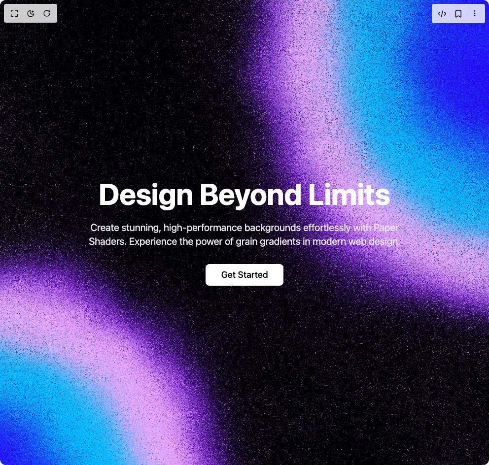

# Build Grain Gradient Hero Section in BuilderStudio

> Build this component in our Agentic IDE: [BuilderStudio](https://builderstudio.dev).
>
> Join the BuilderStudio community on [Discord](https://discord.gg/QdWeSGCqfe) and [Reddit](https://reddit.com/r/builderstudio).



## Component

- Author group: `chow-stack`
- Component: `grain-gradient-hero-section`
- Variant: `default`
- Rendered HTML snapshot: [`rendered.html`](rendered.html)

## BuilderStudio prompt

You are implementing a React component based on a component reference.

## Component identity

- Author: chow-stack
- Component slug: grain-gradient-hero-section
- Demo slug: default
- Title: grain-gradient-hero-section
- Description: 

## Goal

Recreate this component in a React + TypeScript + Tailwind CSS project. Preserve the visual layout, spacing, colors, border radius, shadows, interaction behavior, animation behavior, responsive behavior, and dark mode behavior shown in the rendered demo.

## Implementation requirements

- Use React and TypeScript.
- Use Tailwind CSS classes whenever possible.
- Keep the component self-contained unless the source files require helper components.
- If the source uses CSS variables, custom CSS, animations, or keyframes, include them.
- If the source uses external packages, list and use the required packages.
- Preserve accessibility attributes, button semantics, links, keyboard behavior, and ARIA attributes when visible in the source.
- Do not replace the component with a simplified placeholder.
- Return complete production-ready code.

## Dependencies

No reference metadata available.

## Rendered DOM snapshot

This is the rendered demo HTML extracted from the live preview. Use it to verify structure, class names, visible content, and layout.

```html
<div id="root"><div class="w-screen min-h-screen flex justify-center items-center"><div class="w-screen min-h-screen flex justify-center items-center"><section class="relative min-h-screen flex items-center justify-center overflow-hidden"><div name="Default" params="[object Object]" data-paper-shader="" style="position: fixed; inset: 0px; z-index: -10;"><canvas width="2880" height="2741"></canvas></div><div class="text-center px-6 sm:px-8 max-w-4xl mx-auto"><h1 role="heading" class="text-4xl sm:text-6xl font-bold text-white mb-6">Design Beyond Limits</h1><p class="max-w-2xl text-lg sm:text-xl text-gray-200 mx-auto mb-8">Create stunning, high-performance backgrounds effortlessly with Paper Shaders. Experience the power of grain gradients in modern web design.</p><button class="inline-flex items-center justify-center whitespace-nowrap font-medium ring-offset-background transition-colors focus-visible:outline-none focus-visible:ring-2 focus-visible:ring-ring focus-visible:ring-offset-2 disabled:pointer-events-none disabled:opacity-50 h-11 rounded-md text-lg px-8 py-3 bg-white text-black hover:bg-gray-100">Get Started</button></div></section></div></div></div>
```

## Reference source files

No reference source files were available.
