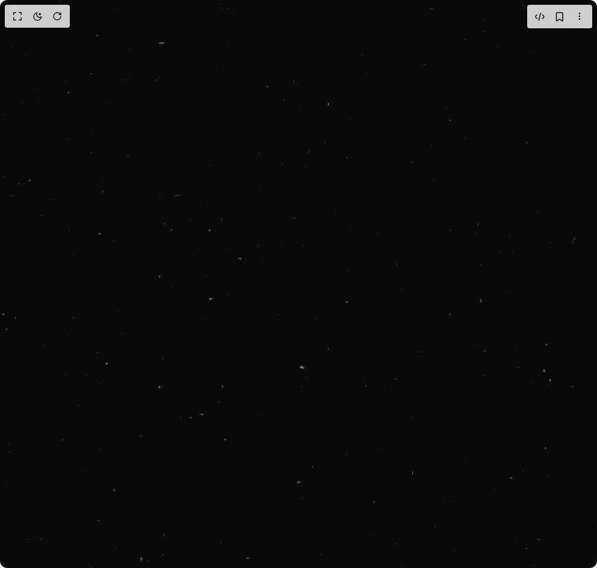

# Build Animated Hero With Web Gl Glitter in BuilderStudio

> Build this component in our Agentic IDE: [BuilderStudio](https://builderstudio.dev).
>
> Join the BuilderStudio community on [Discord](https://discord.gg/QdWeSGCqfe) and [Reddit](https://reddit.com/r/builderstudio).



## Component

- Author group: `cinquinandy`
- Component: `animated-hero-with-web-gl-glitter`
- Variant: `default`
- Rendered HTML snapshot: [`rendered.html`](rendered.html)

## BuilderStudio prompt

You are implementing a React component based on a component reference.

## Component identity

- Author: cinquinandy
- Component slug: animated-hero-with-web-gl-glitter
- Demo slug: default
- Title: animated-hero-with-web-gl-glitter
- Description: 

## Goal

Recreate this component in a React + TypeScript + Tailwind CSS project. Preserve the visual layout, spacing, colors, border radius, shadows, interaction behavior, animation behavior, responsive behavior, and dark mode behavior shown in the rendered demo.

## Implementation requirements

- Use React and TypeScript.
- Use Tailwind CSS classes whenever possible.
- Keep the component self-contained unless the source files require helper components.
- If the source uses CSS variables, custom CSS, animations, or keyframes, include them.
- If the source uses external packages, list and use the required packages.
- Preserve accessibility attributes, button semantics, links, keyboard behavior, and ARIA attributes when visible in the source.
- Do not replace the component with a simplified placeholder.
- Return complete production-ready code.

## Dependencies

No reference metadata available.

## Rendered DOM snapshot

This is the rendered demo HTML extracted from the live preview. Use it to verify structure, class names, visible content, and layout.

```html
<div id="root"><div class="w-screen min-h-screen flex justify-center items-center"><div class="w-screen min-h-screen flex justify-center items-center"><div class="min-w-screen h-screen min-h-screen relative"><div class="fixed scale-125 inset-0 w-full h-full opacity-50 mix-blend-lighten pointer-events-none z-50" style="width: 100vw; height: 100vh;"><div style="position: fixed; width: 100%; height: 100%; overflow: hidden; pointer-events: auto; top: 0px; left: 0px; z-index: 10;"><div style="width: 100%; height: 100%;"><canvas data-engine="three.js r181" width="1240" height="1180" style="display: block; width: 1240px; height: 1180px;"></canvas></div></div></div></div></div></div></div>
```

## Reference source files

No reference source files were available.
