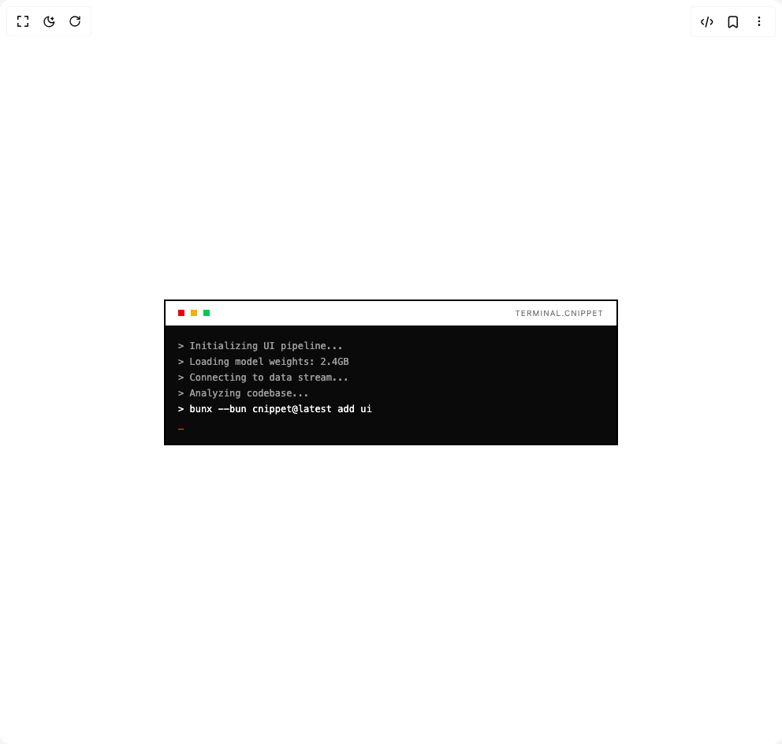

# Build Terminal Card in BuilderStudio

> Build this component in our Agentic IDE: [BuilderStudio](https://builderstudio.dev).
>
> Join the BuilderStudio community on [Discord](https://discord.gg/QdWeSGCqfe) and [Reddit](https://reddit.com/r/builderstudio).



## Component

- Author group: `cnippet_dev`
- Component: `terminal-card`
- Variant: `default`
- Rendered HTML snapshot: [`rendered.html`](rendered.html)

## BuilderStudio prompt

You are implementing a React component based on a component reference.

## Component identity

- Author: cnippet_dev
- Component slug: terminal-card
- Demo slug: default
- Title: terminal-card
- Description: 

## Goal

Recreate this component in a React + TypeScript + Tailwind CSS project. Preserve the visual layout, spacing, colors, border radius, shadows, interaction behavior, animation behavior, responsive behavior, and dark mode behavior shown in the rendered demo.

## Implementation requirements

- Use React and TypeScript.
- Use Tailwind CSS classes whenever possible.
- Keep the component self-contained unless the source files require helper components.
- If the source uses CSS variables, custom CSS, animations, or keyframes, include them.
- If the source uses external packages, list and use the required packages.
- Preserve accessibility attributes, button semantics, links, keyboard behavior, and ARIA attributes when visible in the source.
- Do not replace the component with a simplified placeholder.
- Return complete production-ready code.

## Dependencies

No reference metadata available.

## Rendered DOM snapshot

This is the rendered demo HTML extracted from the live preview. Use it to verify structure, class names, visible content, and layout.

```html
<div id="root"><div class="w-screen min-h-screen flex justify-center items-center"><div class="w-screen min-h-screen flex justify-center items-center"><div class="flex flex-col  h-full mx-auto w-full max-w-xl border-2 border-black dark:border-white"><div class="flex items-center gap-2 border-b-2 border-foreground px-4 py-2"><span class="h-2 w-2 bg-red-600"></span><span class="h-2 w-2 bg-yellow-500"></span><span class="h-2 w-2 bg-green-500"></span><span class="ml-auto text-[10px] tracking-widest text-muted-foreground uppercase">terminal.cnippet</span></div><div class="flex-1 bg-foreground p-4 overflow-hidden"><div class="flex flex-col gap-1"><span class="text-xs text-background font-mono block" style="opacity: 0.6;">&gt; Initializing UI pipeline...</span><span class="text-xs text-background font-mono block" style="opacity: 0.6;">&gt; Loading model weights: 2.4GB</span><span class="text-xs text-background font-mono block" style="opacity: 0.6;">&gt; Connecting to data stream...</span><span class="text-xs text-background font-mono block" style="opacity: 0.6;">&gt; Analyzing codebase...</span><span class="text-xs text-background font-mono block" style="opacity: 1;">&gt; bunx --bun cnippet@latest add ui</span><span class="text-xs text-[#ea580c] font-mono animate-blink">_</span></div></div></div></div></div></div>
```

## Reference source files

No reference source files were available.
