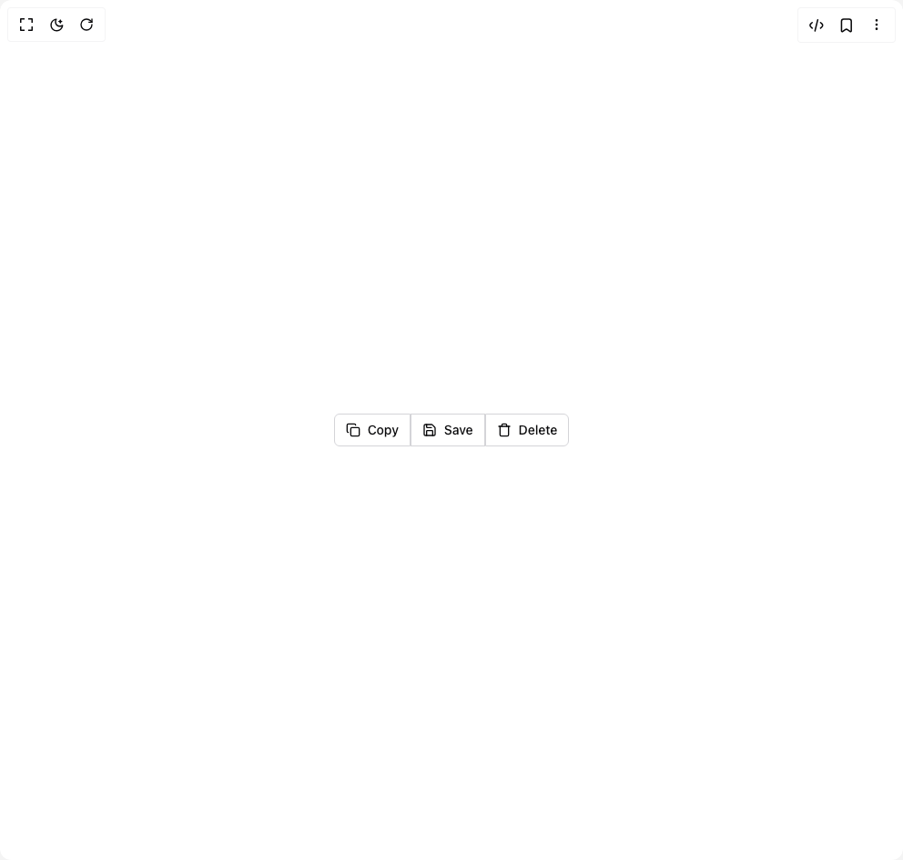
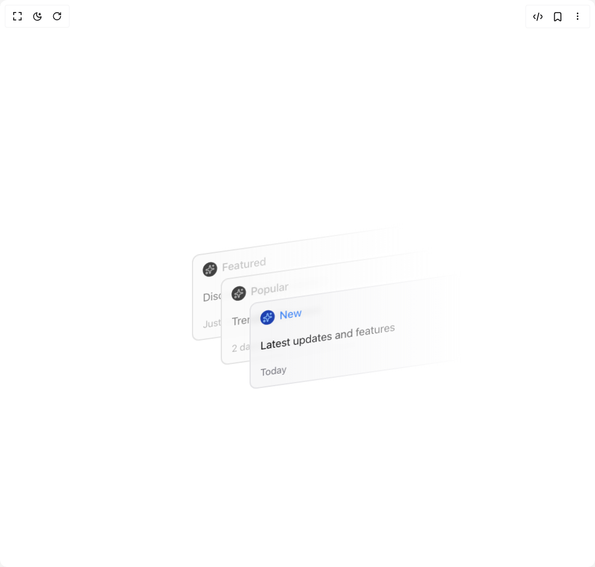
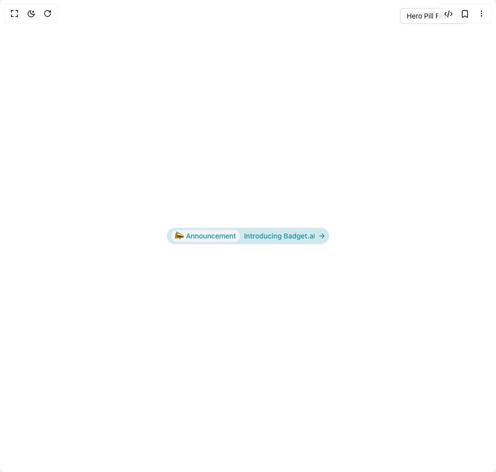
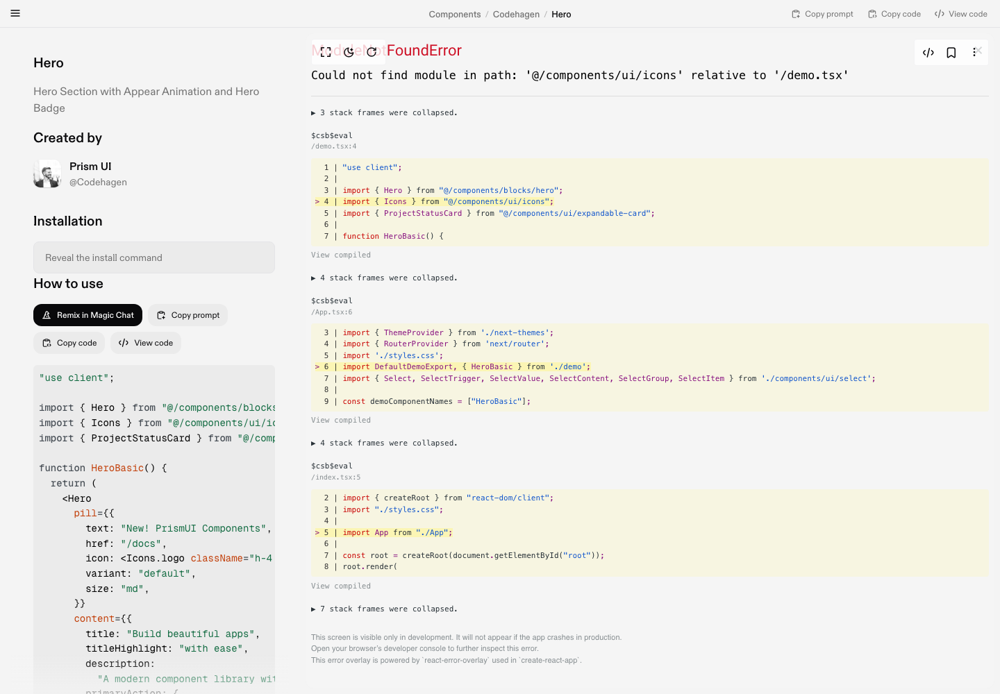
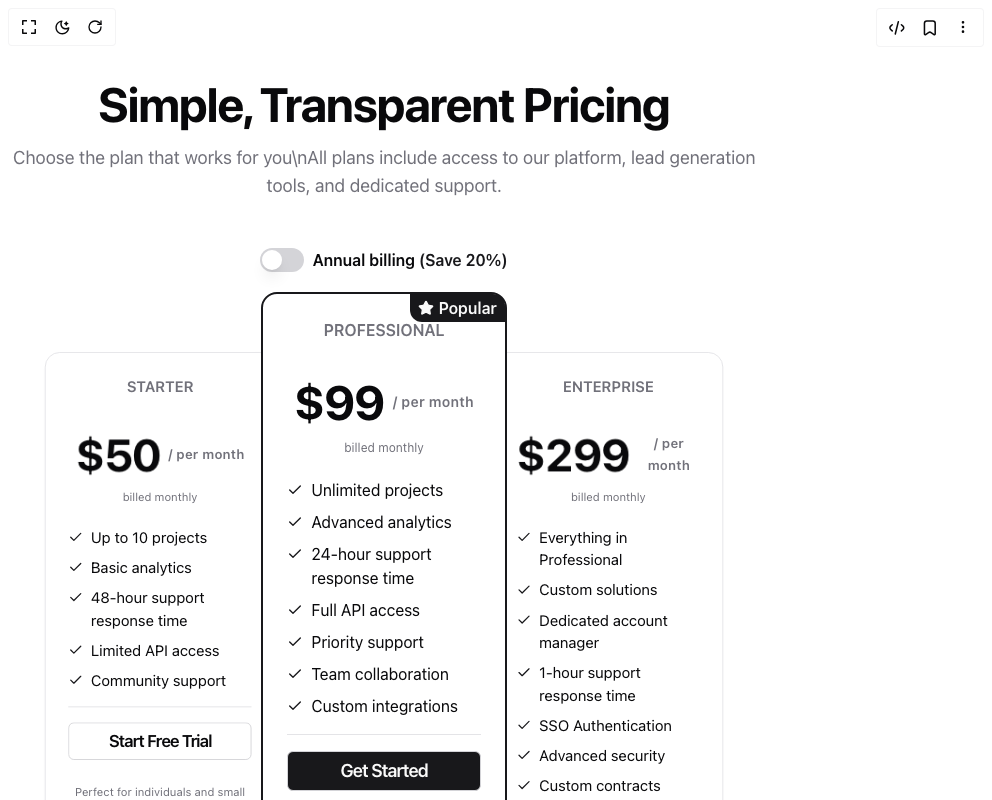
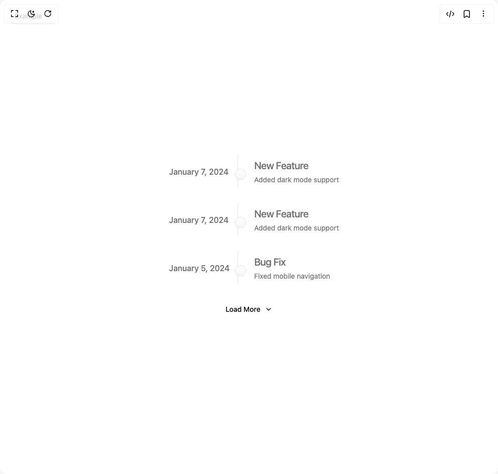
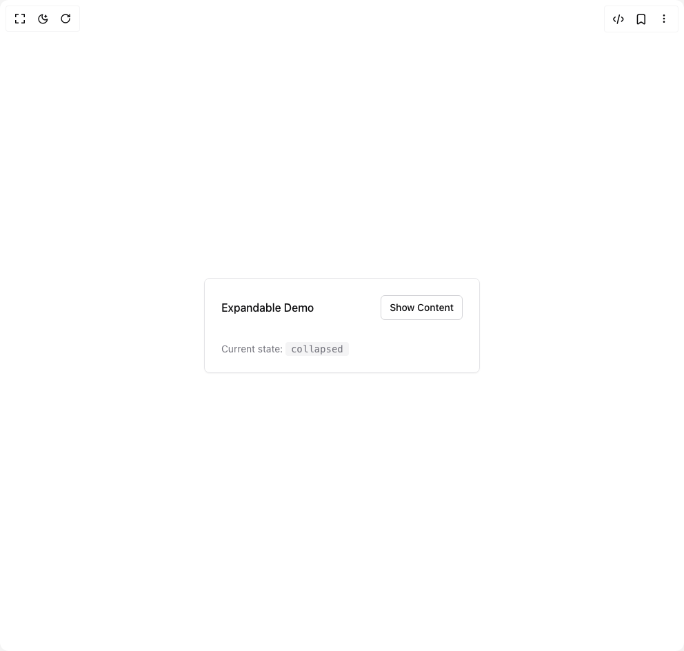

# Codehagen Components

8 components are available in this author group.

> Build any component in [BuilderStudio](https://builderstudio.dev), then share improvements with the community on [Discord](https://discord.gg/QdWeSGCqfe) or [Reddit](https://reddit.com/r/builderstudio).

| Preview | Component | Variant |
| --- | --- | --- |
|  | [Button Group With Icons](button-group-with-icons/default/README.md) | `default` |
|  | [Display Cards](display-cards/default/README.md) | `default` |
|  | [Hero Badge](hero-badge/default/README.md) | `default` |
|  | [Hero Pill](hero-pill/default/README.md) | `default` |
|  | [Hero](hero/default/README.md) | `default` |
|  | [Pricing](pricing/default/README.md) | `default` |
|  | [Timeline](timeline/default/README.md) | `default` |
|  | [Use Expandable](use-expandable/default/README.md) | `default` |
