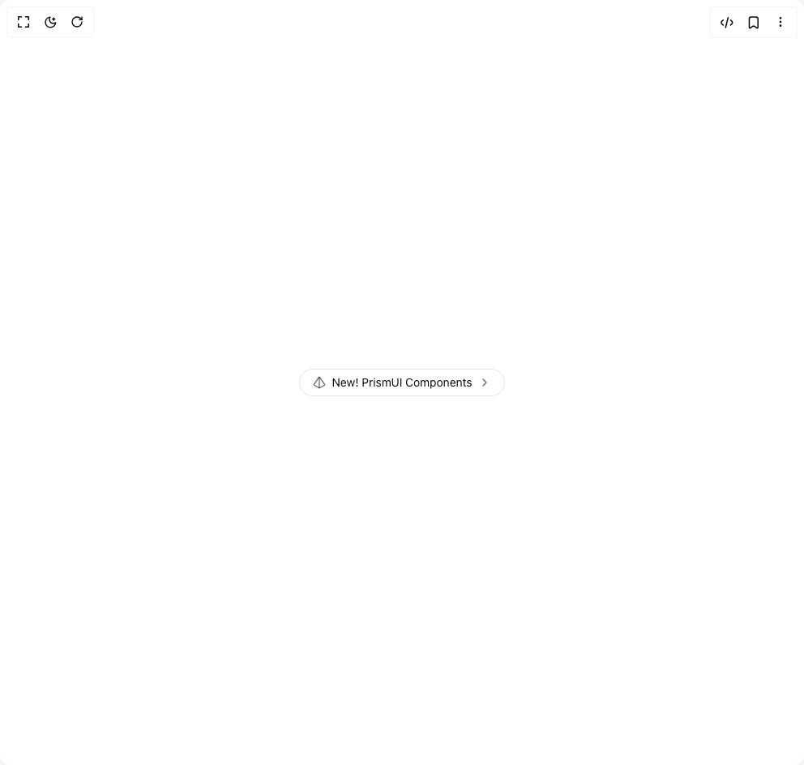

# Build Hero Badge in BuilderStudio

> Build this component in our Agentic IDE: [BuilderStudio](https://builderstudio.dev).
>
> Join the BuilderStudio community on [Discord](https://discord.gg/QdWeSGCqfe) and [Reddit](https://reddit.com/r/builderstudio).



## Component

- Author group: `codehagen`
- Component: `hero-badge`
- Variant: `default`
- Rendered HTML snapshot: [`rendered.html`](rendered.html)

## BuilderStudio prompt

You are implementing a React component based on a component reference.

## Component identity

- Author: Codehagen
- Component slug: hero-badge
- Demo slug: default
- Title: hero-badge
- Description: 

## Goal

Recreate this component in a React + TypeScript + Tailwind CSS project. Preserve the visual layout, spacing, colors, border radius, shadows, interaction behavior, animation behavior, responsive behavior, and dark mode behavior shown in the rendered demo.

## Implementation requirements

- Use React and TypeScript.
- Use Tailwind CSS classes whenever possible.
- Keep the component self-contained unless the source files require helper components.
- If the source uses CSS variables, custom CSS, animations, or keyframes, include them.
- If the source uses external packages, list and use the required packages.
- Preserve accessibility attributes, button semantics, links, keyboard behavior, and ARIA attributes when visible in the source.
- Do not replace the component with a simplified placeholder.
- Return complete production-ready code.

## Dependencies

No reference metadata available.

## Rendered DOM snapshot

This is the rendered demo HTML extracted from the live preview. Use it to verify structure, class names, visible content, and layout.

```html
<div id="root"><div class="relative flex items-center justify-center h-screen w-full m-auto p-16 bg-background text-foreground"><div class="absolute lab-bg inset-0 size-full"><div class="absolute inset-0 bg-[radial-gradient(#00000021_1px,transparent_1px)] dark:bg-[radial-gradient(#ffffff22_1px,transparent_1px)]"></div></div><div class="flex w-full justify-center relative"><div class="flex min-h-[350px] w-full items-center justify-center"><a href="/docs" class="group cursor-pointer"><div class="inline-flex items-center rounded-full border transition-colors bg-background hover:bg-muted px-4 py-1.5 text-sm gap-2" style="opacity: 1; transform: none;"><div class="text-foreground/60 transition-colors group-hover:text-primary" style="transform: none;"><svg xmlns="http://www.w3.org/2000/svg" width="40" height="40" viewBox="0 0 24 24" fill="none" stroke="currentColor" stroke-width="2" stroke-linecap="round" stroke-linejoin="round" class="h-4 w-4"><path d="M2.5 16.88a1 1 0 0 1-.32-1.43l9-13.02a1 1 0 0 1 1.64 0l9 13.01a1 1 0 0 1-.32 1.44l-8.51 4.86a2 2 0 0 1-1.98 0Z"></path><path d="M12 2v20"></path></svg></div><span>New! PrismUI Components</span><div class="text-foreground/60"><svg xmlns="http://www.w3.org/2000/svg" width="24" height="24" viewBox="0 0 24 24" fill="none" stroke="currentColor" stroke-width="2" stroke-linecap="round" stroke-linejoin="round" class="h-4 w-4"><path d="m9 18 6-6-6-6"></path></svg></div></div></a></div></div></div></div>
```

## Reference source files

No reference source files were available.
