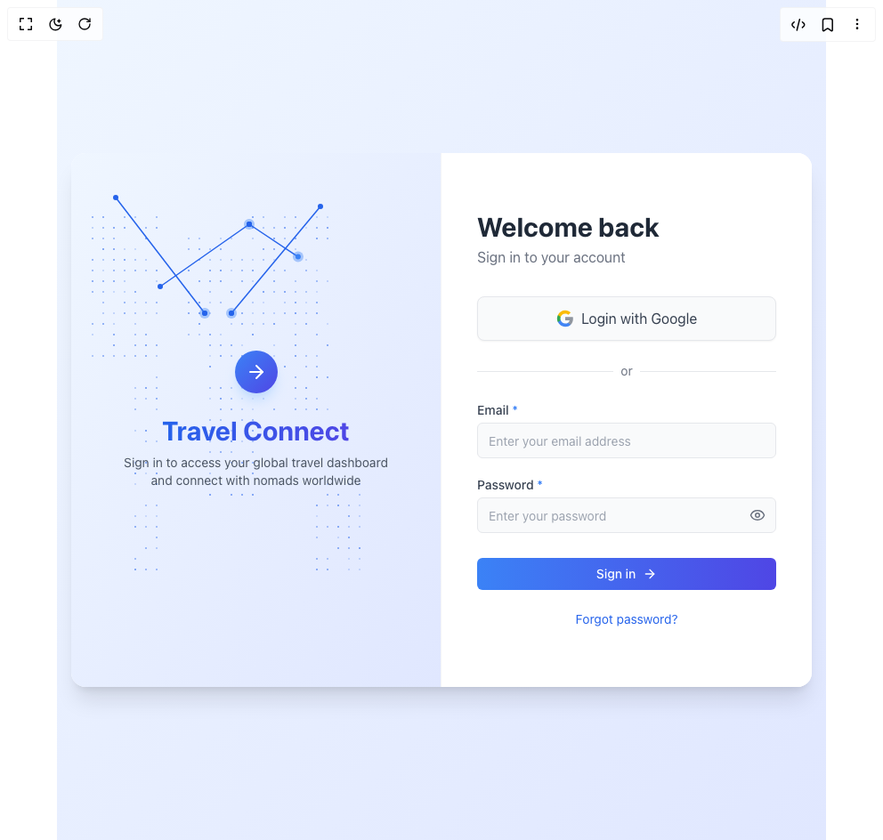

# Build Travel Connect Signin 1 in BuilderStudio

> Build this component in our Agentic IDE: [BuilderStudio](https://builderstudio.dev).
>
> Join the BuilderStudio community on [Discord](https://discord.gg/QdWeSGCqfe) and [Reddit](https://reddit.com/r/builderstudio).



## Component

- Author group: `coderislive07`
- Component: `travel-connect-signin-1`
- Variant: `default`
- Rendered HTML snapshot: [`rendered.html`](rendered.html)

## BuilderStudio prompt

You are implementing a React component based on a component reference.

## Component identity

- Author: coderislive07
- Component slug: travel-connect-signin-1
- Demo slug: default
- Title: travel-connect-signin-1
- Description: 

## Goal

Recreate this component in a React + TypeScript + Tailwind CSS project. Preserve the visual layout, spacing, colors, border radius, shadows, interaction behavior, animation behavior, responsive behavior, and dark mode behavior shown in the rendered demo.

## Implementation requirements

- Use React and TypeScript.
- Use Tailwind CSS classes whenever possible.
- Keep the component self-contained unless the source files require helper components.
- If the source uses CSS variables, custom CSS, animations, or keyframes, include them.
- If the source uses external packages, list and use the required packages.
- Preserve accessibility attributes, button semantics, links, keyboard behavior, and ARIA attributes when visible in the source.
- Do not replace the component with a simplified placeholder.
- Return complete production-ready code.

## Dependencies

No reference metadata available.

## Rendered DOM snapshot

This is the rendered demo HTML extracted from the live preview. Use it to verify structure, class names, visible content, and layout.

```html
<div id="root"><div class="relative flex items-center justify-center h-screen w-full m-auto p-16 bg-background text-foreground"><div class="absolute lab-bg inset-0 size-full"><div class="absolute inset-0 bg-[radial-gradient(#00000021_1px,transparent_1px)] dark:bg-[radial-gradient(#ffffff22_1px,transparent_1px)]"></div></div><div class="flex w-full justify-center relative"><div class="min-h-screen w-full flex items-center justify-center bg-gradient-to-br from-blue-50 to-indigo-100 p-4"><div class="flex w-full h-full items-center justify-center"><div class="w-full max-w-4xl overflow-hidden rounded-2xl flex bg-white shadow-xl" style="opacity: 1; transform: none;"><div class="hidden md:block w-1/2 h-[600px] relative overflow-hidden border-r border-gray-100"><div class="absolute inset-0 bg-gradient-to-br from-blue-50 to-indigo-100"><div class="relative w-full h-full overflow-hidden"><canvas class="absolute inset-0 w-full h-full" width="415" height="600"></canvas></div><div class="absolute inset-0 flex flex-col items-center justify-center p-8 z-10"><div class="mb-6" style="opacity: 1; transform: none;"><div class="h-12 w-12 rounded-full bg-gradient-to-br from-blue-500 to-indigo-600 flex items-center justify-center shadow-lg shadow-blue-200"><svg xmlns="http://www.w3.org/2000/svg" width="24" height="24" viewBox="0 0 24 24" fill="none" stroke="currentColor" stroke-width="2" stroke-linecap="round" stroke-linejoin="round" class="lucide lucide-arrow-right text-white h-6 w-6" aria-hidden="true"><path d="M5 12h14"></path><path d="m12 5 7 7-7 7"></path></svg></div></div><h2 class="text-3xl font-bold mb-2 text-center text-transparent bg-clip-text bg-gradient-to-r from-blue-600 to-indigo-600" style="opacity: 1; transform: none;">Travel Connect</h2><p class="text-sm text-center text-gray-600 max-w-xs" style="opacity: 1; transform: none;">Sign in to access your global travel dashboard and connect with nomads worldwide</p></div></div></div><div class="w-full md:w-1/2 p-8 md:p-10 flex flex-col justify-center bg-white"><div style="opacity: 1; transform: none;"><h1 class="text-2xl md:text-3xl font-bold mb-1 text-gray-800">Welcome back</h1><p class="text-gray-500 mb-8">Sign in to your account</p><div class="mb-6"><button class="w-full flex items-center justify-center gap-2 bg-gray-50 border border-gray-200 rounded-lg p-3 hover:bg-gray-100 transition-all duration-300 text-gray-700 shadow-sm"><svg class="h-5 w-5" viewBox="0 0 24 24"><path fill="currentColor" d="M22.56 12.25c0-.78-.07-1.53-.2-2.25H12v4.26h5.92c-.26 1.37-1.04 2.53-2.21 3.31v2.77h3.57c2.08-1.92 3.28-4.74 3.28-8.09z" fill-opacity=".54"></path><path fill="#4285F4" d="M12 23c2.97 0 5.46-.98 7.28-2.66l-3.57-2.77c-.98.66-2.23 1.06-3.71 1.06-2.86 0-5.29-1.93-6.16-4.53H2.18v2.84C3.99 20.53 7.7 23 12 23z"></path><path fill="#34A853" d="M5.84 14.09c-.22-.66-.35-1.36-.35-2.09s.13-1.43.35-2.09V7.07H2.18C1.43 8.55 1 10.22 1 12s.43 3.45 1.18 4.93l2.85-2.22.81-.62z"></path><path fill="#FBBC05" d="M12 5.38c1.62 0 3.06.56 4.21 1.64l3.15-3.15C17.45 2.09 14.97 1 12 1 7.7 1 3.99 3.47 2.18 7.07l3.66 2.84c.87-2.6 3.3-4.53 6.16-4.53z"></path><path fill="#EA4335" d="M1 1h22v22H1z" fill-opacity="0"></path></svg><span>Login with Google</span></button></div><div class="relative my-6"><div class="absolute inset-0 flex items-center"><div class="w-full border-t border-gray-200"></div></div><div class="relative flex justify-center text-sm"><span class="px-2 bg-white text-gray-500">or</span></div></div><form class="space-y-5"><div><label for="email" class="block text-sm font-medium text-gray-700 mb-1">Email <span class="text-blue-500">*</span></label><input class="flex h-10 w-full rounded-md border bg-background px-3 py-2 text-sm text-gray-800 ring-offset-background file:border-0 file:bg-transparent file:text-sm file:font-medium file:text-foreground placeholder:text-gray-400 focus-visible:outline-none focus-visible:ring-2 focus-visible:ring-blue-500 focus-visible:ring-offset-2 disabled:cursor-not-allowed disabled:opacity-50 bg-gray-50 border-gray-200 placeholder:text-gray-400 text-gray-800 w-full focus:border-blue-500 focus:ring-blue-500" id="email" placeholder="Enter your email address" required="" type="email" value=""></div><div><label for="password" class="block text-sm font-medium text-gray-700 mb-1">Password <span class="text-blue-500">*</span></label><div class="relative"><input class="flex h-10 w-full rounded-md border bg-background px-3 py-2 text-sm text-gray-800 ring-offset-background file:border-0 file:bg-transparent file:text-sm file:font-medium file:text-foreground placeholder:text-gray-400 focus-visible:outline-none focus-visible:ring-2 focus-visible:ring-blue-500 focus-visible:ring-offset-2 disabled:cursor-not-allowed disabled:opacity-50 bg-gray-50 border-gray-200 placeholder:text-gray-400 text-gray-800 w-full pr-10 focus:border-blue-500 focus:ring-blue-500" id="password" placeholder="Enter your password" required="" type="password" value=""><button type="button" class="absolute inset-y-0 right-0 flex items-center pr-3 text-gray-500 hover:text-gray-700"><svg xmlns="http://www.w3.org/2000/svg" width="18" height="18" viewBox="0 0 24 24" fill="none" stroke="currentColor" stroke-width="2" stroke-linecap="round" stroke-linejoin="round" class="lucide lucide-eye" aria-hidden="true"><path d="M2.062 12.348a1 1 0 0 1 0-.696 10.75 10.75 0 0 1 19.876 0 1 1 0 0 1 0 .696 10.75 10.75 0 0 1-19.876 0"></path><circle cx="12" cy="12" r="3"></circle></svg></button></div></div><div class="pt-2" tabindex="0"><button class="inline-flex items-center justify-center gap-2 whitespace-nowrap rounded-md text-sm font-medium transition-colors focus-visible:outline-none focus-visible:ring-2 focus-visible:ring-blue-500 focus-visible:ring-offset-2 disabled:pointer-events-none disabled:opacity-50 bg-primary bg-gradient-to-r from-blue-500 to-indigo-600 text-white hover:from-blue-600 hover:to-indigo-700 w-full bg-gradient-to-r relative overflow-hidden from-blue-500 to-indigo-600 hover:from-blue-600 hover:to-indigo-700 text-white py-2 rounded-lg transition-all duration-300" type="submit"><span class="flex items-center justify-center">Sign in<svg xmlns="http://www.w3.org/2000/svg" width="24" height="24" viewBox="0 0 24 24" fill="none" stroke="currentColor" stroke-width="2" stroke-linecap="round" stroke-linejoin="round" class="lucide lucide-arrow-right ml-2 h-4 w-4" aria-hidden="true"><path d="M5 12h14"></path><path d="m12 5 7 7-7 7"></path></svg></span></button></div><div class="text-center mt-6"><a href="#" class="text-blue-600 hover:text-blue-700 text-sm transition-colors">Forgot password?</a></div></form></div></div></div></div></div></div></div></div>
```

## Reference source files

No reference source files were available.
