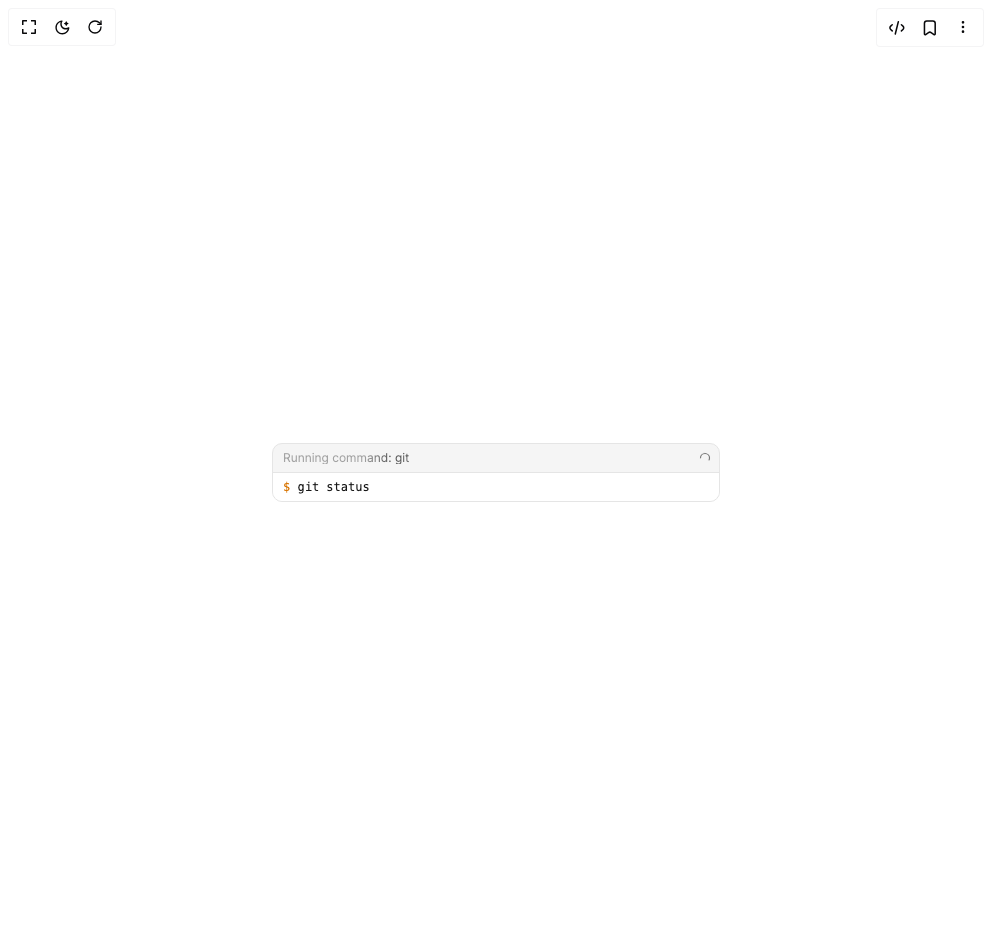

# Build Bash Tool in BuilderStudio

> Build this component in our Agentic IDE: [BuilderStudio](https://builderstudio.dev).
>
> Join the BuilderStudio community on [Discord](https://discord.gg/QdWeSGCqfe) and [Reddit](https://reddit.com/r/builderstudio).



## Component

- Author group: `community`
- Component: `bash-tool`
- Variant: `running-state`
- Rendered HTML snapshot: [`rendered.html`](rendered.html)

## BuilderStudio prompt

You are implementing a React component based on a component reference.

## Component identity

- Author: BuilderStudio
- Component slug: bash-tool
- Demo slug: running-state
- Title: bash-tool
- Description: 

## Goal

Recreate this component in a React + TypeScript + Tailwind CSS project. Preserve the visual layout, spacing, colors, border radius, shadows, interaction behavior, animation behavior, responsive behavior, and dark mode behavior shown in the rendered demo.

## Implementation requirements

- Use React and TypeScript.
- Use Tailwind CSS classes whenever possible.
- Keep the component self-contained unless the source files require helper components.
- If the source uses CSS variables, custom CSS, animations, or keyframes, include them.
- If the source uses external packages, list and use the required packages.
- Preserve accessibility attributes, button semantics, links, keyboard behavior, and ARIA attributes when visible in the source.
- Do not replace the component with a simplified placeholder.
- Return complete production-ready code.

## Dependencies

No reference metadata available.

## Rendered DOM snapshot

This is the rendered demo HTML extracted from the live preview. Use it to verify structure, class names, visible content, and layout.

```html
<div id="root"><div class="flex items-center justify-center w-full min-h-screen bg-background p-8 overflow-hidden"><div class="w-full max-w-md"><div class="rounded-[10px] border border-neutral-200 dark:border-neutral-800 bg-neutral-100 dark:bg-neutral-900 overflow-hidden"><div class="flex items-center justify-between pl-2.5 pr-2 h-7"><div class="flex items-center gap-1.5 min-w-0 overflow-hidden"><span class="an-bash-shimmer text-xs leading-none truncate">Running command: git</span></div><svg class="w-3 h-3 text-neutral-500 dark:text-neutral-400 animate-spin shrink-0" viewBox="0 0 16 16" fill="none" aria-hidden="true"><circle cx="8" cy="8" r="6" stroke="currentColor" stroke-width="1.5" stroke-dasharray="28" stroke-dashoffset="7" stroke-linecap="round"></circle></svg></div><div class="border-t border-neutral-200 dark:border-neutral-800 px-2.5 py-1.5 font-mono text-[12px] leading-[16px] overflow-hidden bg-white dark:bg-neutral-950"><div class="break-all"><span class="text-amber-600 dark:text-amber-400 select-none">$ </span><span class="text-neutral-900 dark:text-neutral-100">git status</span></div></div></div></div></div></div>
```

## Reference source files

No reference source files were available.
