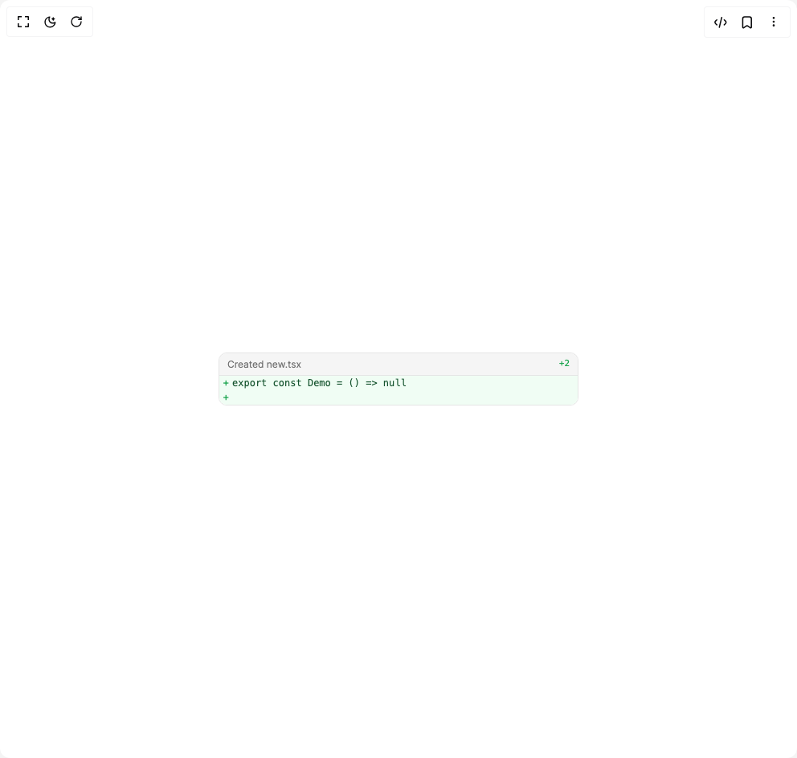

# Build Edit Tool in BuilderStudio

> Build this component in our Agentic IDE: [BuilderStudio](https://builderstudio.dev).
>
> Join the BuilderStudio community on [Discord](https://discord.gg/QdWeSGCqfe) and [Reddit](https://reddit.com/r/builderstudio).



## Component

- Author group: `community`
- Component: `edit-tool`
- Variant: `write-tool`
- Rendered HTML snapshot: [`rendered.html`](rendered.html)

## BuilderStudio prompt

You are implementing a React component based on a component reference.

## Component identity

- Author: BuilderStudio
- Component slug: edit-tool
- Demo slug: write-tool
- Title: edit-tool
- Description: 

## Goal

Recreate this component in a React + TypeScript + Tailwind CSS project. Preserve the visual layout, spacing, colors, border radius, shadows, interaction behavior, animation behavior, responsive behavior, and dark mode behavior shown in the rendered demo.

## Implementation requirements

- Use React and TypeScript.
- Use Tailwind CSS classes whenever possible.
- Keep the component self-contained unless the source files require helper components.
- If the source uses CSS variables, custom CSS, animations, or keyframes, include them.
- If the source uses external packages, list and use the required packages.
- Preserve accessibility attributes, button semantics, links, keyboard behavior, and ARIA attributes when visible in the source.
- Do not replace the component with a simplified placeholder.
- Return complete production-ready code.

## Dependencies

No reference metadata available.

## Rendered DOM snapshot

This is the rendered demo HTML extracted from the live preview. Use it to verify structure, class names, visible content, and layout.

```html
<div id="root"><div class="flex items-center justify-center w-full min-h-screen bg-background p-8 overflow-hidden"><div class="w-full max-w-md"><div class="rounded-[10px] border border-neutral-200 dark:border-neutral-800 bg-neutral-50 dark:bg-black overflow-hidden w-full"><div class="flex items-center justify-between px-2.5 h-7 bg-neutral-100 dark:bg-neutral-900 border-b border-neutral-200 dark:border-neutral-800"><div class="flex items-center gap-1.5 min-w-0"><span class="text-xs text-neutral-500 dark:text-neutral-400 truncate">Created new.tsx</span></div><span class="text-[11px] font-mono text-neutral-500 dark:text-neutral-400 inline-flex gap-2 shrink-0"><span class="text-green-600 dark:text-green-400">+2</span></span></div><div class="text-[12px] font-mono leading-[1.5] bg-white dark:bg-black overflow-x-auto"><div class="flex items-start min-w-0 bg-green-50 dark:bg-green-950/30 text-green-900 dark:text-green-200"><span class="select-none w-4 text-center shrink-0 text-green-600 dark:text-green-400">+</span><span class="whitespace-pre pr-2 flex-1 min-w-0">export const Demo = () =&gt; null</span></div><div class="flex items-start min-w-0 bg-green-50 dark:bg-green-950/30 text-green-900 dark:text-green-200"><span class="select-none w-4 text-center shrink-0 text-green-600 dark:text-green-400">+</span><span class="whitespace-pre pr-2 flex-1 min-w-0"> </span></div></div></div></div></div></div>
```

## Reference source files

No reference source files were available.
