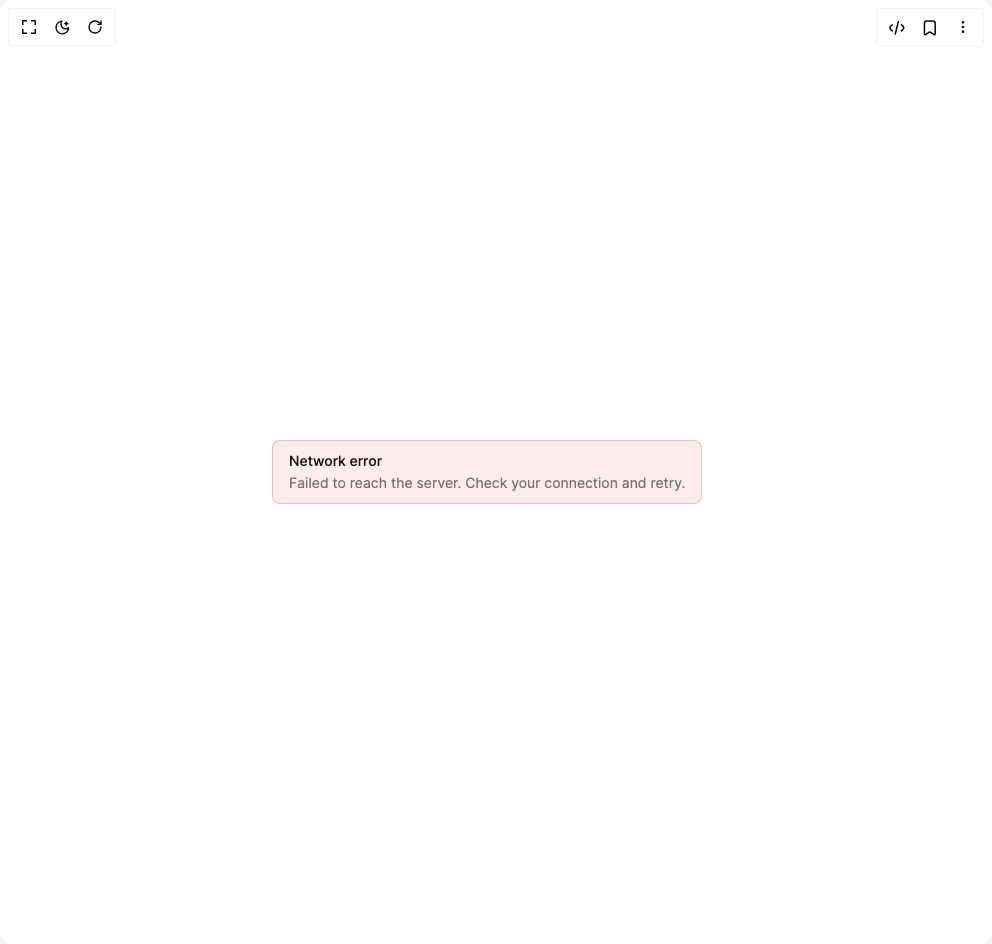

# Build Error Message in BuilderStudio

> Build this component in our Agentic IDE: [BuilderStudio](https://builderstudio.dev).
>
> Join the BuilderStudio community on [Discord](https://discord.gg/QdWeSGCqfe) and [Reddit](https://reddit.com/r/builderstudio).



## Component

- Author group: `community`
- Component: `error-message`
- Variant: `network`
- Rendered HTML snapshot: [`rendered.html`](rendered.html)

## BuilderStudio prompt

You are implementing a React component based on a component reference.

## Component identity

- Author: BuilderStudio
- Component slug: error-message
- Demo slug: network
- Title: error-message
- Description: 

## Goal

Recreate this component in a React + TypeScript + Tailwind CSS project. Preserve the visual layout, spacing, colors, border radius, shadows, interaction behavior, animation behavior, responsive behavior, and dark mode behavior shown in the rendered demo.

## Implementation requirements

- Use React and TypeScript.
- Use Tailwind CSS classes whenever possible.
- Keep the component self-contained unless the source files require helper components.
- If the source uses CSS variables, custom CSS, animations, or keyframes, include them.
- If the source uses external packages, list and use the required packages.
- Preserve accessibility attributes, button semantics, links, keyboard behavior, and ARIA attributes when visible in the source.
- Do not replace the component with a simplified placeholder.
- Return complete production-ready code.

## Dependencies

No reference metadata available.

## Rendered DOM snapshot

This is the rendered demo HTML extracted from the live preview. Use it to verify structure, class names, visible content, and layout.

```html
<div id="root"><div class="min-h-screen w-full flex items-center justify-center p-6 bg-white dark:bg-neutral-950"><div class="w-full max-w-md"><div class="flex justify-start"><div class="border border-red-500/30 bg-red-500/10 px-4 py-2.5 text-sm rounded-[8px]"><div class="font-medium text-neutral-900 dark:text-neutral-100">Network error</div><div class="mt-0.5 text-neutral-500 dark:text-neutral-400">Failed to reach the server. Check your connection and retry.</div></div></div></div></div></div>
```

## Reference source files

No reference source files were available.
