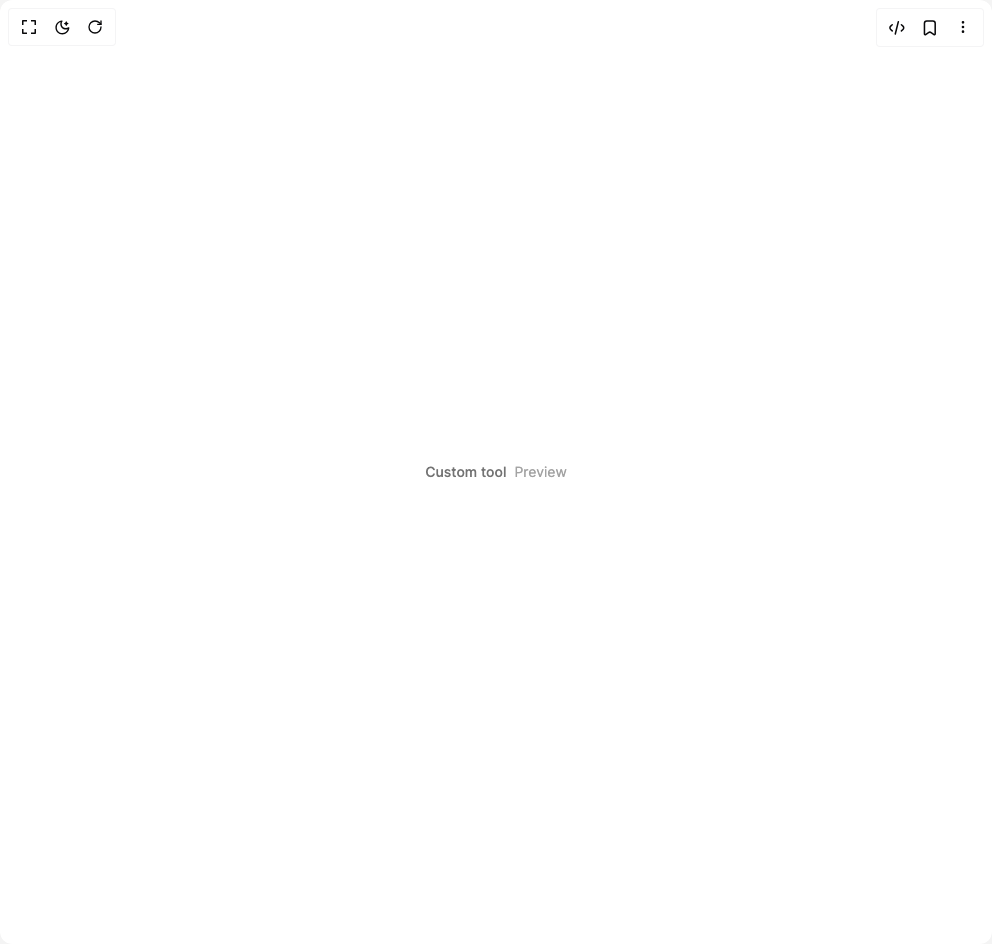

# Build Generic Tool in BuilderStudio

> Build this component in our Agentic IDE: [BuilderStudio](https://builderstudio.dev).
>
> Join the BuilderStudio community on [Discord](https://discord.gg/QdWeSGCqfe) and [Reddit](https://reddit.com/r/builderstudio).



## Component

- Author group: `community`
- Component: `generic-tool`
- Variant: `default`
- Rendered HTML snapshot: [`rendered.html`](rendered.html)

## BuilderStudio prompt

You are implementing a React component based on a component reference.

## Component identity

- Author: BuilderStudio
- Component slug: generic-tool
- Demo slug: default
- Title: generic-tool
- Description: 

## Goal

Recreate this component in a React + TypeScript + Tailwind CSS project. Preserve the visual layout, spacing, colors, border radius, shadows, interaction behavior, animation behavior, responsive behavior, and dark mode behavior shown in the rendered demo.

## Implementation requirements

- Use React and TypeScript.
- Use Tailwind CSS classes whenever possible.
- Keep the component self-contained unless the source files require helper components.
- If the source uses CSS variables, custom CSS, animations, or keyframes, include them.
- If the source uses external packages, list and use the required packages.
- Preserve accessibility attributes, button semantics, links, keyboard behavior, and ARIA attributes when visible in the source.
- Do not replace the component with a simplified placeholder.
- Return complete production-ready code.

## Dependencies

No reference metadata available.

## Rendered DOM snapshot

This is the rendered demo HTML extracted from the live preview. Use it to verify structure, class names, visible content, and layout.

```html
<div id="root"><div class="flex items-center justify-center w-full min-h-screen bg-background p-8 overflow-hidden"><div class="w-fit"><div class="flex items-center max-w-full select-none gap-1"><div class="flex items-center gap-2 min-w-0 text-sm text-neutral-500 dark:text-neutral-400"><span class="font-[450] whitespace-nowrap shrink-0">Custom tool</span><span class="font-normal truncate min-w-0 flex-1 text-neutral-400 dark:text-neutral-500/80">Preview</span></div></div></div></div></div>
```

## Reference source files

No reference source files were available.
