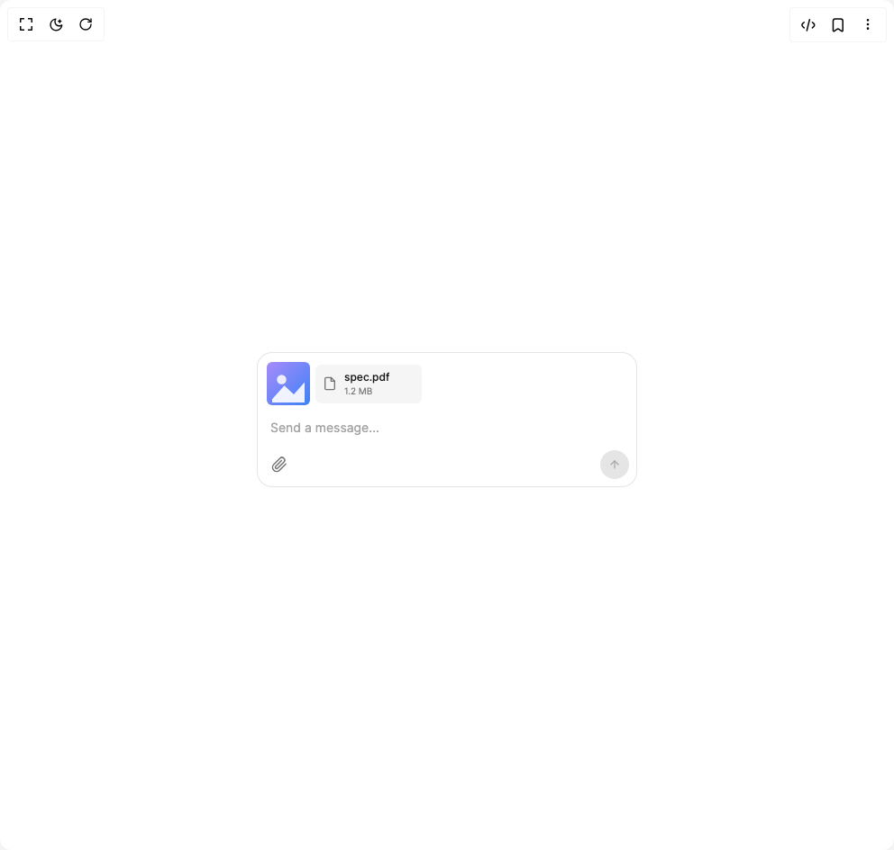

# Build Input Bar in BuilderStudio

> Build this component in our Agentic IDE: [BuilderStudio](https://builderstudio.dev).
>
> Join the BuilderStudio community on [Discord](https://discord.gg/QdWeSGCqfe) and [Reddit](https://reddit.com/r/builderstudio).



## Component

- Author group: `community`
- Component: `input-bar`
- Variant: `with-attachments`
- Rendered HTML snapshot: [`rendered.html`](rendered.html)

## BuilderStudio prompt

You are implementing a React component based on a component reference.

## Component identity

- Author: BuilderStudio
- Component slug: input-bar
- Demo slug: with-attachments
- Title: input-bar
- Description: 

## Goal

Recreate this component in a React + TypeScript + Tailwind CSS project. Preserve the visual layout, spacing, colors, border radius, shadows, interaction behavior, animation behavior, responsive behavior, and dark mode behavior shown in the rendered demo.

## Implementation requirements

- Use React and TypeScript.
- Use Tailwind CSS classes whenever possible.
- Keep the component self-contained unless the source files require helper components.
- If the source uses CSS variables, custom CSS, animations, or keyframes, include them.
- If the source uses external packages, list and use the required packages.
- Preserve accessibility attributes, button semantics, links, keyboard behavior, and ARIA attributes when visible in the source.
- Do not replace the component with a simplified placeholder.
- Return complete production-ready code.

## Dependencies

No reference metadata available.

## Rendered DOM snapshot

This is the rendered demo HTML extracted from the live preview. Use it to verify structure, class names, visible content, and layout.

```html
<div id="root"><div class="min-h-screen w-full flex items-center justify-center p-6 bg-white dark:bg-neutral-950"><div class="w-full max-w-md"><div class="shrink-0 px-3 pb-3 w-full"><div class="mx-auto max-w-[420px]"><div class="relative cursor-text rounded-[16px] bg-white dark:bg-neutral-900 shadow-sm ring-1 ring-neutral-200 dark:ring-neutral-800"><div class="grid transition-[grid-template-rows] duration-200 ease-out grid-rows-[1fr]"><div class="overflow-hidden"><div class="flex flex-wrap items-center gap-1.5 px-2.5 pt-2.5 pb-0.5"><div class="relative w-12 h-12 rounded-md overflow-hidden bg-neutral-100 dark:bg-neutral-800 group"><button type="button" aria-label="Remove image" class="absolute top-0.5 right-0.5 inline-flex items-center justify-center w-4 h-4 rounded-full bg-neutral-900/70 text-white opacity-0 group-hover:opacity-100 transition-opacity"><svg width="12" height="12" viewBox="0 0 24 24" fill="none" stroke="currentColor" stroke-width="2" stroke-linecap="round" stroke-linejoin="round" class="w-2.5 h-2.5"><line x1="18" y1="6" x2="6" y2="18"></line><line x1="6" y1="6" x2="18" y2="18"></line></svg></button></div><div class="inline-flex items-center gap-2 px-2 py-1.5 rounded-md bg-neutral-100 dark:bg-neutral-800 group"><span class="text-neutral-500 dark:text-neutral-400"><svg width="16" height="16" viewBox="0 0 24 24" fill="none" stroke="currentColor" stroke-width="2" stroke-linecap="round" stroke-linejoin="round" class="w-4 h-4"><path d="M14 2H6a2 2 0 00-2 2v16a2 2 0 002 2h12a2 2 0 002-2V8z"></path><polyline points="14 2 14 8 20 8"></polyline></svg></span><div class="flex flex-col min-w-0"><span class="text-xs font-medium truncate text-neutral-900 dark:text-neutral-100 max-w-[140px]">spec.pdf</span><span class="text-[10px] text-neutral-500 dark:text-neutral-400">1.2 MB</span></div><button type="button" aria-label="Remove file" class="inline-flex items-center justify-center w-5 h-5 rounded-full text-neutral-500 dark:text-neutral-400 hover:bg-neutral-200 dark:hover:bg-neutral-700 opacity-0 group-hover:opacity-100 transition-opacity"><svg width="12" height="12" viewBox="0 0 24 24" fill="none" stroke="currentColor" stroke-width="2" stroke-linecap="round" stroke-linejoin="round" class="w-3 h-3"><line x1="18" y1="6" x2="6" y2="18"></line><line x1="6" y1="6" x2="18" y2="18"></line></svg></button></div></div></div></div><div class="pt-3 pb-0 pr-3 pl-3.5 min-h-[44px]"><textarea placeholder="Send a message..." rows="1" class="w-full resize-none bg-transparent border-0 outline-none text-[14px] leading-[1.6] text-neutral-900 dark:text-neutral-100 placeholder:text-neutral-400 dark:placeholder:text-neutral-500 overflow-hidden" style="height: 22px; overflow-y: hidden;"></textarea></div><div class="flex items-center justify-between gap-3 px-2 pt-1 pb-2"><div class="flex items-center gap-1 min-w-0"><button type="button" aria-label="Attach" class="inline-flex items-center justify-center w-8 h-8 rounded-full text-neutral-500 dark:text-neutral-400 hover:bg-neutral-100 dark:hover:bg-neutral-800 transition-colors disabled:opacity-40"><svg width="18" height="18" viewBox="0 0 24 24" fill="none" stroke="currentColor" stroke-width="2" stroke-linecap="round" stroke-linejoin="round" class="w-[18px] h-[18px]"><path d="M21.44 11.05l-9.19 9.19a6 6 0 01-8.49-8.49l9.19-9.19a4 4 0 015.66 5.66l-9.2 9.19a2 2 0 01-2.83-2.83l8.49-8.48"></path></svg></button></div><div class="flex items-center gap-1"><button type="button" aria-label="Send" class="inline-flex items-center justify-center w-8 h-8 rounded-full transition-all duration-150 bg-neutral-200 text-neutral-400 dark:bg-neutral-800 dark:text-neutral-600"><svg width="14" height="14" viewBox="0 0 24 24" fill="none" stroke="currentColor" stroke-width="2" stroke-linecap="round" stroke-linejoin="round" class="w-[14px] h-[14px]"><line x1="12" y1="19" x2="12" y2="5"></line><polyline points="5 12 12 5 19 12"></polyline></svg></button></div></div></div></div></div></div></div></div>
```

## Reference source files

No reference source files were available.
