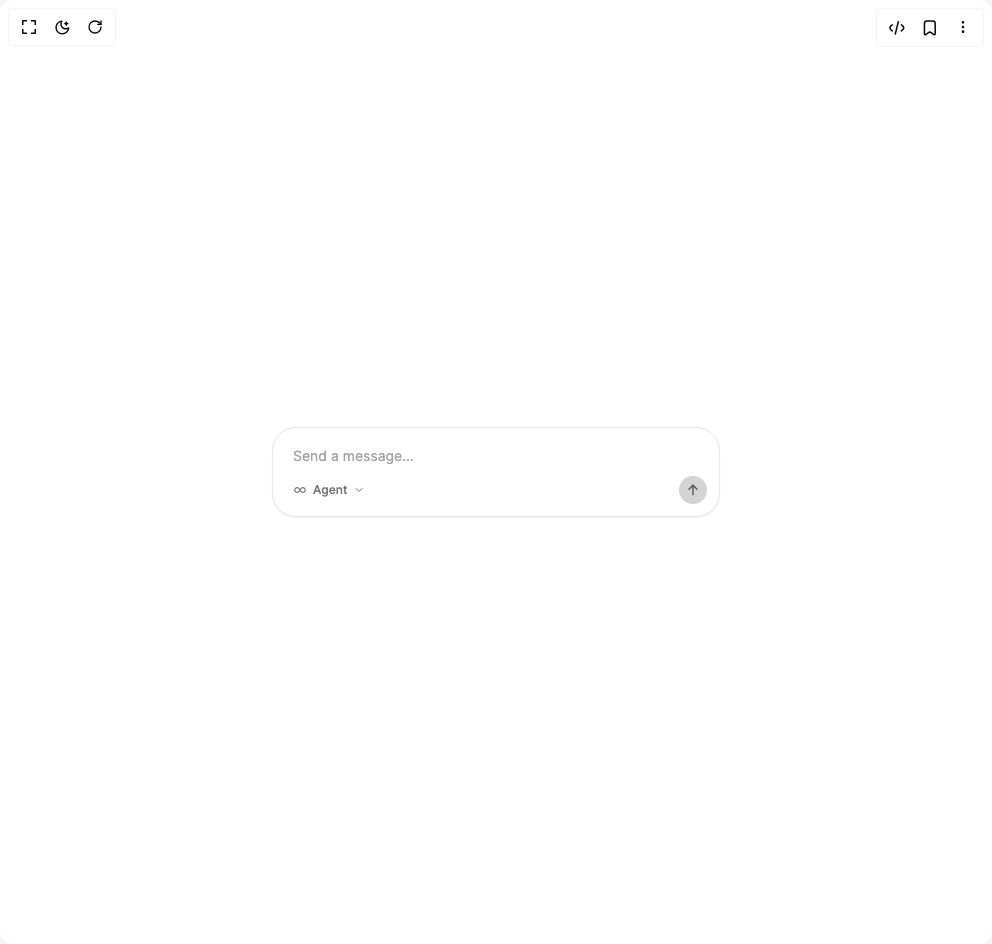

# Build Mode Selector in BuilderStudio

> Build this component in our Agentic IDE: [BuilderStudio](https://builderstudio.dev).
>
> Join the BuilderStudio community on [Discord](https://discord.gg/QdWeSGCqfe) and [Reddit](https://reddit.com/r/builderstudio).



## Component

- Author group: `community`
- Component: `mode-selector`
- Variant: `inside-input-bar`
- Rendered HTML snapshot: [`rendered.html`](rendered.html)

## BuilderStudio prompt

You are implementing a React component based on a component reference.

## Component identity

- Author: BuilderStudio
- Component slug: mode-selector
- Demo slug: inside-input-bar
- Title: mode-selector
- Description: 

## Goal

Recreate this component in a React + TypeScript + Tailwind CSS project. Preserve the visual layout, spacing, colors, border radius, shadows, interaction behavior, animation behavior, responsive behavior, and dark mode behavior shown in the rendered demo.

## Implementation requirements

- Use React and TypeScript.
- Use Tailwind CSS classes whenever possible.
- Keep the component self-contained unless the source files require helper components.
- If the source uses CSS variables, custom CSS, animations, or keyframes, include them.
- If the source uses external packages, list and use the required packages.
- Preserve accessibility attributes, button semantics, links, keyboard behavior, and ARIA attributes when visible in the source.
- Do not replace the component with a simplified placeholder.
- Return complete production-ready code.

## Dependencies

No reference metadata available.

## Rendered DOM snapshot

This is the rendered demo HTML extracted from the live preview. Use it to verify structure, class names, visible content, and layout.

```html
<div id="root"><div class="flex items-center justify-center w-full min-h-screen bg-background p-8 overflow-hidden"><div class="w-full max-w-md"><div class="rounded-3xl border border-neutral-200 dark:border-neutral-800 bg-white dark:bg-neutral-950 p-3 shadow-sm"><input placeholder="Send a message…" class="w-full bg-transparent px-2 py-1.5 text-sm text-neutral-900 dark:text-neutral-100 placeholder:text-neutral-400 dark:placeholder:text-neutral-500 outline-none" type="text"><div class="flex items-center justify-between mt-1"><span class="relative inline-flex"><span class="inline-flex"><button type="button" class="inline-flex h-7 items-center gap-1.5 rounded-[6px] px-2 text-[12px] leading-4 text-neutral-500 dark:text-neutral-400 transition-colors hover:bg-neutral-100 dark:hover:bg-neutral-800 cursor-pointer" aria-label="Select mode"><svg xmlns="http://www.w3.org/2000/svg" width="24" height="24" viewBox="0 0 24 24" fill="none" stroke="currentColor" stroke-width="2" stroke-linecap="round" stroke-linejoin="round" class="tabler-icon tabler-icon-infinity size-3.5 shrink-0"><path d="M9.828 9.172a4 4 0 1 0 0 5.656a10 10 0 0 0 2.172 -2.828a10 10 0 0 1 2.172 -2.828a4 4 0 1 1 0 5.656a10 10 0 0 1 -2.172 -2.828a10 10 0 0 0 -2.172 -2.828"></path></svg><span class="font-medium">Agent</span><svg xmlns="http://www.w3.org/2000/svg" width="24" height="24" viewBox="0 0 24 24" fill="none" stroke="currentColor" stroke-width="2" stroke-linecap="round" stroke-linejoin="round" class="tabler-icon tabler-icon-chevron-down size-3 text-neutral-500 dark:text-neutral-400"><path d="M6 9l6 6l6 -6"></path></svg></button></span></span><button type="button" aria-label="Send message" class="flex items-center justify-center size-7 rounded-full bg-neutral-300 dark:bg-neutral-700 text-neutral-600 dark:text-neutral-300 transition-colors hover:bg-neutral-400 dark:hover:bg-neutral-600"><svg xmlns="http://www.w3.org/2000/svg" width="24" height="24" viewBox="0 0 24 24" fill="none" stroke="currentColor" stroke-width="2" stroke-linecap="round" stroke-linejoin="round" class="tabler-icon tabler-icon-arrow-up size-4"><path d="M12 5l0 14"></path><path d="M18 11l-6 -6"></path><path d="M6 11l6 -6"></path></svg></button></div></div></div></div></div>
```

## Reference source files

No reference source files were available.
