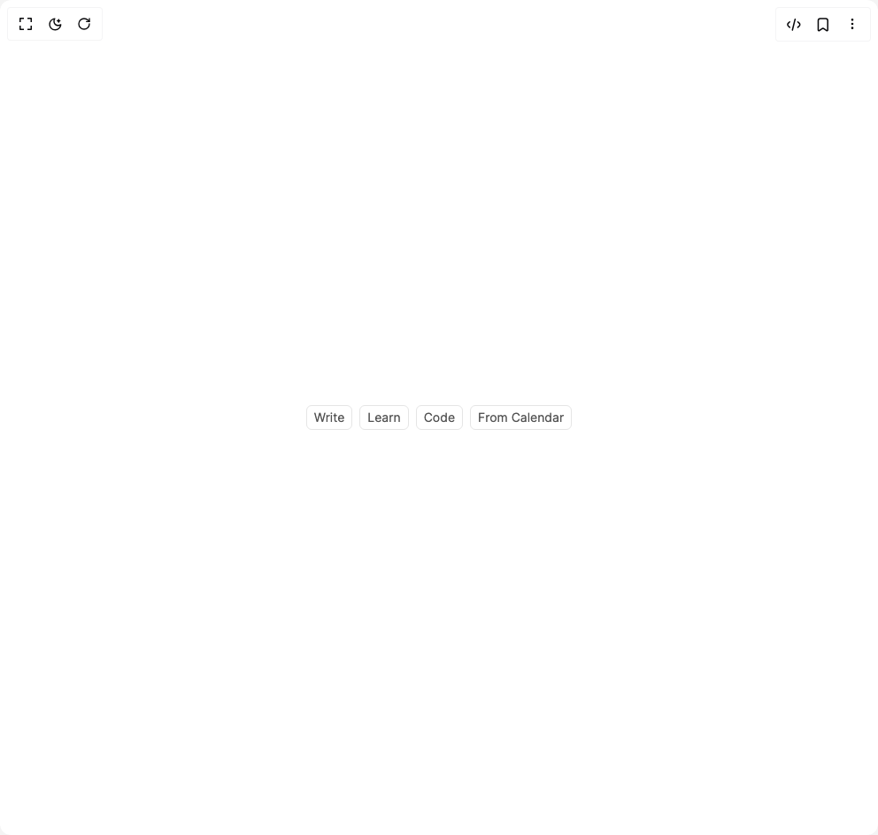

# Build Suggestions in BuilderStudio

> Build this component in our Agentic IDE: [BuilderStudio](https://builderstudio.dev).
>
> Join the BuilderStudio community on [Discord](https://discord.gg/QdWeSGCqfe) and [Reddit](https://reddit.com/r/builderstudio).



## Component

- Author group: `community`
- Component: `suggestions`
- Variant: `default`
- Rendered HTML snapshot: [`rendered.html`](rendered.html)

## BuilderStudio prompt

You are implementing a React component based on a component reference.

## Component identity

- Author: BuilderStudio
- Component slug: suggestions
- Demo slug: default
- Title: suggestions
- Description: 

## Goal

Recreate this component in a React + TypeScript + Tailwind CSS project. Preserve the visual layout, spacing, colors, border radius, shadows, interaction behavior, animation behavior, responsive behavior, and dark mode behavior shown in the rendered demo.

## Implementation requirements

- Use React and TypeScript.
- Use Tailwind CSS classes whenever possible.
- Keep the component self-contained unless the source files require helper components.
- If the source uses CSS variables, custom CSS, animations, or keyframes, include them.
- If the source uses external packages, list and use the required packages.
- Preserve accessibility attributes, button semantics, links, keyboard behavior, and ARIA attributes when visible in the source.
- Do not replace the component with a simplified placeholder.
- Return complete production-ready code.

## Dependencies

No reference metadata available.

## Rendered DOM snapshot

This is the rendered demo HTML extracted from the live preview. Use it to verify structure, class names, visible content, and layout.

```html
<div id="root"><div class="flex h-full w-full items-center justify-center p-8"><div class="flex flex-wrap items-center gap-2 justify-center"><button type="button" class="inline-flex h-7 items-center gap-1 rounded-[6px] border border-neutral-200 bg-transparent px-2 text-sm text-neutral-600 transition-colors hover:bg-neutral-100 hover:text-neutral-900 disabled:opacity-50 disabled:pointer-events-none dark:border-neutral-700 dark:text-neutral-400 dark:hover:bg-neutral-800 dark:hover:text-neutral-100">Write</button><button type="button" class="inline-flex h-7 items-center gap-1 rounded-[6px] border border-neutral-200 bg-transparent px-2 text-sm text-neutral-600 transition-colors hover:bg-neutral-100 hover:text-neutral-900 disabled:opacity-50 disabled:pointer-events-none dark:border-neutral-700 dark:text-neutral-400 dark:hover:bg-neutral-800 dark:hover:text-neutral-100">Learn</button><button type="button" class="inline-flex h-7 items-center gap-1 rounded-[6px] border border-neutral-200 bg-transparent px-2 text-sm text-neutral-600 transition-colors hover:bg-neutral-100 hover:text-neutral-900 disabled:opacity-50 disabled:pointer-events-none dark:border-neutral-700 dark:text-neutral-400 dark:hover:bg-neutral-800 dark:hover:text-neutral-100">Code</button><button type="button" class="inline-flex h-7 items-center gap-1 rounded-[6px] border border-neutral-200 bg-transparent px-2 text-sm text-neutral-600 transition-colors hover:bg-neutral-100 hover:text-neutral-900 disabled:opacity-50 disabled:pointer-events-none dark:border-neutral-700 dark:text-neutral-400 dark:hover:bg-neutral-800 dark:hover:text-neutral-100">From Calendar</button></div></div></div>
```

## Reference source files

No reference source files were available.
