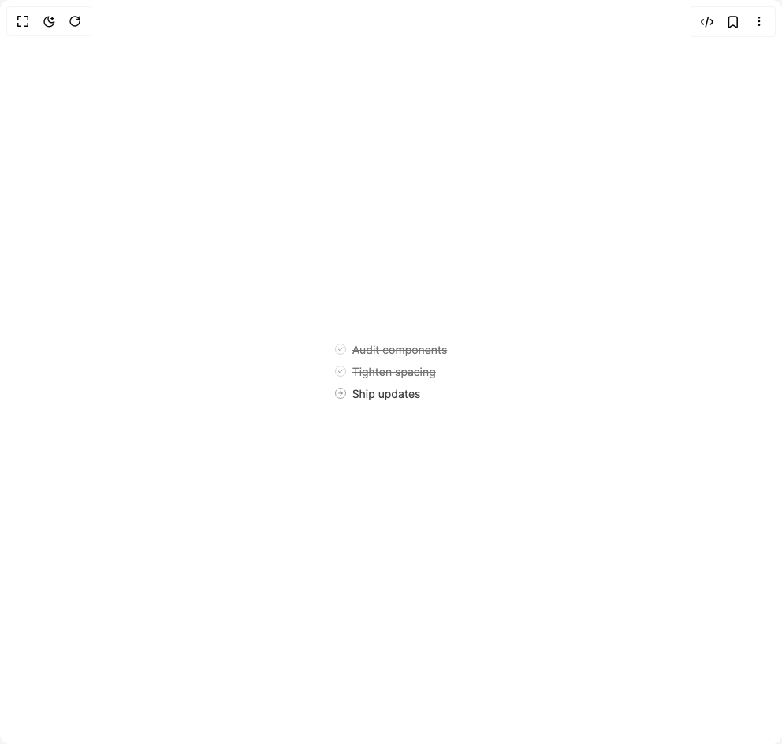

# Build Todo Tool in BuilderStudio

> Build this component in our Agentic IDE: [BuilderStudio](https://builderstudio.dev).
>
> Join the BuilderStudio community on [Discord](https://discord.gg/QdWeSGCqfe) and [Reddit](https://reddit.com/r/builderstudio).



## Component

- Author group: `community`
- Component: `todo-tool`
- Variant: `multiple-updates`
- Rendered HTML snapshot: [`rendered.html`](rendered.html)

## BuilderStudio prompt

You are implementing a React component based on a component reference.

## Component identity

- Author: BuilderStudio
- Component slug: todo-tool
- Demo slug: multiple-updates
- Title: todo-tool
- Description: 

## Goal

Recreate this component in a React + TypeScript + Tailwind CSS project. Preserve the visual layout, spacing, colors, border radius, shadows, interaction behavior, animation behavior, responsive behavior, and dark mode behavior shown in the rendered demo.

## Implementation requirements

- Use React and TypeScript.
- Use Tailwind CSS classes whenever possible.
- Keep the component self-contained unless the source files require helper components.
- If the source uses CSS variables, custom CSS, animations, or keyframes, include them.
- If the source uses external packages, list and use the required packages.
- Preserve accessibility attributes, button semantics, links, keyboard behavior, and ARIA attributes when visible in the source.
- Do not replace the component with a simplified placeholder.
- Return complete production-ready code.

## Dependencies

No reference metadata available.

## Rendered DOM snapshot

This is the rendered demo HTML extracted from the live preview. Use it to verify structure, class names, visible content, and layout.

```html
<div id="root"><div class="flex items-center justify-center w-full min-h-screen bg-background p-8 overflow-hidden"><div class="w-fit"><div class="space-y-2 text-sm leading-relaxed text-neutral-700 dark:text-neutral-300"><div class="flex items-start gap-2"><div class="mt-[2px]"><div class="w-3.5 h-3.5 rounded-full flex items-center justify-center shrink-0 border border-neutral-300 dark:border-neutral-700"><svg viewBox="0 0 24 24" fill="none" stroke="currentColor" stroke-width="2.5" stroke-linecap="round" stroke-linejoin="round" class="w-2 h-2 text-neutral-500 dark:text-neutral-500" aria-hidden="true"><polyline points="20 6 9 17 4 12"></polyline></svg></div></div><span class="text-sm line-through text-neutral-500 dark:text-neutral-400">Audit components</span></div><div class="flex items-start gap-2"><div class="mt-[2px]"><div class="w-3.5 h-3.5 rounded-full flex items-center justify-center shrink-0 border border-neutral-300 dark:border-neutral-700"><svg viewBox="0 0 24 24" fill="none" stroke="currentColor" stroke-width="2.5" stroke-linecap="round" stroke-linejoin="round" class="w-2 h-2 text-neutral-500 dark:text-neutral-500" aria-hidden="true"><polyline points="20 6 9 17 4 12"></polyline></svg></div></div><span class="text-sm line-through text-neutral-500 dark:text-neutral-400">Tighten spacing</span></div><div class="flex items-start gap-2"><div class="mt-[2px]"><div class="w-3.5 h-3.5 rounded-full flex items-center justify-center shrink-0 border border-neutral-400 dark:border-neutral-600"><svg viewBox="0 0 24 24" fill="none" stroke="currentColor" stroke-width="2.5" stroke-linecap="round" stroke-linejoin="round" class="w-2 h-2 text-neutral-500 dark:text-neutral-500" aria-hidden="true"><line x1="5" y1="12" x2="19" y2="12"></line><polyline points="12 5 19 12 12 19"></polyline></svg></div></div><span class="text-sm text-neutral-700 dark:text-neutral-300">Ship updates</span></div></div></div></div></div>
```

## Reference source files

No reference source files were available.
