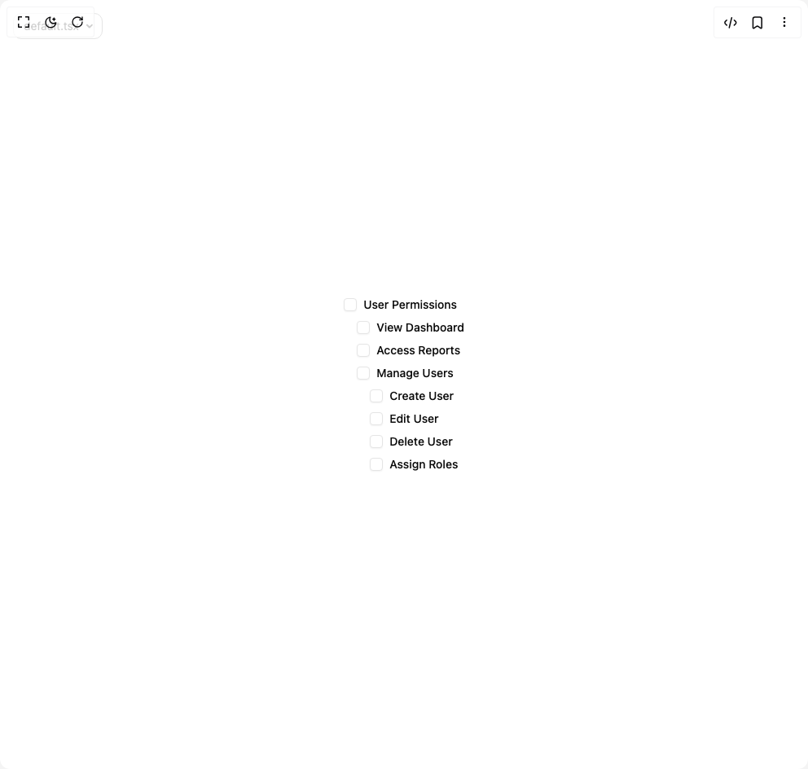

# Build Checkbox Group in BuilderStudio

> Build this component in our Agentic IDE: [BuilderStudio](https://builderstudio.dev).
>
> Join the BuilderStudio community on [Discord](https://discord.gg/QdWeSGCqfe) and [Reddit](https://reddit.com/r/builderstudio).



## Component

- Author group: `coss.com`
- Component: `checkbox-group`
- Variant: `nested-parent-checkbox`
- Rendered HTML snapshot: [`rendered.html`](rendered.html)

## BuilderStudio prompt

You are implementing a React component based on a component reference.

## Component identity

- Author: coss.com
- Component slug: checkbox-group
- Demo slug: nested-parent-checkbox
- Title: checkbox-group
- Description: 

## Goal

Recreate this component in a React + TypeScript + Tailwind CSS project. Preserve the visual layout, spacing, colors, border radius, shadows, interaction behavior, animation behavior, responsive behavior, and dark mode behavior shown in the rendered demo.

## Implementation requirements

- Use React and TypeScript.
- Use Tailwind CSS classes whenever possible.
- Keep the component self-contained unless the source files require helper components.
- If the source uses CSS variables, custom CSS, animations, or keyframes, include them.
- If the source uses external packages, list and use the required packages.
- Preserve accessibility attributes, button semantics, links, keyboard behavior, and ARIA attributes when visible in the source.
- Do not replace the component with a simplified placeholder.
- Return complete production-ready code.

## Dependencies

No reference metadata available.

## Rendered DOM snapshot

This is the rendered demo HTML extracted from the live preview. Use it to verify structure, class names, visible content, and layout.

```html
<div id="root"><div class="w-screen min-h-screen flex justify-center items-center"><div class="fixed top-4 left-4 z-10"><select class="appearance-none h-8 max-w-[200px] text-sm leading-tight rounded-lg pl-3 pr-7 py-0 border bg-background focus:outline-none focus:ring-0"><option value="default.tsx_CheckboxGroupNested">default.tsx</option></select><div class="absolute top-1/2 transform -translate-y-1/2 right-2 pointer-events-none"><svg class="w-4 h-4 fill-current" viewBox="0 0 20 20"><path d="M5.516 7.548c.436-.446 1.043-.48 1.576 0L10 10.405l2.908-2.857c.533-.48 1.14-.446 1.576 0 .436.445.408 1.197 0 1.615l-3.734 3.705c-.533.534-1.39.534-1.923 0l-3.734-3.705c-.408-.418-.436-1.17 0-1.615z"></path></svg></div></div><div class="w-screen min-h-screen flex justify-center items-center"><div class="flex items-center justify-center w-full min-h-screen bg-background"><div role="group" aria-labelledby="user-permissions-caption" class="flex flex-col items-start gap-3"><label class="inline-flex items-center gap-2 font-medium text-base/4.5 text-foreground sm:text-sm/4" data-slot="label" id="user-permissions-caption"><span data-unchecked="" role="checkbox" tabindex="0" id="base-ui-«r0»" aria-checked="false" data-parent="" data-slot="checkbox" aria-controls="base-ui-«r0»-view-dashboard base-ui-«r0»-manage-users base-ui-«r0»-access-reports" class="relative inline-flex size-4.5 shrink-0 items-center justify-center rounded-[.25rem] border border-input bg-background shadow-xs/5 outline-none ring-ring transition-shadow focus-visible:ring-2 focus-visible:ring-offset-1 focus-visible:ring-offset-background data-disabled:opacity-64 sm:size-4 dark:not-data-checked:bg-input/32" aria-labelledby="user-permissions-caption"></span><input id="base-ui-«r3»" tabindex="-1" aria-hidden="true" type="checkbox" style="clip-path: inset(50%); overflow: hidden; white-space: nowrap; border: 0px; padding: 0px; width: 1px; height: 1px; margin: -1px; position: fixed; top: 0px; left: 0px;">User Permissions</label><label class="inline-flex items-center gap-2 font-medium text-base/4.5 text-foreground sm:text-sm/4 ms-4" data-slot="label" id="base-ui-«r0»-view-dashboard-label"><span data-unchecked="" role="checkbox" tabindex="0" id="base-ui-«r5»" aria-checked="false" data-slot="checkbox" class="relative inline-flex size-4.5 shrink-0 items-center justify-center rounded-[.25rem] border border-input bg-background shadow-xs/5 outline-none ring-ring transition-shadow focus-visible:ring-2 focus-visible:ring-offset-1 focus-visible:ring-offset-background data-disabled:opacity-64 sm:size-4 dark:not-data-checked:bg-input/32" aria-labelledby="base-ui-«r0»-view-dashboard-label"></span><input id="base-ui-«r0»-view-dashboard" tabindex="-1" aria-hidden="true" type="checkbox" value="" style="clip-path: inset(50%); overflow: hidden; white-space: nowrap; border: 0px; padding: 0px; width: 1px; height: 1px; margin: -1px; position: fixed; top: 0px; left: 0px;">View Dashboard</label><label class="inline-flex items-center gap-2 font-medium text-base/4.5 text-foreground sm:text-sm/4 ms-4" data-slot="label" id="base-ui-«r0»-access-reports-label"><span data-unchecked="" role="checkbox" tabindex="0" id="base-ui-«r8»" aria-checked="false" data-slot="checkbox" class="relative inline-flex size-4.5 shrink-0 items-center justify-center rounded-[.25rem] border border-input bg-background shadow-xs/5 outline-none ring-ring transition-shadow focus-visible:ring-2 focus-visible:ring-offset-1 focus-visible:ring-offset-background data-disabled:opacity-64 sm:size-4 dark:not-data-checked:bg-input/32" aria-labelledby="base-ui-«r0»-access-reports-label"></span><input id="base-ui-«r0»-access-reports" tabindex="-1" aria-hidden="true" type="checkbox" value="" style="clip-path: inset(50%); overflow: hidden; white-space: nowrap; border: 0px; padding: 0px; width: 1px; height: 1px; margin: -1px; position: fixed; top: 0px; left: 0px;">Access Reports</label><div role="group" aria-labelledby="manage-users-caption" class="flex flex-col items-start gap-3 ms-4"><label class="inline-flex items-center gap-2 font-medium text-base/4.5 text-foreground sm:text-sm/4" data-slot="label" id="manage-users-caption"><span data-unchecked="" role="checkbox" tabindex="0" id="base-ui-«rb»" aria-checked="false" data-parent="" data-slot="checkbox" aria-controls="base-ui-«rb»-create-user base-ui-«rb»-edit-user base-ui-«rb»-delete-user base-ui-«rb»-assign-roles" class="relative inline-flex size-4.5 shrink-0 items-center justify-center rounded-[.25rem] border border-input bg-background shadow-xs/5 outline-none ring-ring transition-shadow focus-visible:ring-2 focus-visible:ring-offset-1 focus-visible:ring-offset-background data-disabled:opacity-64 sm:size-4 dark:not-data-checked:bg-input/32" aria-labelledby="manage-users-caption"></span><input id="base-ui-«re»" tabindex="-1" aria-hidden="true" type="checkbox" style="clip-path: inset(50%); overflow: hidden; white-space: nowrap; border: 0px; padding: 0px; width: 1px; height: 1px; margin: -1px; position: fixed; top: 0px; left: 0px;">Manage Users</label><label class="inline-flex items-center gap-2 font-medium text-base/4.5 text-foreground sm:text-sm/4 ms-4" data-slot="label" id="base-ui-«rb»-create-user-label"><span data-unchecked="" role="checkbox" tabindex="0" id="base-ui-«rg»" aria-checked="false" data-slot="checkbox" class="relative inline-flex size-4.5 shrink-0 items-center justify-center rounded-[.25rem] border border-input bg-background shadow-xs/5 outline-none ring-ring transition-shadow focus-visible:ring-2 focus-visible:ring-offset-1 focus-visible:ring-offset-background data-disabled:opacity-64 sm:size-4 dark:not-data-checked:bg-input/32" aria-labelledby="base-ui-«rb»-create-user-label"></span><input id="base-ui-«rb»-create-user" tabindex="-1" aria-hidden="true" type="checkbox" value="" style="clip-path: inset(50%); overflow: hidden; white-space: nowrap; border: 0px; padding: 0px; width: 1px; height: 1px; margin: -1px; position: fixed; top: 0px; left: 0px;">Create User</label><label class="inline-flex items-center gap-2 font-medium text-base/4.5 text-foreground sm:text-sm/4 ms-4" data-slot="label" id="base-ui-«rb»-edit-user-label"><span data-unchecked="" role="checkbox" tabindex="0" id="base-ui-«rj»" aria-checked="false" data-slot="checkbox" class="relative inline-flex size-4.5 shrink-0 items-center justify-center rounded-[.25rem] border border-input bg-background shadow-xs/5 outline-none ring-ring transition-shadow focus-visible:ring-2 focus-visible:ring-offset-1 focus-visible:ring-offset-background data-disabled:opacity-64 sm:size-4 dark:not-data-checked:bg-input/32" aria-labelledby="base-ui-«rb»-edit-user-label"></span><input id="base-ui-«rb»-edit-user" tabindex="-1" aria-hidden="true" type="checkbox" value="" style="clip-path: inset(50%); overflow: hidden; white-space: nowrap; border: 0px; padding: 0px; width: 1px; height: 1px; margin: -1px; position: fixed; top: 0px; left: 0px;">Edit User</label><label class="inline-flex items-center gap-2 font-medium text-base/4.5 text-foreground sm:text-sm/4 ms-4" data-slot="label" id="base-ui-«rb»-delete-user-label"><span data-unchecked="" role="checkbox" tabindex="0" id="base-ui-«rm»" aria-checked="false" data-slot="checkbox" class="relative inline-flex size-4.5 shrink-0 items-center justify-center rounded-[.25rem] border border-input bg-background shadow-xs/5 outline-none ring-ring transition-shadow focus-visible:ring-2 focus-visible:ring-offset-1 focus-visible:ring-offset-background data-disabled:opacity-64 sm:size-4 dark:not-data-checked:bg-input/32" aria-labelledby="base-ui-«rb»-delete-user-label"></span><input id="base-ui-«rb»-delete-user" tabindex="-1" aria-hidden="true" type="checkbox" value="" style="clip-path: inset(50%); overflow: hidden; white-space: nowrap; border: 0px; padding: 0px; width: 1px; height: 1px; margin: -1px; position: fixed; top: 0px; left: 0px;">Delete User</label><label class="inline-flex items-center gap-2 font-medium text-base/4.5 text-foreground sm:text-sm/4 ms-4" data-slot="label" id="base-ui-«rb»-assign-roles-label"><span data-unchecked="" role="checkbox" tabindex="0" id="base-ui-«rp»" aria-checked="false" data-slot="checkbox" class="relative inline-flex size-4.5 shrink-0 items-center justify-center rounded-[.25rem] border border-input bg-background shadow-xs/5 outline-none ring-ring transition-shadow focus-visible:ring-2 focus-visible:ring-offset-1 focus-visible:ring-offset-background data-disabled:opacity-64 sm:size-4 dark:not-data-checked:bg-input/32" aria-labelledby="base-ui-«rb»-assign-roles-label"></span><input id="base-ui-«rb»-assign-roles" tabindex="-1" aria-hidden="true" type="checkbox" value="" style="clip-path: inset(50%); overflow: hidden; white-space: nowrap; border: 0px; padding: 0px; width: 1px; height: 1px; margin: -1px; position: fixed; top: 0px; left: 0px;">Assign Roles</label></div></div></div></div></div></div>
```

## Reference source files

No reference source files were available.
