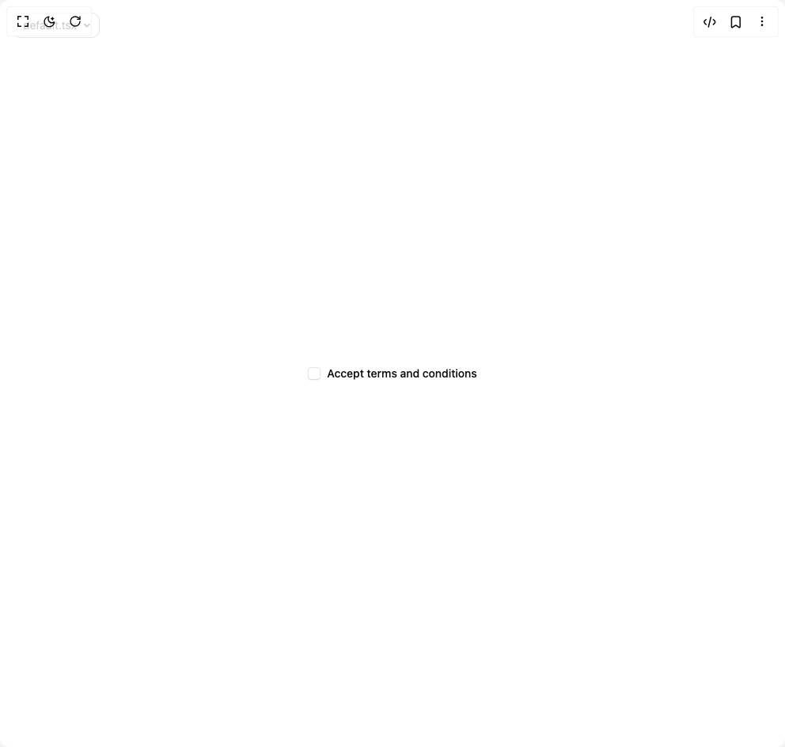

# Build Checkbox in BuilderStudio

> Build this component in our Agentic IDE: [BuilderStudio](https://builderstudio.dev).
>
> Join the BuilderStudio community on [Discord](https://discord.gg/QdWeSGCqfe) and [Reddit](https://reddit.com/r/builderstudio).



## Component

- Author group: `coss.com`
- Component: `checkbox`
- Variant: `default`
- Rendered HTML snapshot: [`rendered.html`](rendered.html)

## BuilderStudio prompt

You are implementing a React component based on a component reference.

## Component identity

- Author: coss.com
- Component slug: checkbox
- Demo slug: default
- Title: checkbox
- Description: 

## Goal

Recreate this component in a React + TypeScript + Tailwind CSS project. Preserve the visual layout, spacing, colors, border radius, shadows, interaction behavior, animation behavior, responsive behavior, and dark mode behavior shown in the rendered demo.

## Implementation requirements

- Use React and TypeScript.
- Use Tailwind CSS classes whenever possible.
- Keep the component self-contained unless the source files require helper components.
- If the source uses CSS variables, custom CSS, animations, or keyframes, include them.
- If the source uses external packages, list and use the required packages.
- Preserve accessibility attributes, button semantics, links, keyboard behavior, and ARIA attributes when visible in the source.
- Do not replace the component with a simplified placeholder.
- Return complete production-ready code.

## Dependencies

No reference metadata available.

## Rendered DOM snapshot

This is the rendered demo HTML extracted from the live preview. Use it to verify structure, class names, visible content, and layout.

```html
<div id="root"><div class="w-screen min-h-screen flex justify-center items-center"><div class="fixed top-4 left-4 z-10"><select class="appearance-none h-8 max-w-[200px] text-sm leading-tight rounded-lg pl-3 pr-7 py-0 border bg-background focus:outline-none focus:ring-0"><option value="default.tsx_Particle">default.tsx</option></select><div class="absolute top-1/2 transform -translate-y-1/2 right-2 pointer-events-none"><svg class="w-4 h-4 fill-current" viewBox="0 0 20 20"><path d="M5.516 7.548c.436-.446 1.043-.48 1.576 0L10 10.405l2.908-2.857c.533-.48 1.14-.446 1.576 0 .436.445.408 1.197 0 1.615l-3.734 3.705c-.533.534-1.39.534-1.923 0l-3.734-3.705c-.408-.418-.436-1.17 0-1.615z"></path></svg></div></div><div class="w-screen min-h-screen flex justify-center items-center"><div class="flex items-center justify-center w-full min-h-screen bg-background p-8"><label class="flex items-center gap-2 text-sm font-medium cursor-pointer select-none " id="base-ui-«r2»"><span data-unchecked="" role="checkbox" tabindex="0" id="base-ui-«r0»" aria-checked="false" data-slot="checkbox" class="relative inline-flex size-4.5 shrink-0 items-center justify-center rounded-[.25rem] border border-input bg-background not-dark:bg-clip-padding shadow-xs/5 outline-none ring-ring transition-shadow before:pointer-events-none before:absolute before:inset-0 before:rounded-[3px] not-data-disabled:not-data-checked:not-aria-invalid:before:shadow-[0_1px_--theme(--color-black/4%)] focus-visible:ring-2 focus-visible:ring-offset-1 focus-visible:ring-offset-background aria-invalid:border-destructive/36 focus-visible:aria-invalid:border-destructive/64 focus-visible:aria-invalid:ring-destructive/48 data-disabled:opacity-64 sm:size-4 dark:not-data-checked:bg-input/32 dark:aria-invalid:ring-destructive/24 dark:not-data-disabled:not-data-checked:not-aria-invalid:before:shadow-[0_-1px_--theme(--color-white/6%)] [[data-disabled],[data-checked],[aria-invalid]]:shadow-none" aria-labelledby="base-ui-«r2»"></span><input tabindex="-1" aria-hidden="true" type="checkbox" style="clip-path: inset(50%); overflow: hidden; white-space: nowrap; border: 0px; padding: 0px; width: 1px; height: 1px; margin: -1px; position: fixed; top: 0px; left: 0px;">Accept terms and conditions</label></div></div></div></div>
```

## Reference source files

No reference source files were available.
