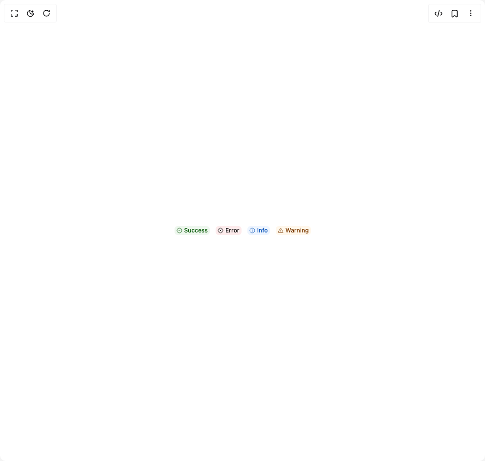

# Build Coss Badge in BuilderStudio

> Build this component in our Agentic IDE: [BuilderStudio](https://builderstudio.dev).
>
> Join the BuilderStudio community on [Discord](https://discord.gg/QdWeSGCqfe) and [Reddit](https://reddit.com/r/builderstudio).



## Component

- Author group: `coss.com`
- Component: `coss-badge`
- Variant: `with-icon`
- Rendered HTML snapshot: [`rendered.html`](rendered.html)

## BuilderStudio prompt

You are implementing a React component based on a component reference.

## Component identity

- Author: coss.com
- Component slug: coss-badge
- Demo slug: with-icon
- Title: coss-badge
- Description: 

## Goal

Recreate this component in a React + TypeScript + Tailwind CSS project. Preserve the visual layout, spacing, colors, border radius, shadows, interaction behavior, animation behavior, responsive behavior, and dark mode behavior shown in the rendered demo.

## Implementation requirements

- Use React and TypeScript.
- Use Tailwind CSS classes whenever possible.
- Keep the component self-contained unless the source files require helper components.
- If the source uses CSS variables, custom CSS, animations, or keyframes, include them.
- If the source uses external packages, list and use the required packages.
- Preserve accessibility attributes, button semantics, links, keyboard behavior, and ARIA attributes when visible in the source.
- Do not replace the component with a simplified placeholder.
- Return complete production-ready code.

## Dependencies

No reference metadata available.

## Rendered DOM snapshot

This is the rendered demo HTML extracted from the live preview. Use it to verify structure, class names, visible content, and layout.

```html
<div id="root"><div class="w-screen min-h-screen flex justify-center items-center"><div class="fixed top-4 left-4 z-10"><select class="appearance-none h-8 max-w-[200px] text-sm leading-tight rounded-lg pl-3 pr-7 py-0 border bg-background focus:outline-none focus:ring-0"><option value="default.tsx_BadgeWithIcon">default.tsx</option></select><div class="absolute top-1/2 transform -translate-y-1/2 right-2 pointer-events-none"><svg class="w-4 h-4 fill-current" viewBox="0 0 20 20"><path d="M5.516 7.548c.436-.446 1.043-.48 1.576 0L10 10.405l2.908-2.857c.533-.48 1.14-.446 1.576 0 .436.445.408 1.197 0 1.615l-3.734 3.705c-.533.534-1.39.534-1.923 0l-3.734-3.705c-.408-.418-.436-1.17 0-1.615z"></path></svg></div></div><div class="w-screen min-h-screen flex justify-center items-center"><div class="flex items-center justify-center w-full min-h-screen bg-background"><div class="flex flex-wrap gap-3 items-center justify-center"><span class="relative inline-flex shrink-0 items-center justify-center gap-1 whitespace-nowrap rounded-sm border border-transparent font-medium outline-none transition-shadow focus-visible:ring-2 focus-visible:ring-ring focus-visible:ring-offset-1 focus-visible:ring-offset-background disabled:pointer-events-none disabled:opacity-64 [&amp;_svg:not([class*='opacity-'])]:opacity-80 [&amp;_svg:not([class*='size-'])]:size-3.5 sm:[&amp;_svg:not([class*='size-'])]:size-3 [&amp;_svg]:pointer-events-none [&amp;_svg]:shrink-0 [button&amp;,a&amp;]:cursor-pointer [button&amp;,a&amp;]:pointer-coarse:after:absolute [button&amp;,a&amp;]:pointer-coarse:after:size-full [button&amp;,a&amp;]:pointer-coarse:after:min-h-11 [button&amp;,a&amp;]:pointer-coarse:after:min-w-11 h-5.5 min-w-5.5 px-[calc(--spacing(1)-1px)] text-sm sm:h-4.5 sm:min-w-4.5 sm:text-xs bg-success/8 text-success-foreground dark:bg-success/16" data-slot="badge"><svg xmlns="http://www.w3.org/2000/svg" width="24" height="24" viewBox="0 0 24 24" fill="none" stroke="currentColor" stroke-width="2" stroke-linecap="round" stroke-linejoin="round" class="lucide lucide-circle-check" aria-hidden="true"><circle cx="12" cy="12" r="10"></circle><path d="m9 12 2 2 4-4"></path></svg>Success</span><span class="relative inline-flex shrink-0 items-center justify-center gap-1 whitespace-nowrap rounded-sm border border-transparent font-medium outline-none transition-shadow focus-visible:ring-2 focus-visible:ring-ring focus-visible:ring-offset-1 focus-visible:ring-offset-background disabled:pointer-events-none disabled:opacity-64 [&amp;_svg:not([class*='opacity-'])]:opacity-80 [&amp;_svg:not([class*='size-'])]:size-3.5 sm:[&amp;_svg:not([class*='size-'])]:size-3 [&amp;_svg]:pointer-events-none [&amp;_svg]:shrink-0 [button&amp;,a&amp;]:cursor-pointer [button&amp;,a&amp;]:pointer-coarse:after:absolute [button&amp;,a&amp;]:pointer-coarse:after:size-full [button&amp;,a&amp;]:pointer-coarse:after:min-h-11 [button&amp;,a&amp;]:pointer-coarse:after:min-w-11 h-5.5 min-w-5.5 px-[calc(--spacing(1)-1px)] text-sm sm:h-4.5 sm:min-w-4.5 sm:text-xs bg-destructive/8 text-destructive-foreground dark:bg-destructive/16" data-slot="badge"><svg xmlns="http://www.w3.org/2000/svg" width="24" height="24" viewBox="0 0 24 24" fill="none" stroke="currentColor" stroke-width="2" stroke-linecap="round" stroke-linejoin="round" class="lucide lucide-circle-x" aria-hidden="true"><circle cx="12" cy="12" r="10"></circle><path d="m15 9-6 6"></path><path d="m9 9 6 6"></path></svg>Error</span><span class="relative inline-flex shrink-0 items-center justify-center gap-1 whitespace-nowrap rounded-sm border border-transparent font-medium outline-none transition-shadow focus-visible:ring-2 focus-visible:ring-ring focus-visible:ring-offset-1 focus-visible:ring-offset-background disabled:pointer-events-none disabled:opacity-64 [&amp;_svg:not([class*='opacity-'])]:opacity-80 [&amp;_svg:not([class*='size-'])]:size-3.5 sm:[&amp;_svg:not([class*='size-'])]:size-3 [&amp;_svg]:pointer-events-none [&amp;_svg]:shrink-0 [button&amp;,a&amp;]:cursor-pointer [button&amp;,a&amp;]:pointer-coarse:after:absolute [button&amp;,a&amp;]:pointer-coarse:after:size-full [button&amp;,a&amp;]:pointer-coarse:after:min-h-11 [button&amp;,a&amp;]:pointer-coarse:after:min-w-11 h-5.5 min-w-5.5 px-[calc(--spacing(1)-1px)] text-sm sm:h-4.5 sm:min-w-4.5 sm:text-xs bg-info/8 text-info-foreground dark:bg-info/16" data-slot="badge"><svg xmlns="http://www.w3.org/2000/svg" width="24" height="24" viewBox="0 0 24 24" fill="none" stroke="currentColor" stroke-width="2" stroke-linecap="round" stroke-linejoin="round" class="lucide lucide-info" aria-hidden="true"><circle cx="12" cy="12" r="10"></circle><path d="M12 16v-4"></path><path d="M12 8h.01"></path></svg>Info</span><span class="relative inline-flex shrink-0 items-center justify-center gap-1 whitespace-nowrap rounded-sm border border-transparent font-medium outline-none transition-shadow focus-visible:ring-2 focus-visible:ring-ring focus-visible:ring-offset-1 focus-visible:ring-offset-background disabled:pointer-events-none disabled:opacity-64 [&amp;_svg:not([class*='opacity-'])]:opacity-80 [&amp;_svg:not([class*='size-'])]:size-3.5 sm:[&amp;_svg:not([class*='size-'])]:size-3 [&amp;_svg]:pointer-events-none [&amp;_svg]:shrink-0 [button&amp;,a&amp;]:cursor-pointer [button&amp;,a&amp;]:pointer-coarse:after:absolute [button&amp;,a&amp;]:pointer-coarse:after:size-full [button&amp;,a&amp;]:pointer-coarse:after:min-h-11 [button&amp;,a&amp;]:pointer-coarse:after:min-w-11 h-5.5 min-w-5.5 px-[calc(--spacing(1)-1px)] text-sm sm:h-4.5 sm:min-w-4.5 sm:text-xs bg-warning/8 text-warning-foreground dark:bg-warning/16" data-slot="badge"><svg xmlns="http://www.w3.org/2000/svg" width="24" height="24" viewBox="0 0 24 24" fill="none" stroke="currentColor" stroke-width="2" stroke-linecap="round" stroke-linejoin="round" class="lucide lucide-triangle-alert" aria-hidden="true"><path d="m21.73 18-8-14a2 2 0 0 0-3.48 0l-8 14A2 2 0 0 0 4 21h16a2 2 0 0 0 1.73-3"></path><path d="M12 9v4"></path><path d="M12 17h.01"></path></svg>Warning</span></div></div></div></div></div>
```

## Reference source files

No reference source files were available.
