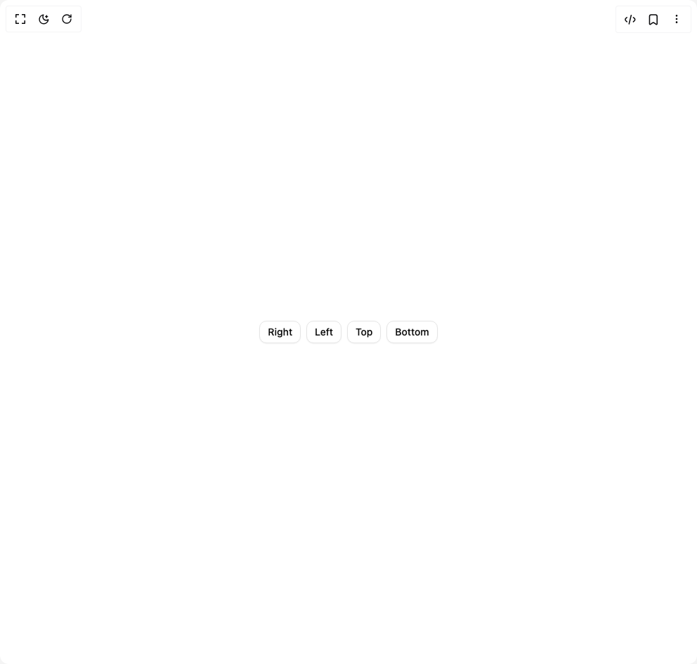

# Build Drawer in BuilderStudio

> Build this component in our Agentic IDE: [BuilderStudio](https://builderstudio.dev).
>
> Join the BuilderStudio community on [Discord](https://discord.gg/QdWeSGCqfe) and [Reddit](https://reddit.com/r/builderstudio).



## Component

- Author group: `coss.com`
- Component: `drawer`
- Variant: `straight-variant`
- Rendered HTML snapshot: [`rendered.html`](rendered.html)

## BuilderStudio prompt

You are implementing a React component based on a component reference.

## Component identity

- Author: coss.com
- Component slug: drawer
- Demo slug: straight-variant
- Title: drawer
- Description: 

## Goal

Recreate this component in a React + TypeScript + Tailwind CSS project. Preserve the visual layout, spacing, colors, border radius, shadows, interaction behavior, animation behavior, responsive behavior, and dark mode behavior shown in the rendered demo.

## Implementation requirements

- Use React and TypeScript.
- Use Tailwind CSS classes whenever possible.
- Keep the component self-contained unless the source files require helper components.
- If the source uses CSS variables, custom CSS, animations, or keyframes, include them.
- If the source uses external packages, list and use the required packages.
- Preserve accessibility attributes, button semantics, links, keyboard behavior, and ARIA attributes when visible in the source.
- Do not replace the component with a simplified placeholder.
- Return complete production-ready code.

## Dependencies

No reference metadata available.

## Rendered DOM snapshot

This is the rendered demo HTML extracted from the live preview. Use it to verify structure, class names, visible content, and layout.

```html
<div id="root"><div class="w-screen min-h-screen flex justify-center items-center"><div class="w-screen min-h-screen flex justify-center items-center"><div class="flex items-center justify-center w-full min-h-screen bg-background p-8"><div class="flex flex-wrap gap-2"><button class="relative inline-flex shrink-0 cursor-pointer items-center justify-center gap-2 whitespace-nowrap rounded-lg border font-medium text-base outline-none transition-shadow focus-visible:ring-2 focus-visible:ring-ring focus-visible:ring-offset-1 focus-visible:ring-offset-background disabled:pointer-events-none disabled:opacity-64 sm:text-sm [&amp;_svg:not([class*='size-'])]:size-4.5 sm:[&amp;_svg:not([class*='size-'])]:size-4 [&amp;_svg]:pointer-events-none [&amp;_svg]:shrink-0 h-9 px-[calc(--spacing(3)-1px)] sm:h-8 border-input bg-popover text-foreground shadow-xs/5 hover:bg-accent/50 dark:bg-input/32 dark:hover:bg-input/64" type="button" tabindex="0" data-base-ui-click-trigger="" id="base-ui-«r3»" data-slot="drawer-trigger" aria-haspopup="dialog" aria-expanded="false">Right</button><button class="relative inline-flex shrink-0 cursor-pointer items-center justify-center gap-2 whitespace-nowrap rounded-lg border font-medium text-base outline-none transition-shadow focus-visible:ring-2 focus-visible:ring-ring focus-visible:ring-offset-1 focus-visible:ring-offset-background disabled:pointer-events-none disabled:opacity-64 sm:text-sm [&amp;_svg:not([class*='size-'])]:size-4.5 sm:[&amp;_svg:not([class*='size-'])]:size-4 [&amp;_svg]:pointer-events-none [&amp;_svg]:shrink-0 h-9 px-[calc(--spacing(3)-1px)] sm:h-8 border-input bg-popover text-foreground shadow-xs/5 hover:bg-accent/50 dark:bg-input/32 dark:hover:bg-input/64" type="button" tabindex="0" data-base-ui-click-trigger="" id="base-ui-«r7»" data-slot="drawer-trigger" aria-haspopup="dialog" aria-expanded="false">Left</button><button class="relative inline-flex shrink-0 cursor-pointer items-center justify-center gap-2 whitespace-nowrap rounded-lg border font-medium text-base outline-none transition-shadow focus-visible:ring-2 focus-visible:ring-ring focus-visible:ring-offset-1 focus-visible:ring-offset-background disabled:pointer-events-none disabled:opacity-64 sm:text-sm [&amp;_svg:not([class*='size-'])]:size-4.5 sm:[&amp;_svg:not([class*='size-'])]:size-4 [&amp;_svg]:pointer-events-none [&amp;_svg]:shrink-0 h-9 px-[calc(--spacing(3)-1px)] sm:h-8 border-input bg-popover text-foreground shadow-xs/5 hover:bg-accent/50 dark:bg-input/32 dark:hover:bg-input/64" type="button" tabindex="0" data-base-ui-click-trigger="" id="base-ui-«rb»" data-slot="drawer-trigger" aria-haspopup="dialog" aria-expanded="false">Top</button><button class="relative inline-flex shrink-0 cursor-pointer items-center justify-center gap-2 whitespace-nowrap rounded-lg border font-medium text-base outline-none transition-shadow focus-visible:ring-2 focus-visible:ring-ring focus-visible:ring-offset-1 focus-visible:ring-offset-background disabled:pointer-events-none disabled:opacity-64 sm:text-sm [&amp;_svg:not([class*='size-'])]:size-4.5 sm:[&amp;_svg:not([class*='size-'])]:size-4 [&amp;_svg]:pointer-events-none [&amp;_svg]:shrink-0 h-9 px-[calc(--spacing(3)-1px)] sm:h-8 border-input bg-popover text-foreground shadow-xs/5 hover:bg-accent/50 dark:bg-input/32 dark:hover:bg-input/64" type="button" tabindex="0" data-base-ui-click-trigger="" id="base-ui-«rf»" data-slot="drawer-trigger" aria-haspopup="dialog" aria-expanded="false">Bottom</button></div></div></div></div></div>
```

## Reference source files

No reference source files were available.
