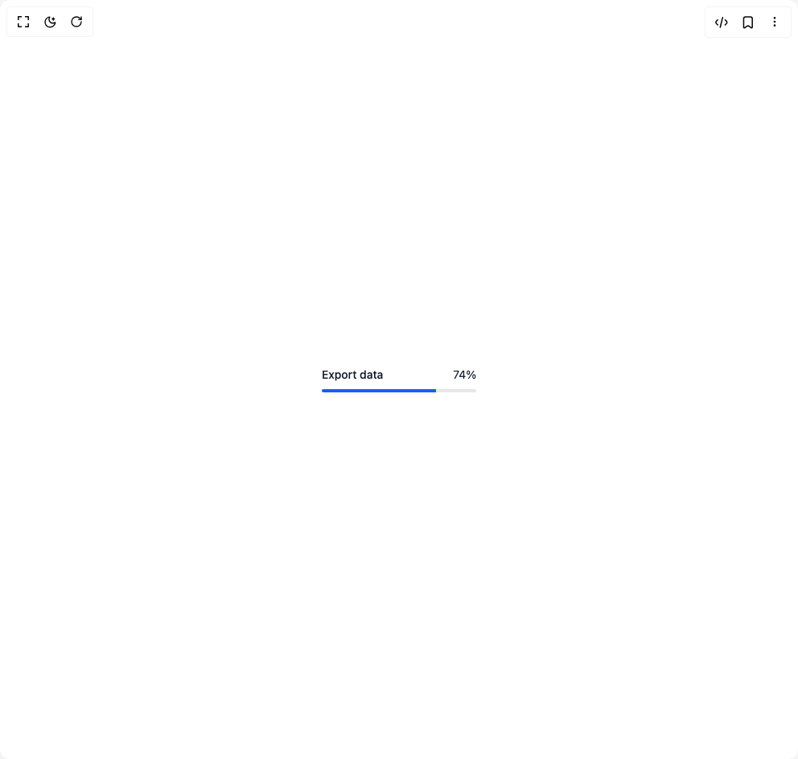

# Build Progress in BuilderStudio

> Build this component in our Agentic IDE: [BuilderStudio](https://builderstudio.dev).
>
> Join the BuilderStudio community on [Discord](https://discord.gg/QdWeSGCqfe) and [Reddit](https://reddit.com/r/builderstudio).



## Component

- Author group: `coss.com`
- Component: `progress`
- Variant: `default`
- Rendered HTML snapshot: [`rendered.html`](rendered.html)

## BuilderStudio prompt

You are implementing a React component based on a component reference.

## Component identity

- Author: coss.com
- Component slug: progress
- Demo slug: default
- Title: progress
- Description: 

## Goal

Recreate this component in a React + TypeScript + Tailwind CSS project. Preserve the visual layout, spacing, colors, border radius, shadows, interaction behavior, animation behavior, responsive behavior, and dark mode behavior shown in the rendered demo.

## Implementation requirements

- Use React and TypeScript.
- Use Tailwind CSS classes whenever possible.
- Keep the component self-contained unless the source files require helper components.
- If the source uses CSS variables, custom CSS, animations, or keyframes, include them.
- If the source uses external packages, list and use the required packages.
- Preserve accessibility attributes, button semantics, links, keyboard behavior, and ARIA attributes when visible in the source.
- Do not replace the component with a simplified placeholder.
- Return complete production-ready code.

## Dependencies

No reference metadata available.

## Rendered DOM snapshot

This is the rendered demo HTML extracted from the live preview. Use it to verify structure, class names, visible content, and layout.

```html
<div id="root"><div class="w-screen min-h-screen flex justify-center items-center"><div class="w-screen min-h-screen flex justify-center items-center"><div data-progressing="" aria-valuemax="100" aria-valuemin="0" aria-valuenow="74" aria-valuetext="74%" role="progressbar" class="grid w-48 grid-cols-2 gap-y-2" aria-labelledby="base-ui-«r0»"><span data-progressing="" id="base-ui-«r0»" class="text-sm font-medium text-gray-900 dark:text-gray-100">Export data</span><span data-progressing="" aria-hidden="true" class="col-start-2 text-right text-sm text-gray-900 dark:text-gray-100">74%</span><div data-progressing="" class="col-span-full h-1 overflow-hidden rounded bg-gray-200 dark:bg-gray-700 shadow-[inset_0_0_0_1px] shadow-gray-200 dark:shadow-gray-700"><div data-progressing="" class="block bg-blue-600 dark:bg-blue-500 transition-all duration-500" style="inset-inline-start: 0px; height: inherit; width: 74%;"></div></div></div></div></div></div>
```

## Reference source files

No reference source files were available.
