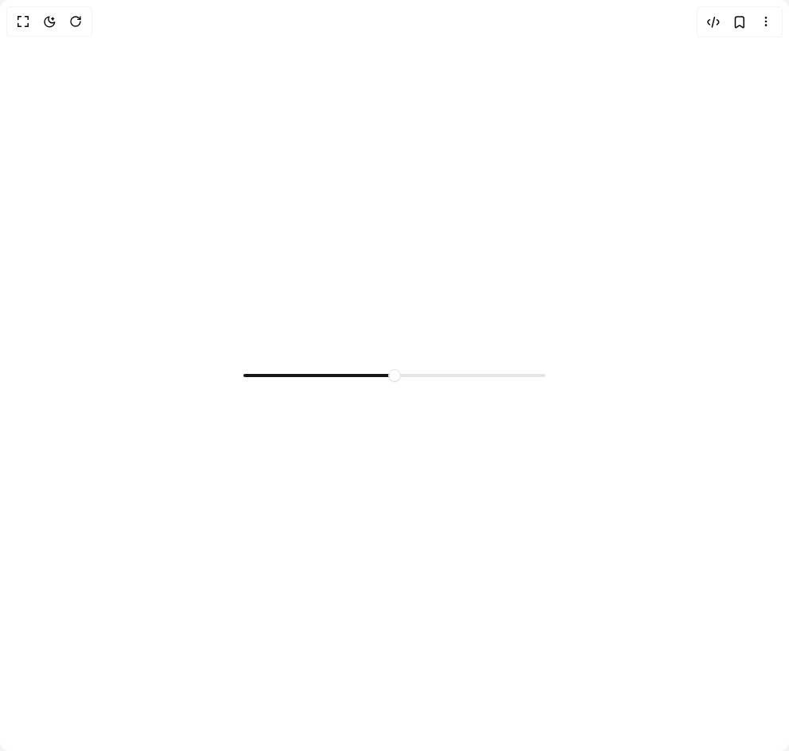

# Build Slider in BuilderStudio

> Build this component in our Agentic IDE: [BuilderStudio](https://builderstudio.dev).
>
> Join the BuilderStudio community on [Discord](https://discord.gg/QdWeSGCqfe) and [Reddit](https://reddit.com/r/builderstudio).



## Component

- Author group: `coss.com`
- Component: `slider`
- Variant: `default`
- Rendered HTML snapshot: [`rendered.html`](rendered.html)

## BuilderStudio prompt

You are implementing a React component based on a component reference.

## Component identity

- Author: coss.com
- Component slug: slider
- Demo slug: default
- Title: slider
- Description: 

## Goal

Recreate this component in a React + TypeScript + Tailwind CSS project. Preserve the visual layout, spacing, colors, border radius, shadows, interaction behavior, animation behavior, responsive behavior, and dark mode behavior shown in the rendered demo.

## Implementation requirements

- Use React and TypeScript.
- Use Tailwind CSS classes whenever possible.
- Keep the component self-contained unless the source files require helper components.
- If the source uses CSS variables, custom CSS, animations, or keyframes, include them.
- If the source uses external packages, list and use the required packages.
- Preserve accessibility attributes, button semantics, links, keyboard behavior, and ARIA attributes when visible in the source.
- Do not replace the component with a simplified placeholder.
- Return complete production-ready code.

## Dependencies

No reference metadata available.

## Rendered DOM snapshot

This is the rendered demo HTML extracted from the live preview. Use it to verify structure, class names, visible content, and layout.

```html
<div id="root"><div class="w-screen min-h-screen flex justify-center items-center"><div class="fixed top-4 left-4 z-10"><select class="appearance-none h-8 max-w-[200px] text-sm leading-tight rounded-lg pl-3 pr-7 py-0 border bg-background focus:outline-none focus:ring-0"><option value="default.tsx_Particle">default.tsx</option></select><div class="absolute top-1/2 transform -translate-y-1/2 right-2 pointer-events-none"><svg class="w-4 h-4 fill-current" viewBox="0 0 20 20"><path d="M5.516 7.548c.436-.446 1.043-.48 1.576 0L10 10.405l2.908-2.857c.533-.48 1.14-.446 1.576 0 .436.445.408 1.197 0 1.615l-3.734 3.705c-.533.534-1.39.534-1.923 0l-3.734-3.705c-.408-.418-.436-1.17 0-1.615z"></path></svg></div></div><div class="w-screen min-h-screen flex justify-center items-center"><div class="flex items-center justify-center w-full min-h-screen bg-background p-8"><div class="w-full max-w-sm"><div data-orientation="horizontal" id="base-ui-«r0»" role="group" class="data-[orientation=horizontal]:w-full"><div data-orientation="horizontal" data-base-ui-slider-control="" tabindex="-1" data-slot="slider-control" class="flex touch-none select-none data-disabled:pointer-events-none data-[orientation=vertical]:h-full data-[orientation=vertical]:min-h-44 data-[orientation=horizontal]:w-full data-[orientation=horizontal]:min-w-44 data-[orientation=vertical]:flex-col data-disabled:opacity-64"><div data-orientation="horizontal" data-slot="slider-track" class="relative grow select-none before:absolute before:rounded-full before:bg-input data-[orientation=horizontal]:h-1 data-[orientation=vertical]:h-full data-[orientation=horizontal]:w-full data-[orientation=vertical]:w-1 data-[orientation=horizontal]:before:inset-x-0.5 data-[orientation=vertical]:before:inset-x-0 data-[orientation=horizontal]:before:inset-y-0 data-[orientation=vertical]:before:inset-y-0.5" style="position: relative;"><div data-orientation="horizontal" data-base-ui-slider-indicator="" data-slot="slider-indicator" class="select-none rounded-full bg-primary data-[orientation=horizontal]:ms-0.5 data-[orientation=vertical]:mb-0.5" style="position: relative; height: inherit; --start-position: 50%; inset-inline-start: 0px; width: var(--start-position);"></div><div data-orientation="horizontal" data-index="0" id="base-ui-«r1»" tabindex="-1" data-slot="slider-thumb" class="block size-5 shrink-0 select-none rounded-full border border-input bg-white not-dark:bg-clip-padding shadow-xs/5 outline-none transition-[box-shadow,scale] before:absolute before:inset-0 before:rounded-full before:shadow-[0_1px_--theme(--color-black/4%)] has-focus-visible:ring-[3px] has-focus-visible:ring-ring/24 data-dragging:scale-120 sm:size-4 dark:border-background dark:has-focus-visible:ring-ring/48 [:has(*:focus-visible),[data-dragging]]:shadow-none" style="--position: 50%; position: absolute; inset-inline-start: var(--position); top: 50%; translate: -50% -50%;"><input aria-orientation="horizontal" aria-valuenow="50" id="base-ui-«r3»" max="100" min="0" step="1" type="range" value="50" style="clip-path: inset(50%); overflow: hidden; white-space: nowrap; border: 0px; padding: 0px; width: 100%; height: 100%; margin: -1px; position: fixed; top: 0px; left: 0px;"></div></div></div></div></div></div></div></div></div>
```

## Reference source files

No reference source files were available.
