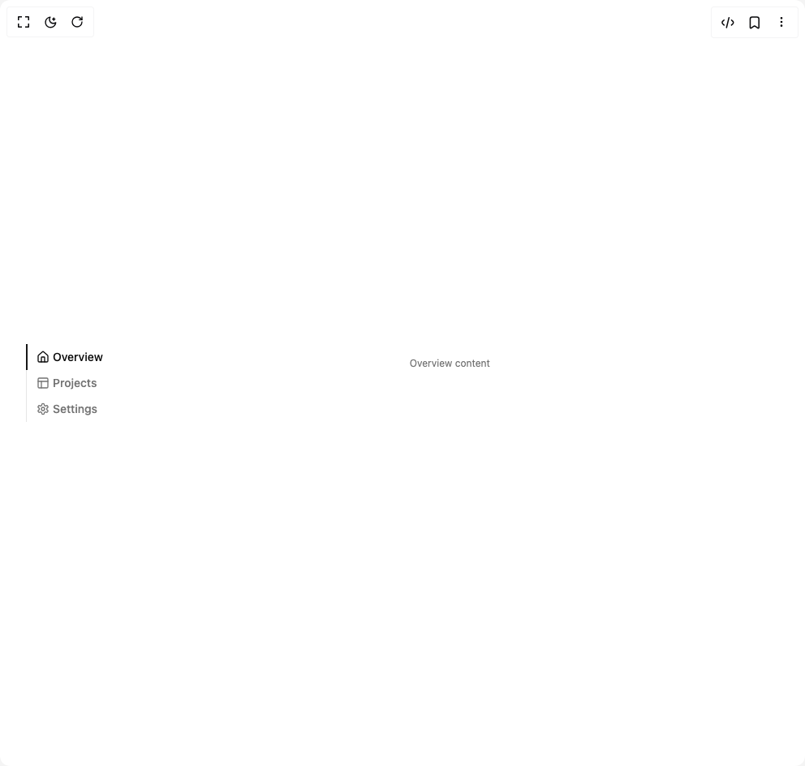

# Build Tabs in BuilderStudio

> Build this component in our Agentic IDE: [BuilderStudio](https://builderstudio.dev).
>
> Join the BuilderStudio community on [Discord](https://discord.gg/QdWeSGCqfe) and [Reddit](https://reddit.com/r/builderstudio).



## Component

- Author group: `coss.com`
- Component: `tabs`
- Variant: `vertical-with-icons`
- Rendered HTML snapshot: [`rendered.html`](rendered.html)

## BuilderStudio prompt

You are implementing a React component based on a component reference.

## Component identity

- Author: coss.com
- Component slug: tabs
- Demo slug: vertical-with-icons
- Title: tabs
- Description: 

## Goal

Recreate this component in a React + TypeScript + Tailwind CSS project. Preserve the visual layout, spacing, colors, border radius, shadows, interaction behavior, animation behavior, responsive behavior, and dark mode behavior shown in the rendered demo.

## Implementation requirements

- Use React and TypeScript.
- Use Tailwind CSS classes whenever possible.
- Keep the component self-contained unless the source files require helper components.
- If the source uses CSS variables, custom CSS, animations, or keyframes, include them.
- If the source uses external packages, list and use the required packages.
- Preserve accessibility attributes, button semantics, links, keyboard behavior, and ARIA attributes when visible in the source.
- Do not replace the component with a simplified placeholder.
- Return complete production-ready code.

## Dependencies

No reference metadata available.

## Rendered DOM snapshot

This is the rendered demo HTML extracted from the live preview. Use it to verify structure, class names, visible content, and layout.

```html
<div id="root"><div class="w-screen min-h-screen flex justify-center items-center"><div class="fixed top-4 left-4 z-10"><select class="appearance-none h-8 max-w-[200px] text-sm leading-tight rounded-lg pl-3 pr-7 py-0 border bg-background focus:outline-none focus:ring-0"><option value="default.tsx_Particle">default.tsx</option></select><div class="absolute top-1/2 transform -translate-y-1/2 right-2 pointer-events-none"><svg class="w-4 h-4 fill-current" viewBox="0 0 20 20"><path d="M5.516 7.548c.436-.446 1.043-.48 1.576 0L10 10.405l2.908-2.857c.533-.48 1.14-.446 1.576 0 .436.445.408 1.197 0 1.615l-3.734 3.705c-.533.534-1.39.534-1.923 0l-3.734-3.705c-.408-.418-.436-1.17 0-1.615z"></path></svg></div></div><div class="w-screen min-h-screen flex justify-center items-center"><div class="flex items-center justify-center w-full min-h-screen bg-background p-8"><div data-orientation="vertical" data-activation-direction="none" data-slot="tabs" class="flex gap-2 data-[orientation=vertical]:flex-row w-full flex-row"><div class="border-s"><div data-orientation="vertical" data-activation-direction="none" aria-orientation="vertical" role="tablist" data-slot="tabs-list" class="relative z-0 flex w-fit items-center justify-center gap-x-0.5 text-muted-foreground data-[orientation=vertical]:flex-col data-[orientation=vertical]:px-1 data-[orientation=horizontal]:py-1 *:data-[slot=tabs-tab]:hover:bg-accent"><button type="button" data-active="" data-orientation="vertical" aria-disabled="false" tabindex="0" role="tab" aria-selected="true" id="base-ui-«r0»" data-composite-item-active="" data-slot="tabs-tab" class="relative flex h-9 shrink-0 grow cursor-pointer items-center justify-center gap-1.5 whitespace-nowrap rounded-md border border-transparent px-[calc(--spacing(2.5)-1px)] font-medium text-base outline-none transition-[color,background-color,box-shadow] hover:text-muted-foreground focus-visible:ring-2 focus-visible:ring-ring data-disabled:pointer-events-none data-[orientation=vertical]:w-full data-[orientation=vertical]:justify-start data-active:text-foreground data-disabled:opacity-64 sm:h-8 sm:text-sm [&amp;_svg:not([class*='size-'])]:size-4.5 sm:[&amp;_svg:not([class*='size-'])]:size-4 [&amp;_svg]:pointer-events-none [&amp;_svg]:-mx-0.5 [&amp;_svg]:shrink-0" aria-controls="base-ui-«r3»"><svg xmlns="http://www.w3.org/2000/svg" width="24" height="24" viewBox="0 0 24 24" fill="none" stroke="currentColor" stroke-width="2" stroke-linecap="round" stroke-linejoin="round" class="lucide lucide-house" aria-hidden="true"><path d="M15 21v-8a1 1 0 0 0-1-1h-4a1 1 0 0 0-1 1v8"></path><path d="M3 10a2 2 0 0 1 .709-1.528l7-5.999a2 2 0 0 1 2.582 0l7 5.999A2 2 0 0 1 21 10v9a2 2 0 0 1-2 2H5a2 2 0 0 1-2-2z"></path></svg>Overview</button><button type="button" data-orientation="vertical" aria-disabled="false" tabindex="-1" role="tab" aria-selected="false" id="base-ui-«r1»" data-slot="tabs-tab" class="relative flex h-9 shrink-0 grow cursor-pointer items-center justify-center gap-1.5 whitespace-nowrap rounded-md border border-transparent px-[calc(--spacing(2.5)-1px)] font-medium text-base outline-none transition-[color,background-color,box-shadow] hover:text-muted-foreground focus-visible:ring-2 focus-visible:ring-ring data-disabled:pointer-events-none data-[orientation=vertical]:w-full data-[orientation=vertical]:justify-start data-active:text-foreground data-disabled:opacity-64 sm:h-8 sm:text-sm [&amp;_svg:not([class*='size-'])]:size-4.5 sm:[&amp;_svg:not([class*='size-'])]:size-4 [&amp;_svg]:pointer-events-none [&amp;_svg]:-mx-0.5 [&amp;_svg]:shrink-0"><svg xmlns="http://www.w3.org/2000/svg" width="24" height="24" viewBox="0 0 24 24" fill="none" stroke="currentColor" stroke-width="2" stroke-linecap="round" stroke-linejoin="round" class="lucide lucide-panels-top-left" aria-hidden="true"><rect width="18" height="18" x="3" y="3" rx="2"></rect><path d="M3 9h18"></path><path d="M9 21V9"></path></svg>Projects</button><button type="button" data-orientation="vertical" aria-disabled="false" tabindex="-1" role="tab" aria-selected="false" id="base-ui-«r2»" data-slot="tabs-tab" class="relative flex h-9 shrink-0 grow cursor-pointer items-center justify-center gap-1.5 whitespace-nowrap rounded-md border border-transparent px-[calc(--spacing(2.5)-1px)] font-medium text-base outline-none transition-[color,background-color,box-shadow] hover:text-muted-foreground focus-visible:ring-2 focus-visible:ring-ring data-disabled:pointer-events-none data-[orientation=vertical]:w-full data-[orientation=vertical]:justify-start data-active:text-foreground data-disabled:opacity-64 sm:h-8 sm:text-sm [&amp;_svg:not([class*='size-'])]:size-4.5 sm:[&amp;_svg:not([class*='size-'])]:size-4 [&amp;_svg]:pointer-events-none [&amp;_svg]:-mx-0.5 [&amp;_svg]:shrink-0"><svg xmlns="http://www.w3.org/2000/svg" width="24" height="24" viewBox="0 0 24 24" fill="none" stroke="currentColor" stroke-width="2" stroke-linecap="round" stroke-linejoin="round" class="lucide lucide-settings" aria-hidden="true"><path d="M12.22 2h-.44a2 2 0 0 0-2 2v.18a2 2 0 0 1-1 1.73l-.43.25a2 2 0 0 1-2 0l-.15-.08a2 2 0 0 0-2.73.73l-.22.38a2 2 0 0 0 .73 2.73l.15.1a2 2 0 0 1 1 1.72v.51a2 2 0 0 1-1 1.74l-.15.09a2 2 0 0 0-.73 2.73l.22.38a2 2 0 0 0 2.73.73l.15-.08a2 2 0 0 1 2 0l.43.25a2 2 0 0 1 1 1.73V20a2 2 0 0 0 2 2h.44a2 2 0 0 0 2-2v-.18a2 2 0 0 1 1-1.73l.43-.25a2 2 0 0 1 2 0l.15.08a2 2 0 0 0 2.73-.73l.22-.39a2 2 0 0 0-.73-2.73l-.15-.08a2 2 0 0 1-1-1.74v-.5a2 2 0 0 1 1-1.74l.15-.09a2 2 0 0 0 .73-2.73l-.22-.38a2 2 0 0 0-2.73-.73l-.15.08a2 2 0 0 1-2 0l-.43-.25a2 2 0 0 1-1-1.73V4a2 2 0 0 0-2-2z"></path><circle cx="12" cy="12" r="3"></circle></svg>Settings</button><span data-orientation="vertical" data-activation-direction="none" role="presentation" data-slot="tab-indicator" class="absolute bottom-0 left-0 h-(--active-tab-height) w-(--active-tab-width) translate-x-(--active-tab-left) -translate-y-(--active-tab-bottom) transition-[width,translate] duration-200 ease-in-out z-10 bg-primary data-[orientation=horizontal]:h-0.5 data-[orientation=vertical]:w-0.5 data-[orientation=vertical]:-translate-x-px data-[orientation=horizontal]:translate-y-px" style="--active-tab-left: 4.000004643738209px; --active-tab-right: 4.328095356261798px; --active-tab-top: 0px; --active-tab-bottom: 64px; --active-tab-width: 99.6719px; --active-tab-height: 32px;"></span></div></div><div data-orientation="vertical" data-activation-direction="none" id="base-ui-«r3»" role="tabpanel" tabindex="0" data-index="0" data-slot="tabs-content" class="flex-1 outline-none" aria-labelledby="base-ui-«r0»"><p class="p-4 text-center text-muted-foreground text-xs">Overview content</p></div></div></div></div></div></div>
```

## Reference source files

No reference source files were available.
