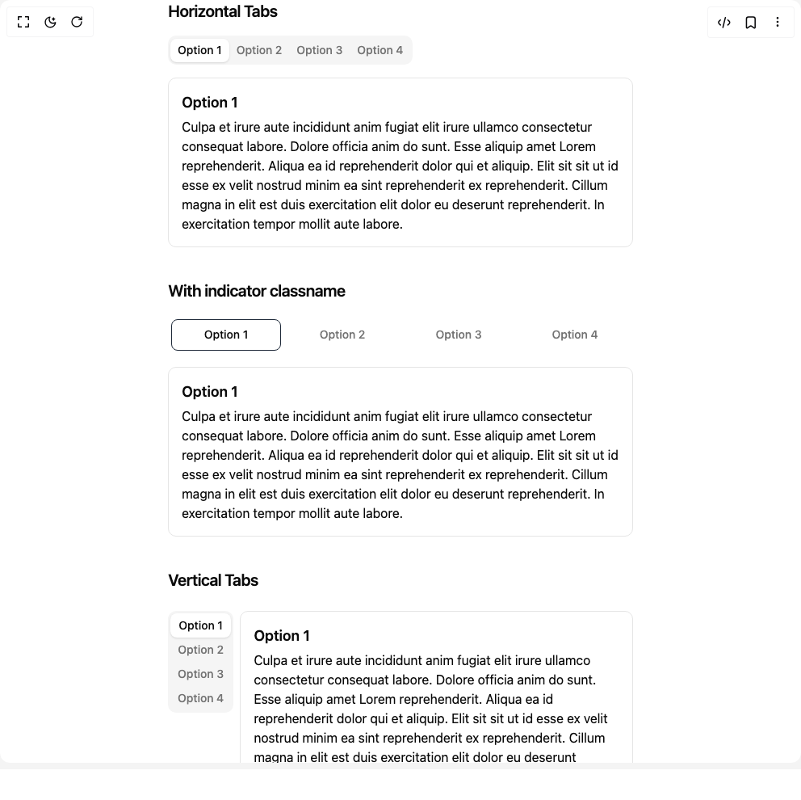
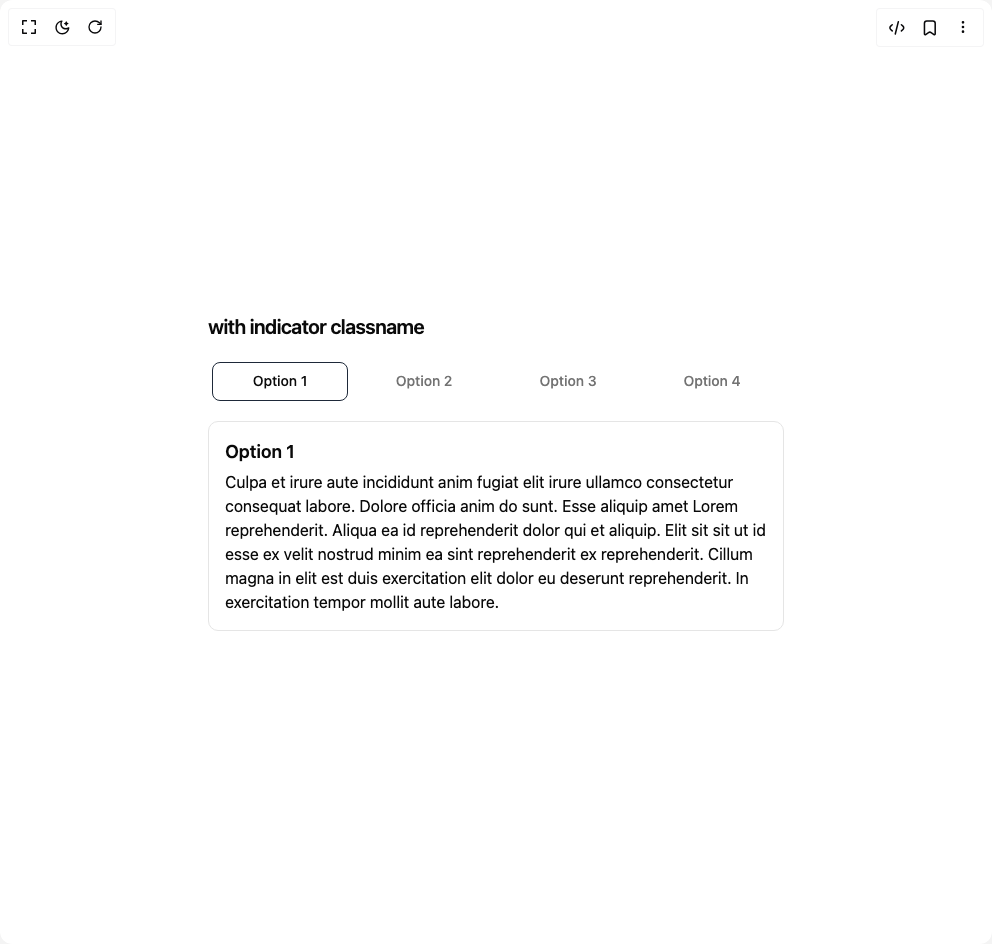
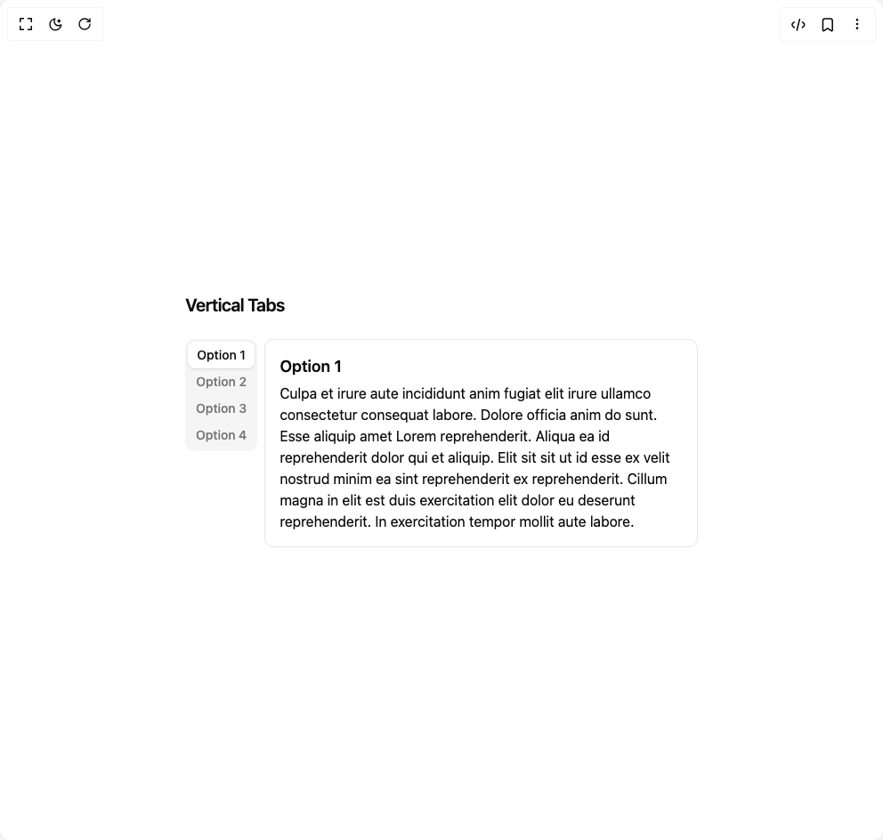
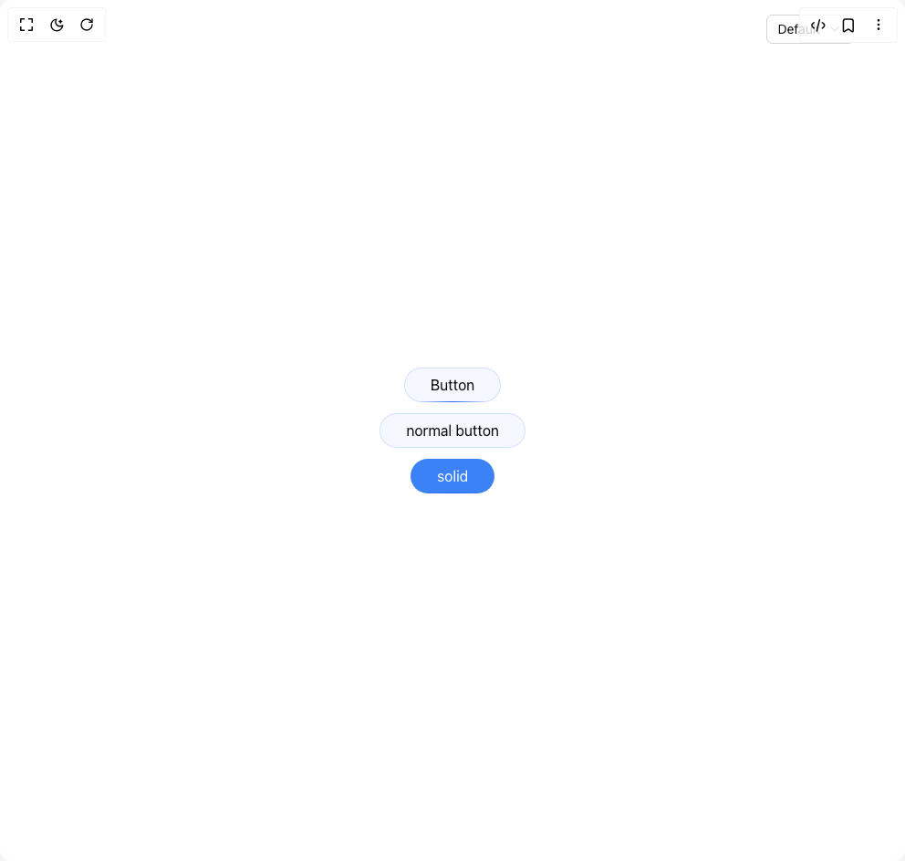

# Cybergaz Components

4 components are available in this author group.

> Build any component in [BuilderStudio](https://builderstudio.dev), then share improvements with the community on [Discord](https://discord.gg/QdWeSGCqfe) or [Reddit](https://reddit.com/r/builderstudio).

| Preview | Component | Variant |
| --- | --- | --- |
|  | [Animated Shadcn S Tabs](animated-shadcn-s-tabs/default/README.md) | `default` |
|  | [Animated Shadcn S Tabs](animated-shadcn-s-tabs/indicator-modifications/README.md) | `indicator-modifications` |
|  | [Animated Shadcn S Tabs](animated-shadcn-s-tabs/vertical-tabs/README.md) | `vertical-tabs` |
|  | [Neon Button](neon-button/default/README.md) | `default` |
