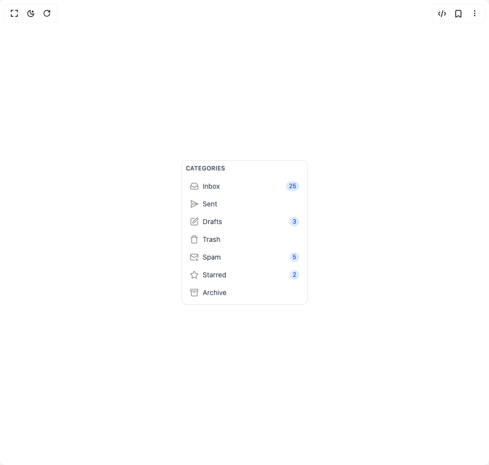

# Build Email Categories in BuilderStudio

> Build this component in our Agentic IDE: [BuilderStudio](https://builderstudio.dev).
>
> Join the BuilderStudio community on [Discord](https://discord.gg/QdWeSGCqfe) and [Reddit](https://reddit.com/r/builderstudio).



## Component

- Author group: `dailydischq`
- Component: `email-categories`
- Variant: `default`
- Rendered HTML snapshot: [`rendered.html`](rendered.html)

## BuilderStudio prompt

You are implementing a React component based on a component reference.

## Component identity

- Author: dailydischq
- Component slug: email-categories
- Demo slug: default
- Title: email-categories
- Description: 

## Goal

Recreate this component in a React + TypeScript + Tailwind CSS project. Preserve the visual layout, spacing, colors, border radius, shadows, interaction behavior, animation behavior, responsive behavior, and dark mode behavior shown in the rendered demo.

## Implementation requirements

- Use React and TypeScript.
- Use Tailwind CSS classes whenever possible.
- Keep the component self-contained unless the source files require helper components.
- If the source uses CSS variables, custom CSS, animations, or keyframes, include them.
- If the source uses external packages, list and use the required packages.
- Preserve accessibility attributes, button semantics, links, keyboard behavior, and ARIA attributes when visible in the source.
- Do not replace the component with a simplified placeholder.
- Return complete production-ready code.

## Dependencies

No reference metadata available.

## Rendered DOM snapshot

This is the rendered demo HTML extracted from the live preview. Use it to verify structure, class names, visible content, and layout.

```html
<div id="root"><div class="w-screen min-h-screen flex justify-center items-center"><div class="w-screen min-h-screen flex justify-center items-center"><div class="w-64 bg-white border rounded-lg"><div class="p-2"><div class="mb-3"><h4 class="text-xs font-semibold text-gray-600 uppercase tracking-wide">Categories</h4></div><div class="space-y-1"><button class="w-full flex items-center justify-between px-2 py-1.5 text-sm hover:bg-gray-100 rounded-md transition-colors group"><div class="flex items-center space-x-2 min-w-0 flex-1"><svg xmlns="http://www.w3.org/2000/svg" width="18" height="18" viewBox="0 0 24 24" fill="none" stroke="currentColor" stroke-width="2" stroke-linecap="round" stroke-linejoin="round" class="lucide lucide-inbox flex-shrink-0 transition-transform duration-200 group-hover:-rotate-12" aria-hidden="true" style="color: rgb(143, 143, 143);"><polyline points="22 12 16 12 14 15 10 15 8 12 2 12"></polyline><path d="M5.45 5.11 2 12v6a2 2 0 0 0 2 2h16a2 2 0 0 0 2-2v-6l-3.45-6.89A2 2 0 0 0 16.76 4H7.24a2 2 0 0 0-1.79 1.11z"></path></svg><span class="text-gray-700 truncate">Inbox</span></div><div class="bg-blue-100 text-blue-700 text-xs px-1.5 py-0.5 rounded-full min-w-[18px] text-center flex-shrink-0 ml-2">25</div></button><button class="w-full flex items-center justify-between px-2 py-1.5 text-sm hover:bg-gray-100 rounded-md transition-colors group"><div class="flex items-center space-x-2 min-w-0 flex-1"><svg xmlns="http://www.w3.org/2000/svg" width="18" height="18" viewBox="0 0 24 24" fill="none" stroke="currentColor" stroke-width="2" stroke-linecap="round" stroke-linejoin="round" class="lucide lucide-send-horizontal flex-shrink-0 transition-transform duration-200 group-hover:-rotate-12" aria-hidden="true" style="color: rgb(143, 143, 143);"><path d="M3.714 3.048a.498.498 0 0 0-.683.627l2.843 7.627a2 2 0 0 1 0 1.396l-2.842 7.627a.498.498 0 0 0 .682.627l18-8.5a.5.5 0 0 0 0-.904z"></path><path d="M6 12h16"></path></svg><span class="text-gray-700 truncate">Sent</span></div></button><button class="w-full flex items-center justify-between px-2 py-1.5 text-sm hover:bg-gray-100 rounded-md transition-colors group"><div class="flex items-center space-x-2 min-w-0 flex-1"><svg xmlns="http://www.w3.org/2000/svg" width="18" height="18" viewBox="0 0 24 24" fill="none" stroke="currentColor" stroke-width="2" stroke-linecap="round" stroke-linejoin="round" class="lucide lucide-square-pen flex-shrink-0 transition-transform duration-200 group-hover:-rotate-12" aria-hidden="true" style="color: rgb(143, 143, 143);"><path d="M12 3H5a2 2 0 0 0-2 2v14a2 2 0 0 0 2 2h14a2 2 0 0 0 2-2v-7"></path><path d="M18.375 2.625a1 1 0 0 1 3 3l-9.013 9.014a2 2 0 0 1-.853.505l-2.873.84a.5.5 0 0 1-.62-.62l.84-2.873a2 2 0 0 1 .506-.852z"></path></svg><span class="text-gray-700 truncate">Drafts</span></div><div class="bg-blue-100 text-blue-700 text-xs px-1.5 py-0.5 rounded-full min-w-[18px] text-center flex-shrink-0 ml-2">3</div></button><button class="w-full flex items-center justify-between px-2 py-1.5 text-sm hover:bg-gray-100 rounded-md transition-colors group"><div class="flex items-center space-x-2 min-w-0 flex-1"><svg xmlns="http://www.w3.org/2000/svg" width="18" height="18" viewBox="0 0 24 24" fill="none" stroke="currentColor" stroke-width="2" stroke-linecap="round" stroke-linejoin="round" class="lucide lucide-trash flex-shrink-0 transition-transform duration-200 group-hover:-rotate-12" aria-hidden="true" style="color: rgb(143, 143, 143);"><path d="M3 6h18"></path><path d="M19 6v14c0 1-1 2-2 2H7c-1 0-2-1-2-2V6"></path><path d="M8 6V4c0-1 1-2 2-2h4c1 0 2 1 2 2v2"></path></svg><span class="text-gray-700 truncate">Trash</span></div></button><button class="w-full flex items-center justify-between px-2 py-1.5 text-sm hover:bg-gray-100 rounded-md transition-colors group"><div class="flex items-center space-x-2 min-w-0 flex-1"><svg xmlns="http://www.w3.org/2000/svg" width="18" height="18" viewBox="0 0 24 24" fill="none" stroke="currentColor" stroke-width="2" stroke-linecap="round" stroke-linejoin="round" class="lucide lucide-mail-x flex-shrink-0 transition-transform duration-200 group-hover:-rotate-12" aria-hidden="true" style="color: rgb(143, 143, 143);"><path d="M22 13V6a2 2 0 0 0-2-2H4a2 2 0 0 0-2 2v12c0 1.1.9 2 2 2h9"></path><path d="m22 7-8.97 5.7a1.94 1.94 0 0 1-2.06 0L2 7"></path><path d="m17 17 4 4"></path><path d="m21 17-4 4"></path></svg><span class="text-gray-700 truncate">Spam</span></div><div class="bg-blue-100 text-blue-700 text-xs px-1.5 py-0.5 rounded-full min-w-[18px] text-center flex-shrink-0 ml-2">5</div></button><button class="w-full flex items-center justify-between px-2 py-1.5 text-sm hover:bg-gray-100 rounded-md transition-colors group"><div class="flex items-center space-x-2 min-w-0 flex-1"><svg xmlns="http://www.w3.org/2000/svg" width="18" height="18" viewBox="0 0 24 24" fill="none" stroke="currentColor" stroke-width="2" stroke-linecap="round" stroke-linejoin="round" class="lucide lucide-star flex-shrink-0 transition-transform duration-200 group-hover:-rotate-12" aria-hidden="true" style="color: rgb(143, 143, 143);"><path d="M11.525 2.295a.53.53 0 0 1 .95 0l2.31 4.679a2.123 2.123 0 0 0 1.595 1.16l5.166.756a.53.53 0 0 1 .294.904l-3.736 3.638a2.123 2.123 0 0 0-.611 1.878l.882 5.14a.53.53 0 0 1-.771.56l-4.618-2.428a2.122 2.122 0 0 0-1.973 0L6.396 21.01a.53.53 0 0 1-.77-.56l.881-5.139a2.122 2.122 0 0 0-.611-1.879L2.16 9.795a.53.53 0 0 1 .294-.906l5.165-.755a2.122 2.122 0 0 0 1.597-1.16z"></path></svg><span class="text-gray-700 truncate">Starred</span></div><div class="bg-blue-100 text-blue-700 text-xs px-1.5 py-0.5 rounded-full min-w-[18px] text-center flex-shrink-0 ml-2">2</div></button><button class="w-full flex items-center justify-between px-2 py-1.5 text-sm hover:bg-gray-100 rounded-md transition-colors group"><div class="flex items-center space-x-2 min-w-0 flex-1"><svg xmlns="http://www.w3.org/2000/svg" width="18" height="18" viewBox="0 0 24 24" fill="none" stroke="currentColor" stroke-width="2" stroke-linecap="round" stroke-linejoin="round" class="lucide lucide-archive flex-shrink-0 transition-transform duration-200 group-hover:-rotate-12" aria-hidden="true" style="color: rgb(143, 143, 143);"><rect width="20" height="5" x="2" y="3" rx="1"></rect><path d="M4 8v11a2 2 0 0 0 2 2h12a2 2 0 0 0 2-2V8"></path><path d="M10 12h4"></path></svg><span class="text-gray-700 truncate">Archive</span></div></button></div></div></div></div></div></div>
```

## Reference source files

No reference source files were available.
