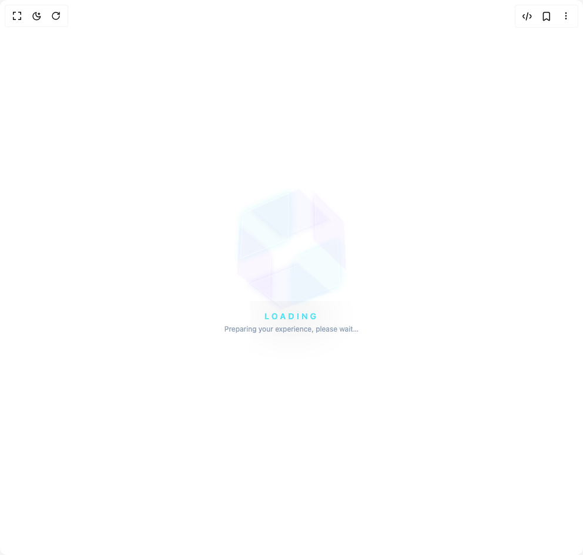

# Build Cube Loader in BuilderStudio

> Build this component in our Agentic IDE: [BuilderStudio](https://builderstudio.dev).
>
> Join the BuilderStudio community on [Discord](https://discord.gg/QdWeSGCqfe) and [Reddit](https://reddit.com/r/builderstudio).



## Component

- Author group: `daiv09`
- Component: `cube-loader`
- Variant: `default`
- Rendered HTML snapshot: [`rendered.html`](rendered.html)

## BuilderStudio prompt

You are implementing a React component based on a component reference.

## Component identity

- Author: daiv09
- Component slug: cube-loader
- Demo slug: default
- Title: cube-loader
- Description: 

## Goal

Recreate this component in a React + TypeScript + Tailwind CSS project. Preserve the visual layout, spacing, colors, border radius, shadows, interaction behavior, animation behavior, responsive behavior, and dark mode behavior shown in the rendered demo.

## Implementation requirements

- Use React and TypeScript.
- Use Tailwind CSS classes whenever possible.
- Keep the component self-contained unless the source files require helper components.
- If the source uses CSS variables, custom CSS, animations, or keyframes, include them.
- If the source uses external packages, list and use the required packages.
- Preserve accessibility attributes, button semantics, links, keyboard behavior, and ARIA attributes when visible in the source.
- Do not replace the component with a simplified placeholder.
- Return complete production-ready code.

## Dependencies

No reference metadata available.

## Rendered DOM snapshot

This is the rendered demo HTML extracted from the live preview. Use it to verify structure, class names, visible content, and layout.

```html
<div id="root"><div class="w-screen min-h-screen flex justify-center items-center"><div class="w-screen min-h-screen flex justify-center items-center"><div class="flex flex-col items-center justify-center gap-12 p-12 min-h-[400px] bg-slate-950/0 perspective-container"><div class="relative w-24 h-24 flex items-center justify-center preserve-3d"><div class="relative w-full h-full preserve-3d animate-cube-spin"><div class="absolute inset-0 m-auto w-8 h-8 bg-white rounded-full blur-md shadow-[0_0_40px_rgba(255,255,255,0.8)] animate-pulse-fast"></div><div class="side-wrapper front"><div class="face bg-cyan-500/10 border-2 border-cyan-400 shadow-[0_0_15px_rgba(34,211,238,0.4)]"></div></div><div class="side-wrapper back"><div class="face bg-cyan-500/10 border-2 border-cyan-400 shadow-[0_0_15px_rgba(34,211,238,0.4)]"></div></div><div class="side-wrapper right"><div class="face bg-purple-500/10 border-2 border-purple-400 shadow-[0_0_15px_rgba(168,85,247,0.4)]"></div></div><div class="side-wrapper left"><div class="face bg-purple-500/10 border-2 border-purple-400 shadow-[0_0_15px_rgba(168,85,247,0.4)]"></div></div><div class="side-wrapper top"><div class="face bg-indigo-500/10 border-2 border-indigo-400 shadow-[0_0_15px_rgba(99,102,241,0.4)]"></div></div><div class="side-wrapper bottom"><div class="face bg-indigo-500/10 border-2 border-indigo-400 shadow-[0_0_15px_rgba(99,102,241,0.4)]"></div></div></div><div class="absolute -bottom-20 w-24 h-8 bg-black/40 blur-xl rounded-[100%] animate-shadow-breathe"></div></div><div class="flex flex-col items-center gap-1 mt-2"><h3 class="text-sm font-semibold tracking-[0.3em] text-cyan-300 uppercase">Loading</h3><p class="text-xs text-slate-400">Preparing your experience, please wait…</p></div><style>
        .perspective-container {
          perspective: 1200px;
        }

        .preserve-3d {
          transform-style: preserve-3d;
        }

        /* 1. Cube Spin 
          Rotates the entire assembly on X and Y axes 
        */
        @keyframes cubeSpin {
          0% { transform: rotateX(0deg) rotateY(0deg); }
          100% { transform: rotateX(360deg) rotateY(360deg); }
        }

        /* 2. Face Breathing 
          Moves the face outward (translateZ) and back.
          Since the parent (.side-wrapper) is already rotated, Z is always "outward" relative to that face.
        */
        @keyframes breathe {
          0%, 100% { transform: translateZ(48px); opacity: 0.8; } /* 48px is half of w-24 (96px) */
          50% { transform: translateZ(80px); opacity: 0.4; border-color: rgba(255,255,255,0.8); }
        }

        @keyframes pulse-fast {
            0%, 100% { transform: scale(0.8); opacity: 0.5; }
            50% { transform: scale(1.2); opacity: 1; }
        }

        @keyframes shadow-breathe {
            0%, 100% { transform: scale(1); opacity: 0.4; }
            50% { transform: scale(1.5); opacity: 0.2; }
        }

        @keyframes glitch {
            0% { clip-path: inset(10% 0 80% 0); transform: translate(-2px, 1px); }
            20% { clip-path: inset(80% 0 5% 0); transform: translate(2px, -1px); }
            40% { clip-path: inset(40% 0 50% 0); transform: translate(-2px, 2px); }
            60% { clip-path: inset(10% 0 60% 0); transform: translate(2px, -2px); }
            80% { clip-path: inset(30% 0 20% 0); transform: translate(1px, 2px); }
            100% { clip-path: inset(10% 0 80% 0); transform: translate(-2px, 1px); }
        }

        .animate-cube-spin {
          animation: cubeSpin 8s linear infinite;
        }

        .animate-pulse-fast {
            animation: pulse-fast 2s ease-in-out infinite;
        }

        .animate-shadow-breathe {
            animation: shadow-breathe 3s ease-in-out infinite;
        }

        .animate-glitch-text {
            animation: glitch 2s infinite linear alternate-reverse;
        }

        /* Positioning the Sides */
        .side-wrapper {
          position: absolute;
          width: 100%;
          height: 100%;
          display: flex;
          align-items: center;
          justify-content: center;
          transform-style: preserve-3d;
        }

        .face {
          width: 100%;
          height: 100%;
          position: absolute;
          /* The 'breathe' animation is applied here */
          animation: breathe 3s ease-in-out infinite;
          backdrop-filter: blur(2px);
        }

        /* Rotations to form the cube structure */
        .front  { transform: rotateY(0deg); }
        .back   { transform: rotateY(180deg); }
        .right  { transform: rotateY(90deg); }
        .left   { transform: rotateY(-90deg); }
        .top    { transform: rotateX(90deg); }
        .bottom { transform: rotateX(-90deg); }
      </style></div></div></div></div>
```

## Reference source files

No reference source files were available.
