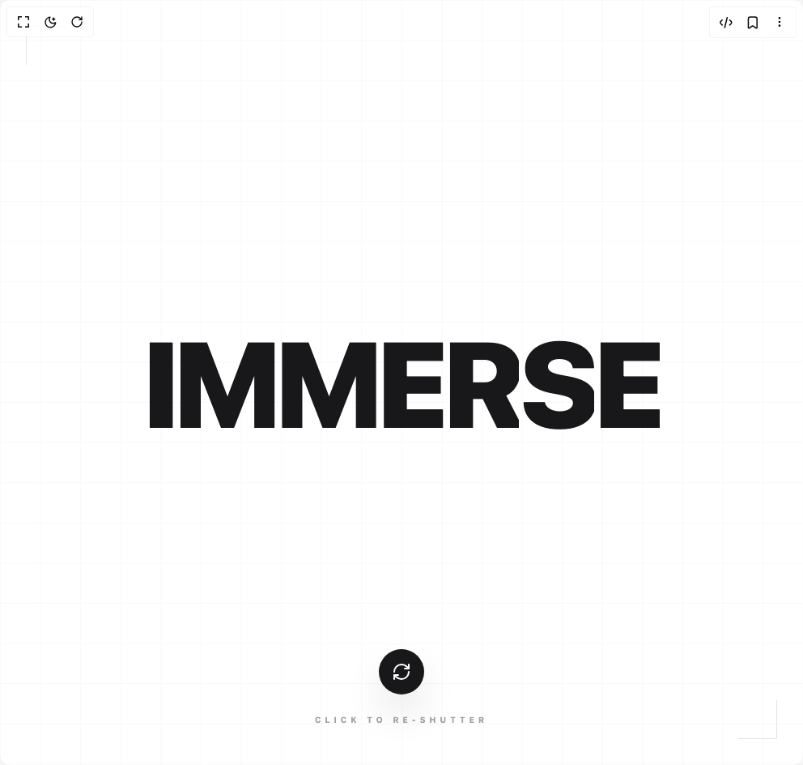

# Build Hero Shutter Text in BuilderStudio

> Build this component in our Agentic IDE: [BuilderStudio](https://builderstudio.dev).
>
> Join the BuilderStudio community on [Discord](https://discord.gg/QdWeSGCqfe) and [Reddit](https://reddit.com/r/builderstudio).



## Component

- Author group: `daiv09`
- Component: `hero-shutter-text`
- Variant: `default`
- Rendered HTML snapshot: [`rendered.html`](rendered.html)

## BuilderStudio prompt

You are implementing a React component based on a component reference.

## Component identity

- Author: daiv09
- Component slug: hero-shutter-text
- Demo slug: default
- Title: hero-shutter-text
- Description: 

## Goal

Recreate this component in a React + TypeScript + Tailwind CSS project. Preserve the visual layout, spacing, colors, border radius, shadows, interaction behavior, animation behavior, responsive behavior, and dark mode behavior shown in the rendered demo.

## Implementation requirements

- Use React and TypeScript.
- Use Tailwind CSS classes whenever possible.
- Keep the component self-contained unless the source files require helper components.
- If the source uses CSS variables, custom CSS, animations, or keyframes, include them.
- If the source uses external packages, list and use the required packages.
- Preserve accessibility attributes, button semantics, links, keyboard behavior, and ARIA attributes when visible in the source.
- Do not replace the component with a simplified placeholder.
- Return complete production-ready code.

## Dependencies

No reference metadata available.

## Rendered DOM snapshot

This is the rendered demo HTML extracted from the live preview. Use it to verify structure, class names, visible content, and layout.

```html
<div id="root"><div class="w-screen min-h-screen flex justify-center items-center"><div class="w-screen min-h-screen flex justify-center items-center"><main class="h-screen w-screen overflow-hidden bg-white dark:bg-zinc-950"><div class="relative flex flex-col items-center justify-center h-full w-full 
      bg-white dark:bg-zinc-950 transition-colors duration-700 "><div class="absolute inset-0 opacity-[0.05] dark:opacity-[0.15] pointer-events-none" style="background-image: linear-gradient(to right, rgb(136, 136, 136) 1px, transparent 1px), linear-gradient(rgb(136, 136, 136) 1px, transparent 1px); background-size: clamp(20px, 5vw, 60px) clamp(20px, 5vw, 60px);"></div><div class="relative z-10 w-full px-4 flex flex-col items-center"><div class="flex flex-wrap justify-center items-center w-full"><div class="relative px-[0.1vw] overflow-hidden group"><span class="text-[15vw] leading-none font-black text-zinc-900 dark:text-white tracking-tighter" style="opacity: 1; filter: blur(0px);">I</span><span class="absolute inset-0 text-[15vw] leading-none font-black text-indigo-600 dark:text-emerald-400 z-10 pointer-events-none" style="clip-path: polygon(0px 0px, 100% 0px, 100% 35%, 0px 35%); opacity: 0; transform: translateX(100%);">I</span><span class="absolute inset-0 text-[15vw] leading-none font-black text-zinc-800 dark:text-zinc-200 z-10 pointer-events-none" style="clip-path: polygon(0px 35%, 100% 35%, 100% 65%, 0px 65%); opacity: 0; transform: translateX(-100%);">I</span><span class="absolute inset-0 text-[15vw] leading-none font-black text-indigo-600 dark:text-emerald-400 z-10 pointer-events-none" style="clip-path: polygon(0px 65%, 100% 65%, 100% 100%, 0px 100%); opacity: 0; transform: translateX(100%);">I</span></div><div class="relative px-[0.1vw] overflow-hidden group"><span class="text-[15vw] leading-none font-black text-zinc-900 dark:text-white tracking-tighter" style="opacity: 1; filter: blur(0px);">M</span><span class="absolute inset-0 text-[15vw] leading-none font-black text-indigo-600 dark:text-emerald-400 z-10 pointer-events-none" style="clip-path: polygon(0px 0px, 100% 0px, 100% 35%, 0px 35%); opacity: 0; transform: translateX(100%);">M</span><span class="absolute inset-0 text-[15vw] leading-none font-black text-zinc-800 dark:text-zinc-200 z-10 pointer-events-none" style="clip-path: polygon(0px 35%, 100% 35%, 100% 65%, 0px 65%); opacity: 0; transform: translateX(-100%);">M</span><span class="absolute inset-0 text-[15vw] leading-none font-black text-indigo-600 dark:text-emerald-400 z-10 pointer-events-none" style="clip-path: polygon(0px 65%, 100% 65%, 100% 100%, 0px 100%); opacity: 0; transform: translateX(100%);">M</span></div><div class="relative px-[0.1vw] overflow-hidden group"><span class="text-[15vw] leading-none font-black text-zinc-900 dark:text-white tracking-tighter" style="opacity: 1; filter: blur(0px);">M</span><span class="absolute inset-0 text-[15vw] leading-none font-black text-indigo-600 dark:text-emerald-400 z-10 pointer-events-none" style="clip-path: polygon(0px 0px, 100% 0px, 100% 35%, 0px 35%); opacity: 0; transform: translateX(100%);">M</span><span class="absolute inset-0 text-[15vw] leading-none font-black text-zinc-800 dark:text-zinc-200 z-10 pointer-events-none" style="clip-path: polygon(0px 35%, 100% 35%, 100% 65%, 0px 65%); opacity: 0; transform: translateX(-100%);">M</span><span class="absolute inset-0 text-[15vw] leading-none font-black text-indigo-600 dark:text-emerald-400 z-10 pointer-events-none" style="clip-path: polygon(0px 65%, 100% 65%, 100% 100%, 0px 100%); opacity: 0; transform: translateX(100%);">M</span></div><div class="relative px-[0.1vw] overflow-hidden group"><span class="text-[15vw] leading-none font-black text-zinc-900 dark:text-white tracking-tighter" style="opacity: 1; filter: blur(0px);">E</span><span class="absolute inset-0 text-[15vw] leading-none font-black text-indigo-600 dark:text-emerald-400 z-10 pointer-events-none" style="clip-path: polygon(0px 0px, 100% 0px, 100% 35%, 0px 35%); opacity: 0; transform: translateX(100%);">E</span><span class="absolute inset-0 text-[15vw] leading-none font-black text-zinc-800 dark:text-zinc-200 z-10 pointer-events-none" style="clip-path: polygon(0px 35%, 100% 35%, 100% 65%, 0px 65%); opacity: 0; transform: translateX(-100%);">E</span><span class="absolute inset-0 text-[15vw] leading-none font-black text-indigo-600 dark:text-emerald-400 z-10 pointer-events-none" style="clip-path: polygon(0px 65%, 100% 65%, 100% 100%, 0px 100%); opacity: 0; transform: translateX(100%);">E</span></div><div class="relative px-[0.1vw] overflow-hidden group"><span class="text-[15vw] leading-none font-black text-zinc-900 dark:text-white tracking-tighter" style="opacity: 1; filter: blur(0px);">R</span><span class="absolute inset-0 text-[15vw] leading-none font-black text-indigo-600 dark:text-emerald-400 z-10 pointer-events-none" style="clip-path: polygon(0px 0px, 100% 0px, 100% 35%, 0px 35%); opacity: 0; transform: translateX(100%);">R</span><span class="absolute inset-0 text-[15vw] leading-none font-black text-zinc-800 dark:text-zinc-200 z-10 pointer-events-none" style="clip-path: polygon(0px 35%, 100% 35%, 100% 65%, 0px 65%); opacity: 0; transform: translateX(-100%);">R</span><span class="absolute inset-0 text-[15vw] leading-none font-black text-indigo-600 dark:text-emerald-400 z-10 pointer-events-none" style="clip-path: polygon(0px 65%, 100% 65%, 100% 100%, 0px 100%); opacity: 0; transform: translateX(100%);">R</span></div><div class="relative px-[0.1vw] overflow-hidden group"><span class="text-[15vw] leading-none font-black text-zinc-900 dark:text-white tracking-tighter" style="opacity: 1; filter: blur(0px);">S</span><span class="absolute inset-0 text-[15vw] leading-none font-black text-indigo-600 dark:text-emerald-400 z-10 pointer-events-none" style="clip-path: polygon(0px 0px, 100% 0px, 100% 35%, 0px 35%); opacity: 0; transform: translateX(100%);">S</span><span class="absolute inset-0 text-[15vw] leading-none font-black text-zinc-800 dark:text-zinc-200 z-10 pointer-events-none" style="clip-path: polygon(0px 35%, 100% 35%, 100% 65%, 0px 65%); opacity: 0; transform: translateX(-100%);">S</span><span class="absolute inset-0 text-[15vw] leading-none font-black text-indigo-600 dark:text-emerald-400 z-10 pointer-events-none" style="clip-path: polygon(0px 65%, 100% 65%, 100% 100%, 0px 100%); opacity: 0; transform: translateX(100%);">S</span></div><div class="relative px-[0.1vw] overflow-hidden group"><span class="text-[15vw] leading-none font-black text-zinc-900 dark:text-white tracking-tighter" style="opacity: 1; filter: blur(0px);">E</span><span class="absolute inset-0 text-[15vw] leading-none font-black text-indigo-600 dark:text-emerald-400 z-10 pointer-events-none" style="clip-path: polygon(0px 0px, 100% 0px, 100% 35%, 0px 35%); opacity: 0; transform: translateX(100%);">E</span><span class="absolute inset-0 text-[15vw] leading-none font-black text-zinc-800 dark:text-zinc-200 z-10 pointer-events-none" style="clip-path: polygon(0px 35%, 100% 35%, 100% 65%, 0px 65%); opacity: 0; transform: translateX(-100%);">E</span><span class="absolute inset-0 text-[15vw] leading-none font-black text-indigo-600 dark:text-emerald-400 z-10 pointer-events-none" style="clip-path: polygon(0px 65%, 100% 65%, 100% 100%, 0px 100%); opacity: 0; transform: translateX(100%);">E</span></div></div></div><div class="absolute bottom-12 flex flex-col items-center gap-6 z-20"><button class="p-4 bg-zinc-900 dark:bg-white text-white dark:text-black rounded-full shadow-2xl transition-colors duration-300" tabindex="0"><svg xmlns="http://www.w3.org/2000/svg" width="24" height="24" viewBox="0 0 24 24" fill="none" stroke="currentColor" stroke-width="2" stroke-linecap="round" stroke-linejoin="round" class="lucide lucide-refresh-cw" aria-hidden="true"><path d="M3 12a9 9 0 0 1 9-9 9.75 9.75 0 0 1 6.74 2.74L21 8"></path><path d="M21 3v5h-5"></path><path d="M21 12a9 9 0 0 1-9 9 9.75 9.75 0 0 1-6.74-2.74L3 16"></path><path d="M8 16H3v5"></path></svg></button><p class="text-[10px] uppercase tracking-[0.5em] font-bold text-zinc-400 dark:text-zinc-500">Click to re-shutter</p></div><div class="absolute top-8 left-8 border-l border-t border-zinc-200 dark:border-zinc-800 w-12 h-12"></div><div class="absolute bottom-8 right-8 border-r border-b border-zinc-200 dark:border-zinc-800 w-12 h-12"></div></div></main></div></div></div>
```

## Reference source files

No reference source files were available.
