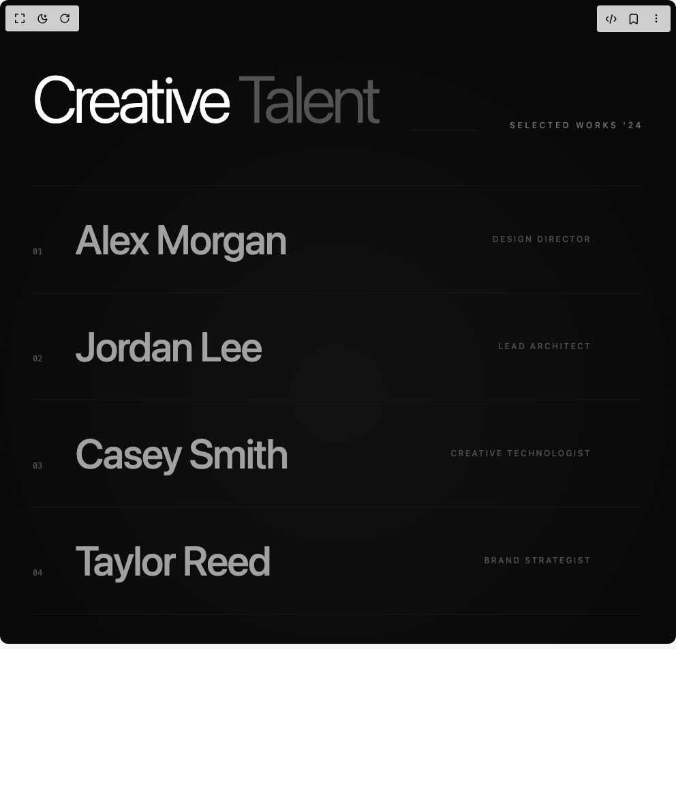

# Build Kinetic Team Hybrid in BuilderStudio

> Build this component in our Agentic IDE: [BuilderStudio](https://builderstudio.dev).
>
> Join the BuilderStudio community on [Discord](https://discord.gg/QdWeSGCqfe) and [Reddit](https://reddit.com/r/builderstudio).



## Component

- Author group: `daiv09`
- Component: `kinetic-team-hybrid`
- Variant: `default`
- Rendered HTML snapshot: [`rendered.html`](rendered.html)

## BuilderStudio prompt

You are implementing a React component based on a component reference.

## Component identity

- Author: daiv09
- Component slug: kinetic-team-hybrid
- Demo slug: default
- Title: kinetic-team-hybrid
- Description: 

## Goal

Recreate this component in a React + TypeScript + Tailwind CSS project. Preserve the visual layout, spacing, colors, border radius, shadows, interaction behavior, animation behavior, responsive behavior, and dark mode behavior shown in the rendered demo.

## Implementation requirements

- Use React and TypeScript.
- Use Tailwind CSS classes whenever possible.
- Keep the component self-contained unless the source files require helper components.
- If the source uses CSS variables, custom CSS, animations, or keyframes, include them.
- If the source uses external packages, list and use the required packages.
- Preserve accessibility attributes, button semantics, links, keyboard behavior, and ARIA attributes when visible in the source.
- Do not replace the component with a simplified placeholder.
- Return complete production-ready code.

## Dependencies

No reference metadata available.

## Rendered DOM snapshot

This is the rendered demo HTML extracted from the live preview. Use it to verify structure, class names, visible content, and layout.

```html
<div id="root"><div class="w-screen min-h-screen flex justify-center items-center"><div class="w-screen min-h-screen flex justify-center items-center"><div class="relative min-h-screen w-full cursor-default bg-neutral-950 px-6 py-24 text-neutral-200 md:px-12"><div class="pointer-events-none absolute inset-0 bg-[radial-gradient(circle_at_50%_50%,rgba(255,255,255,0.03),transparent_70%)]"></div><div class="pointer-events-none absolute inset-0 bg-[url('https://grainy-gradients.vercel.app/noise.svg')] opacity-[0.05] mix-blend-overlay"></div><div class="mx-auto max-w-6xl"><header class="mb-20 flex flex-col gap-4 md:flex-row md:items-end md:justify-between" style="opacity: 1; transform: none;"><div><h1 class="text-4xl font-light tracking-tighter text-white sm:text-6xl md:text-8xl">Creative <span class="text-neutral-600">Talent</span></h1></div><div class="h-px flex-1 bg-neutral-900 mx-8 hidden md:block"></div><p class="text-xs font-medium uppercase tracking-[0.3em] text-neutral-500">Selected Works '24</p></header><div class="flex flex-col"><div class="group relative border-t border-neutral-900 transition-colors duration-500 last:border-b cursor-default" style="opacity: 1; transform: none; background-color: transparent;"><div class="relative z-10 flex flex-col py-8 md:flex-row md:items-center md:justify-between md:py-12"><div class="flex items-baseline gap-6 md:gap-12 pl-4 md:pl-0 transition-transform duration-500 group-hover:translate-x-4"><span class="font-mono text-xs text-neutral-600">01</span><h2 class="text-3xl font-medium tracking-tight text-neutral-400 transition-colors duration-300 group-hover:text-white md:text-6xl">Alex Morgan</h2></div><div class="mt-4 flex items-center justify-between pl-12 pr-4 md:mt-0 md:justify-end md:gap-12 md:pl-0 md:pr-0"><span class="text-xs font-medium uppercase tracking-[0.2em] text-neutral-600 transition-colors group-hover:text-neutral-400">Design Director</span><div class="block md:hidden text-neutral-500"><svg xmlns="http://www.w3.org/2000/svg" width="18" height="18" viewBox="0 0 24 24" fill="none" stroke="currentColor" stroke-width="2" stroke-linecap="round" stroke-linejoin="round" class="lucide lucide-plus" aria-hidden="true"><path d="M5 12h14"></path><path d="M12 5v14"></path></svg></div><div class="hidden md:block text-white" style="opacity: 0; transform: translateX(-10px);"><svg xmlns="http://www.w3.org/2000/svg" width="28" height="28" viewBox="0 0 24 24" fill="none" stroke="currentColor" stroke-width="1.5" stroke-linecap="round" stroke-linejoin="round" class="lucide lucide-arrow-up-right" aria-hidden="true"><path d="M7 7h10v10"></path><path d="M7 17 17 7"></path></svg></div></div></div></div><div class="group relative border-t border-neutral-900 transition-colors duration-500 last:border-b cursor-default" style="opacity: 1; transform: none; background-color: transparent;"><div class="relative z-10 flex flex-col py-8 md:flex-row md:items-center md:justify-between md:py-12"><div class="flex items-baseline gap-6 md:gap-12 pl-4 md:pl-0 transition-transform duration-500 group-hover:translate-x-4"><span class="font-mono text-xs text-neutral-600">02</span><h2 class="text-3xl font-medium tracking-tight text-neutral-400 transition-colors duration-300 group-hover:text-white md:text-6xl">Jordan Lee</h2></div><div class="mt-4 flex items-center justify-between pl-12 pr-4 md:mt-0 md:justify-end md:gap-12 md:pl-0 md:pr-0"><span class="text-xs font-medium uppercase tracking-[0.2em] text-neutral-600 transition-colors group-hover:text-neutral-400">Lead Architect</span><div class="block md:hidden text-neutral-500"><svg xmlns="http://www.w3.org/2000/svg" width="18" height="18" viewBox="0 0 24 24" fill="none" stroke="currentColor" stroke-width="2" stroke-linecap="round" stroke-linejoin="round" class="lucide lucide-plus" aria-hidden="true"><path d="M5 12h14"></path><path d="M12 5v14"></path></svg></div><div class="hidden md:block text-white" style="opacity: 0; transform: translateX(-10px);"><svg xmlns="http://www.w3.org/2000/svg" width="28" height="28" viewBox="0 0 24 24" fill="none" stroke="currentColor" stroke-width="1.5" stroke-linecap="round" stroke-linejoin="round" class="lucide lucide-arrow-up-right" aria-hidden="true"><path d="M7 7h10v10"></path><path d="M7 17 17 7"></path></svg></div></div></div></div><div class="group relative border-t border-neutral-900 transition-colors duration-500 last:border-b cursor-default" style="opacity: 1; transform: none; background-color: transparent;"><div class="relative z-10 flex flex-col py-8 md:flex-row md:items-center md:justify-between md:py-12"><div class="flex items-baseline gap-6 md:gap-12 pl-4 md:pl-0 transition-transform duration-500 group-hover:translate-x-4"><span class="font-mono text-xs text-neutral-600">03</span><h2 class="text-3xl font-medium tracking-tight text-neutral-400 transition-colors duration-300 group-hover:text-white md:text-6xl">Casey Smith</h2></div><div class="mt-4 flex items-center justify-between pl-12 pr-4 md:mt-0 md:justify-end md:gap-12 md:pl-0 md:pr-0"><span class="text-xs font-medium uppercase tracking-[0.2em] text-neutral-600 transition-colors group-hover:text-neutral-400">Creative Technologist</span><div class="block md:hidden text-neutral-500"><svg xmlns="http://www.w3.org/2000/svg" width="18" height="18" viewBox="0 0 24 24" fill="none" stroke="currentColor" stroke-width="2" stroke-linecap="round" stroke-linejoin="round" class="lucide lucide-plus" aria-hidden="true"><path d="M5 12h14"></path><path d="M12 5v14"></path></svg></div><div class="hidden md:block text-white" style="opacity: 0; transform: translateX(-10px);"><svg xmlns="http://www.w3.org/2000/svg" width="28" height="28" viewBox="0 0 24 24" fill="none" stroke="currentColor" stroke-width="1.5" stroke-linecap="round" stroke-linejoin="round" class="lucide lucide-arrow-up-right" aria-hidden="true"><path d="M7 7h10v10"></path><path d="M7 17 17 7"></path></svg></div></div></div></div><div class="group relative border-t border-neutral-900 transition-colors duration-500 last:border-b cursor-default" style="opacity: 1; transform: none; background-color: transparent;"><div class="relative z-10 flex flex-col py-8 md:flex-row md:items-center md:justify-between md:py-12"><div class="flex items-baseline gap-6 md:gap-12 pl-4 md:pl-0 transition-transform duration-500 group-hover:translate-x-4"><span class="font-mono text-xs text-neutral-600">04</span><h2 class="text-3xl font-medium tracking-tight text-neutral-400 transition-colors duration-300 group-hover:text-white md:text-6xl">Taylor Reed</h2></div><div class="mt-4 flex items-center justify-between pl-12 pr-4 md:mt-0 md:justify-end md:gap-12 md:pl-0 md:pr-0"><span class="text-xs font-medium uppercase tracking-[0.2em] text-neutral-600 transition-colors group-hover:text-neutral-400">Brand Strategist</span><div class="block md:hidden text-neutral-500"><svg xmlns="http://www.w3.org/2000/svg" width="18" height="18" viewBox="0 0 24 24" fill="none" stroke="currentColor" stroke-width="2" stroke-linecap="round" stroke-linejoin="round" class="lucide lucide-plus" aria-hidden="true"><path d="M5 12h14"></path><path d="M12 5v14"></path></svg></div><div class="hidden md:block text-white" style="opacity: 0; transform: translateX(-10px);"><svg xmlns="http://www.w3.org/2000/svg" width="28" height="28" viewBox="0 0 24 24" fill="none" stroke="currentColor" stroke-width="1.5" stroke-linecap="round" stroke-linejoin="round" class="lucide lucide-arrow-up-right" aria-hidden="true"><path d="M7 7h10v10"></path><path d="M7 17 17 7"></path></svg></div></div></div></div><div class="group relative border-t border-neutral-900 transition-colors duration-500 last:border-b cursor-default" style="opacity: 1; transform: none; background-color: transparent;"><div class="relative z-10 flex flex-col py-8 md:flex-row md:items-center md:justify-between md:py-12"><div class="flex items-baseline gap-6 md:gap-12 pl-4 md:pl-0 transition-transform duration-500 group-hover:translate-x-4"><span class="font-mono text-xs text-neutral-600">05</span><h2 class="text-3xl font-medium tracking-tight text-neutral-400 transition-colors duration-300 group-hover:text-white md:text-6xl">Riley Davis</h2></div><div class="mt-4 flex items-center justify-between pl-12 pr-4 md:mt-0 md:justify-end md:gap-12 md:pl-0 md:pr-0"><span class="text-xs font-medium uppercase tracking-[0.2em] text-neutral-600 transition-colors group-hover:text-neutral-400">Motion Designer</span><div class="block md:hidden text-neutral-500"><svg xmlns="http://www.w3.org/2000/svg" width="18" height="18" viewBox="0 0 24 24" fill="none" stroke="currentColor" stroke-width="2" stroke-linecap="round" stroke-linejoin="round" class="lucide lucide-plus" aria-hidden="true"><path d="M5 12h14"></path><path d="M12 5v14"></path></svg></div><div class="hidden md:block text-white" style="opacity: 0; transform: translateX(-10px);"><svg xmlns="http://www.w3.org/2000/svg" width="28" height="28" viewBox="0 0 24 24" fill="none" stroke="currentColor" stroke-width="1.5" stroke-linecap="round" stroke-linejoin="round" class="lucide lucide-arrow-up-right" aria-hidden="true"><path d="M7 7h10v10"></path><path d="M7 17 17 7"></path></svg></div></div></div></div></div></div><div class="pointer-events-none fixed left-0 top-0 z-50 hidden md:block" style="transform: none;"></div></div></div></div></div>
```

## Reference source files

No reference source files were available.
