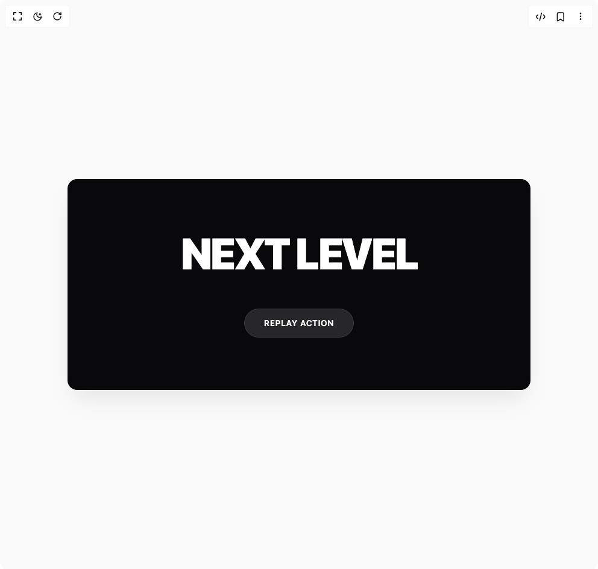

# Build Next Reveal in BuilderStudio

> Build this component in our Agentic IDE: [BuilderStudio](https://builderstudio.dev).
>
> Join the BuilderStudio community on [Discord](https://discord.gg/QdWeSGCqfe) and [Reddit](https://reddit.com/r/builderstudio).



## Component

- Author group: `daiv09`
- Component: `next-reveal`
- Variant: `default`
- Rendered HTML snapshot: [`rendered.html`](rendered.html)

## BuilderStudio prompt

You are implementing a React component based on a component reference.

## Component identity

- Author: daiv09
- Component slug: next-reveal
- Demo slug: default
- Title: next-reveal
- Description: 

## Goal

Recreate this component in a React + TypeScript + Tailwind CSS project. Preserve the visual layout, spacing, colors, border radius, shadows, interaction behavior, animation behavior, responsive behavior, and dark mode behavior shown in the rendered demo.

## Implementation requirements

- Use React and TypeScript.
- Use Tailwind CSS classes whenever possible.
- Keep the component self-contained unless the source files require helper components.
- If the source uses CSS variables, custom CSS, animations, or keyframes, include them.
- If the source uses external packages, list and use the required packages.
- Preserve accessibility attributes, button semantics, links, keyboard behavior, and ARIA attributes when visible in the source.
- Do not replace the component with a simplified placeholder.
- Return complete production-ready code.

## Dependencies

No reference metadata available.

## Rendered DOM snapshot

This is the rendered demo HTML extracted from the live preview. Use it to verify structure, class names, visible content, and layout.

```html
<div id="root"><div class="w-screen min-h-screen flex justify-center items-center"><div class="w-screen min-h-screen flex justify-center items-center"><div class="min-h-screen w-full flex items-center justify-center bg-zinc-50 dark:bg-black p-4 transition-colors duration-300"><div class="w-full max-w-3xl"><div class="flip-container "><div class="text-wrapper"><h1 class="title" aria-label="NEXT LEVEL"><span class="char" style="--index: 0;">N</span><span class="char" style="--index: 1;">E</span><span class="char" style="--index: 2;">X</span><span class="char" style="--index: 3;">T</span><span class="char" style="--index: 4;">&nbsp;</span><span class="char" style="--index: 5;">L</span><span class="char" style="--index: 6;">E</span><span class="char" style="--index: 7;">V</span><span class="char" style="--index: 8;">E</span><span class="char" style="--index: 9;">L</span></h1></div><button class="replay-button"><span class="btn-text">Replay Action</span></button><style>
        /* --- INVERTED THEME VARIABLES --- */
        .flip-container {
          /* Light Mode (Default): Component is BLACK, Text is WHITE */
          --bg-color: #09090b;      
          --text-color: #ffffff;    
          
          /* Button styling */
          --btn-bg: #27272a;       
          --btn-text: #ffffff;
          --btn-border: #3f3f46;
          --btn-hover: #52525b;
        }

        @media (prefers-color-scheme: dark) {
          .flip-container {
            /* Dark Mode: Component is WHITE, Text is BLACK */
            --bg-color: #ffffff;    
            --text-color: #09090b;  
            
            --btn-bg: #f4f4f5;      
            --btn-text: #18181b;
            --btn-border: #e4e4e7;
            --btn-hover: #d4d4d8;
          }
        }

        /* Manual .dark class override */
        :global(.dark) .flip-container {
          --bg-color: #ffffff;    
          --text-color: #09090b;  
          --btn-bg: #f4f4f5;      
          --btn-text: #18181b;
          --btn-border: #e4e4e7;
          --btn-hover: #d4d4d8;
        }

        /* --- Layout --- */
        .flip-container {
          display: flex;
          flex-direction: column;
          align-items: center;
          justify-content: center;
          padding: 4rem 2rem;
          background-color: var(--bg-color); 
          color: var(--text-color);
          border-radius: 16px;
          overflow: hidden;
          min-height: 350px;
          width: 100%;
          transition: background-color 0.4s ease, color 0.4s ease;
          
          /* 3D Stage */
          perspective: 800px; 
          box-shadow: 0 20px 40px -10px rgba(0,0,0,0.1);
        }

        /* --- Typography --- */
        .title {
          font-size: 4.5rem; /* Massive text */
          font-weight: 900;
          margin: 0;
          display: flex;
          flex-wrap: wrap;
          justify-content: center;
          line-height: 1;
          text-transform: uppercase; /* Force uppercase for impact */
          letter-spacing: -0.04em;   /* Tight tracking */
          transform-style: preserve-3d;
        }

        /* --- 3D Character Animation --- */
        .char {
          display: inline-block;
          color: var(--text-color);
          transform-origin: bottom center; /* Hinge from bottom */
          
          opacity: 0;
          transform: rotateX(-90deg) translateY(20px);
          
          /* Elastic bounce effect */
          animation: flip-up 0.8s cubic-bezier(0.175, 0.885, 0.32, 1.275) forwards;
          animation-delay: calc(0.06s * var(--index));
          will-change: transform, opacity;
        }

        /* --- Button --- */
        .replay-button {
          margin-top: 3.5rem;
          padding: 0.8rem 2rem;
          background-color: var(--btn-bg);
          color: var(--btn-text);
          border: 1px solid var(--btn-border);
          border-radius: 99px;
          font-weight: 600;
          font-size: 0.85rem;
          cursor: pointer;
          transition: all 0.2s ease;
          text-transform: uppercase;
          letter-spacing: 0.05em;
        }

        .replay-button:hover {
          background-color: var(--btn-hover);
          transform: scale(1.05);
        }
        
        .replay-button:active {
          transform: scale(0.95);
        }

        /* --- Keyframes --- */
        @keyframes flip-up {
          0% {
            opacity: 0;
            transform: rotateX(-90deg) translateY(40px);
          }
          100% {
            opacity: 1;
            transform: rotateX(0deg) translateY(0);
          }
        }

        /* Responsive Text Sizing */
        @media (max-width: 768px) {
          .title { font-size: 2.5rem; }
        }

        @media (prefers-reduced-motion: reduce) {
          .char {
            opacity: 1 !important;
            transform: none !important;
            animation: none !important;
          }
        }
      </style></div></div></div></div></div></div>
```

## Reference source files

No reference source files were available.
