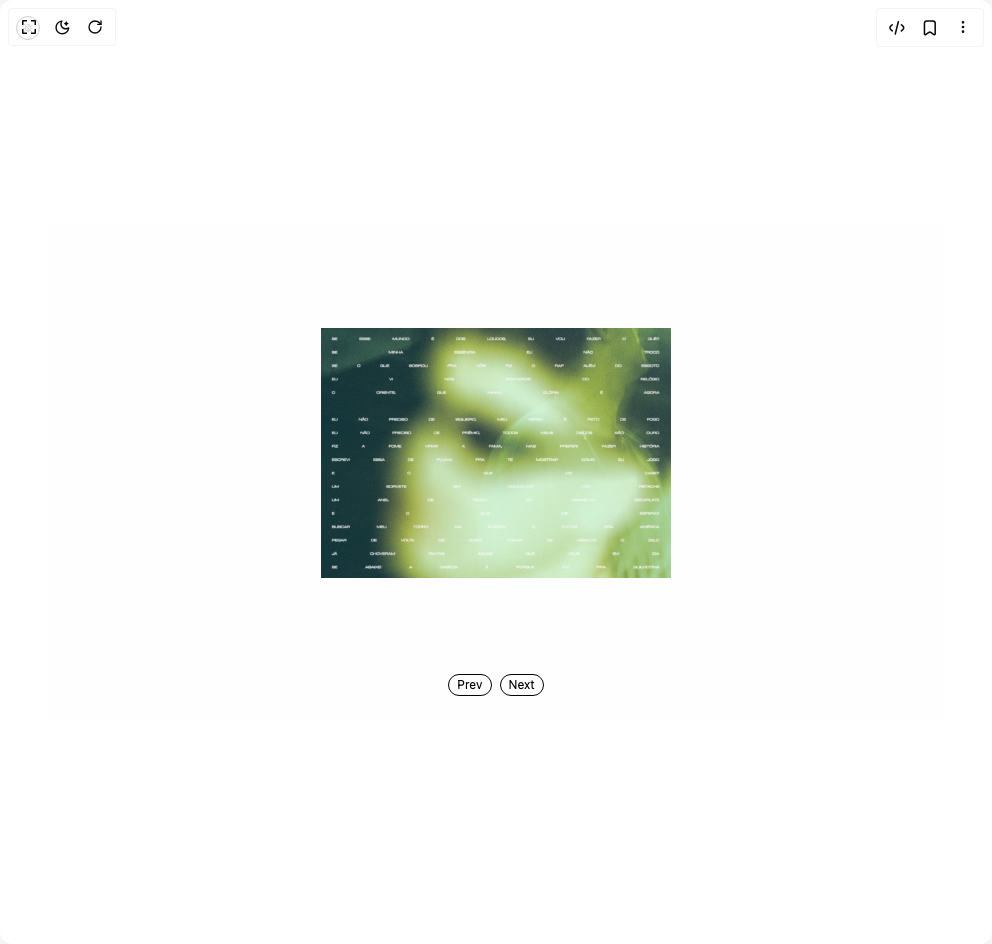

# Build Box Carousel in BuilderStudio

> Build this component in our Agentic IDE: [BuilderStudio](https://builderstudio.dev).
>
> Join the BuilderStudio community on [Discord](https://discord.gg/QdWeSGCqfe) and [Reddit](https://reddit.com/r/builderstudio).



## Component

- Author group: `danielpetho`
- Component: `box-carousel`
- Variant: `default`
- Rendered HTML snapshot: [`rendered.html`](rendered.html)

## BuilderStudio prompt

You are implementing a React component based on a component reference.

## Component identity

- Author: danielpetho
- Component slug: box-carousel
- Demo slug: default
- Title: box-carousel
- Description: 

## Goal

Recreate this component in a React + TypeScript + Tailwind CSS project. Preserve the visual layout, spacing, colors, border radius, shadows, interaction behavior, animation behavior, responsive behavior, and dark mode behavior shown in the rendered demo.

## Implementation requirements

- Use React and TypeScript.
- Use Tailwind CSS classes whenever possible.
- Keep the component self-contained unless the source files require helper components.
- If the source uses CSS variables, custom CSS, animations, or keyframes, include them.
- If the source uses external packages, list and use the required packages.
- Preserve accessibility attributes, button semantics, links, keyboard behavior, and ARIA attributes when visible in the source.
- Do not replace the component with a simplified placeholder.
- Return complete production-ready code.

## Dependencies

No reference metadata available.

## Rendered DOM snapshot

This is the rendered demo HTML extracted from the live preview. Use it to verify structure, class names, visible content, and layout.

```html
<div id="root"><div class="w-screen min-h-screen flex justify-center items-center"><div class="w-screen min-h-screen flex justify-center items-center"><div class="w-full max-w-4xl h-full p-6 flex justify-items-center justify-center items-center text-muted-foreground bg-[#fefefe]"><button class="absolute top-4 left-4 p-1.5 border border-black text-black rounded-full cursor-pointer transition-all duration-300 ease-out hover:bg-gray-100 active:scale-95" title="Debug Mode: OFF"><svg xmlns="http://www.w3.org/2000/svg" width="10" height="10" viewBox="0 0 24 24" fill="none" stroke="currentColor" stroke-width="2" stroke-linecap="round" stroke-linejoin="round" class="lucide lucide-bug-off" aria-hidden="true"><path d="M15 7.13V6a3 3 0 0 0-5.14-2.1L8 2"></path><path d="M14.12 3.88 16 2"></path><path d="M22 13h-4v-2a4 4 0 0 0-4-4h-1.3"></path><path d="M20.97 5c0 2.1-1.6 3.8-3.5 4"></path><path d="m2 2 20 20"></path><path d="M7.7 7.7A4 4 0 0 0 6 11v3a6 6 0 0 0 11.13 3.13"></path><path d="M12 20v-8"></path><path d="M6 13H2"></path><path d="M3 21c0-2.1 1.7-3.9 3.8-4"></path></svg></button><div class="space-y-24"><div class="flex justify-center pt-20"><div class="relative focus:outline-0 cursor-move" tabindex="0" aria-label="3D carousel with 7 items" aria-describedby="carousel-instructions" aria-live="polite" aria-atomic="true" style="width: 350px; height: 250px; perspective: 1000px;"><div class="sr-only" aria-live="assertive">Showing item 1 of 7: Blurry poster</div><div class="relative w-full h-full [transform-style:preserve-3d]" style="transform: translateZ(-175px) rotateX(0deg) rotateY(0deg);"><div class="absolute overflow-hidden" style="transform: rotateY(90deg) translateZ(175px); width: 350px; height: 250px;"></div><div class="absolute overflow-hidden" style="transform: rotateY(0deg) translateZ(175px); width: 350px; height: 250px;"></div><div class="absolute overflow-hidden" style="transform: rotateY(-90deg) translateZ(175px); width: 350px; height: 250px;"></div><div class="absolute overflow-hidden" style="transform: rotateY(180deg) translateZ(175px); width: 350px; height: 250px;"></div></div></div></div><div class="flex gap-2 justify-center"><button class="px-2 py-0.5 text-xs border border-black text-black rounded-full cursor-pointer transition-all duration-300 ease-out hover:bg-gray-100 active:scale-95">Prev</button><button class="px-2 py-0.5 text-xs border border-black text-black rounded-full cursor-pointer transition-all duration-300 ease-out hover:bg-gray-100 active:scale-95">Next</button></div></div></div></div></div></div>
```

## Reference source files

No reference source files were available.
